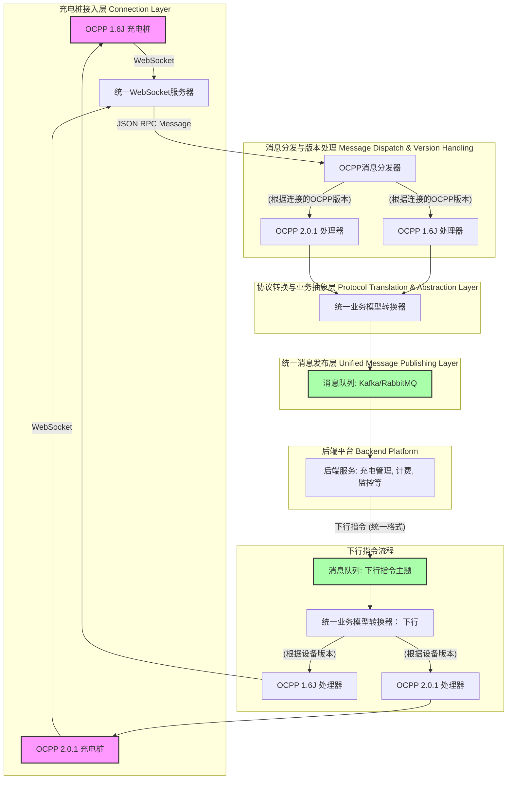
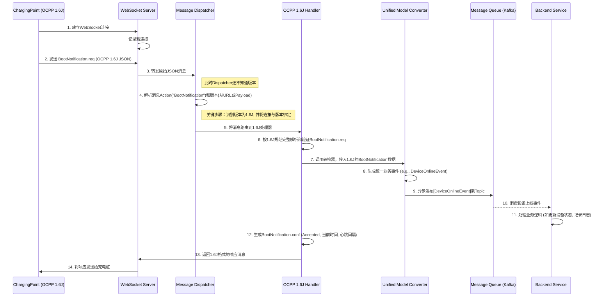
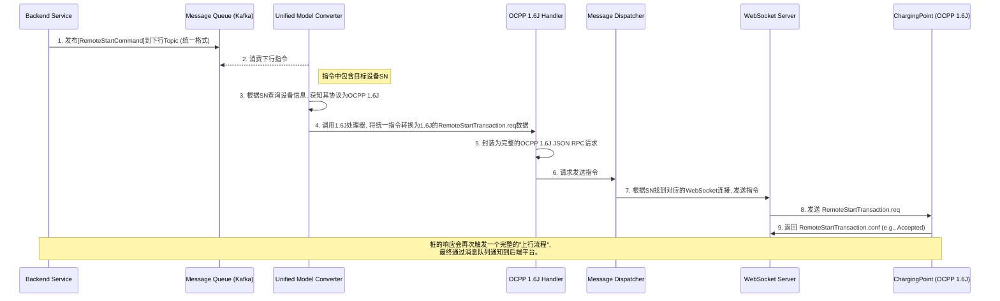

# 充电桩网关数据流概述

### OCPP 1.6J vs. OCPP 2.0.1 的主要差异：

*   **消息集合 (Message Set)**：
    *   2.0.1 引入了大量新消息（例如，更细粒度的安全管理、设备模型、智能充电功能）。
    *   2.0.1 废弃或修改了1.6J中的一些消息。
    *   即使是同名的消息，其**Payload（参数）结构也可能完全不同**。
        *   例如，`BootNotification`在1.6J中包含`chargePointModel`和`chargePointVendor`。
        *   在2.0.1中，这些字段被移动到`chargingStation`对象下，并增加了`reason`、`firmwareVersion`等新字段。
*   **安全模型 (Security)**：2.0.1 对安全做了大幅增强，包括证书管理、安全固件更新等，这在1.6J中是缺失或简陋的。
*   **设备模型 (Device Model)**：2.0.1 定义了更详细、更灵活的设备模型，允许更精细地配置和管理充电桩的各个组件。
*   **智能充电 (Smart Charging)**：2.0.1 提供了更强大的智能充电功能，支持更复杂的负荷管理策略。
*   **扩展性 (Extensibility)**：2.0.1 在设计上更注重未来的扩展性。

### 结论：你仍然需要“版本适配器”

虽然底层传输和RPC框架可以复用，但你仍然需要针对每个OCPP版本实现**独立的“协议内容解析器”或“版本适配器”**。

**架构会演变为：**

#### 关键组件职责：

1.  **统一WebSocket服务器**: 负责建立和维护所有OCPP连接。当充电桩连接时，它会发送`BootNotification`消息，其中包含充电桩支持的OCPP版本信息。网关需要解析这个消息，并**记录下每个连接对应的OCPP版本**。
2.  **OCPP消息分发器 (Dispatcher)**:
    *   接收来自WebSocket服务器的原始JSON RPC消息。
    *   根据消息的`MessageId`和`Action`，以及**该连接对应的OCPP版本**，将消息路由到正确的版本处理器。
3.  **OCPP版本处理器 (e.g., `Ocpp16Handler`, `Ocpp201Handler`)**:
    *   这是真正的“版本适配器”。
    *   **职责**:
        *   **JSON Schema验证**: 确保接收到的JSON Payload符合该OCPP版本的规范。
        *   **消息解析**: 将版本特定的JSON Payload解析成内部数据结构。
        *   **业务逻辑映射**: 将版本特定的消息（例如，1.6J的`MeterValues`和2.0.1的`MeterValues`，它们参数不同）映射到统一的业务模型。
        *   **响应生成**: 根据业务处理结果，生成符合该OCPP版本规范的响应消息。
    *   **实现**: 你会为每个OCPP版本编写一套独立的类或函数来处理其特有的消息结构和逻辑。
4.  **统一业务模型转换器**: 职责不变，将不同版本OCPP的消息统一为后端平台能理解的抽象业务事件。

### 总结：

虽然你不再需要处理像国标那样的完全不同的传输层和序列化格式，但OCPP不同版本之间的**语义和结构差异**仍然要求你在网关内部进行**版本层面的适配**。这种适配体现在：

*   **不同的消息解析逻辑**：即使是同名消息，参数也可能不同。
*   **不同的业务逻辑映射**：需要将版本特定的字段映射到统一模型。
*   **不同的状态机处理**：某些新功能或流程只存在于新版本中。

因此，**“适配器”的概念依然存在，只是它从“协议类型适配器”变成了“协议版本适配器”**。这仍然是构建一个健壮、可扩展的充电桩网关的关键。

---

### 🧑‍💻 User

把这个图 用充列图表示.

---

### 🤖 Assistant

好的，没有问题。

我们用**时序图**（Sequence Diagram，也称序列图）来清晰地展示这个支持多版本OCPP的网关的工作流程。时序图能非常直观地表现出各个组件之间的交互顺序。

我们将分为两个核心场景来展示：

1.  **上行流程**：充电桩主动上报信息（以最关键的 `BootNotification` 为例）。
2.  **下行流程**：后端平台主动下发指令（以 `RemoteStartTransaction` 为例）。

---

### 场景一：上行流程 (充电桩连接并上报 `BootNotification`)

这个流程展示了充电桩第一次连接到网关时，网关如何识别其版本并处理其上报的数据。

**流程解读:**

1.  充电桩通过WebSocket连接到网关。
2.  它发送第一个消息`BootNotification`，这个消息本身就包含了版本信息。
3.  **消息分发器(Dispatcher)** 是关键，它负责识别消息的版本，并将后续所有来自这个连接的消息都路由给对应的**版本处理器(OCPP 1.6J Handler)**。
4.  版本处理器负责该版本协议的所有细节，它解析完数据后，会调用**统一模型转换器(Unified Model Converter)**。
5.  转换器将特定版本的数据“翻译”成后端能理解的、标准化的业务事件，然后发布到消息队列。
6.  后端服务消费这个标准事件，无需关心它来自哪个版本的OCPP。
7.  同时，版本处理器会按照OCPP的RPC规范，立即生成一个响应，通过原路返回给充电桩。

---

### 场景二：下行流程 (后端平台远程启动充电)

这个流程展示了后端如何通过网关，向一个特定版本的充电桩下发指令。

**流程解读:**

1.  后端服务发布一个标准化的、与协议无关的远程启动指令到消息队列。
2.  **统一模型转换器(Unified Model Converter)** 消费这个指令。
3.  它根据指令中的设备ID，查询到该设备使用的是OCPP 1.6J协议，然后将指令交给**OCPP 1.6J处理器**。
4.  版本处理器将标准指令“翻译”成OCPP 1.6J规范的`RemoteStartTransaction`请求报文。
5.  网关通过之前建立的WebSocket连接，将这个请求准确地发送给目标充电桩。
6.  充电桩收到指令后会返回一个响应，这个响应会像上行流程一样，被网关处理并最终通知给后端。

这两个时序图清晰地展示了您的网关如何通过**分层解耦**（连接层、分发层、协议处理层、业务抽象层）来优雅地支持多种协议版本，同时保持后端平台的纯净和稳定。

