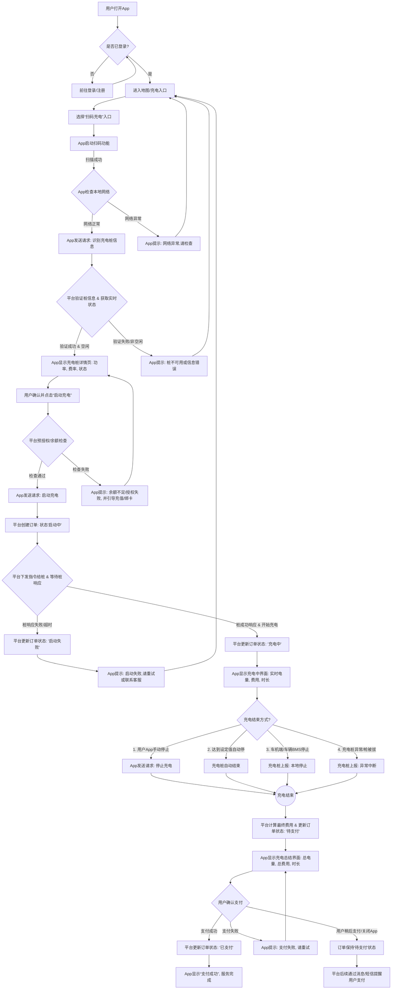
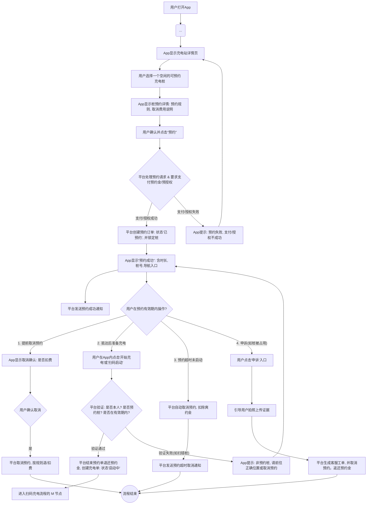

# 充电流程风险异常处理设计

### 🧑‍💻 User

针对 用户充电流程 深入进行“风险与异常处理设计”

---

### 🤖 Assistant

好的，这两份用户充电流程（扫码充电和预约充电）的Mermaid流程图非常清晰和完整，涵盖了用户从启动App到完成充电支付的核心路径。

现在，我们可以基于这两个核心流程，深入进行“风险与异常处理设计”的顶层需求梳理。这将是一个系统性的思考过程，旨在确保在各种异常情况下，平台仍能提供稳定、安全、用户体验良好的服务。

我们将从以下几个维度进行梳理：

1.  **用户操作维度 (C端异常)**
2.  **设备/桩维度 (物联网异常)**
3.  **系统/平台维度 (后端服务异常)**
4.  **支付与账户维度 (资损异常)**
5.  **第三方协作维度 (跨平台异常)**
6.  **安全维度 (攻击/漏洞异常)**
7.  **运营/管理维度 (非技术异常)**

对于每个维度，我们都会列举可能的风险点，并思考对应的顶层处理策略。

---

# 智能电动汽车充电服务平台 - 风险与异常处理设计顶层需求梳理

## 目标

*   识别用户充电流程中潜在的各类风险与异常场景。
*   设计顶层的统一处理机制和策略，确保用户体验、数据一致性和业务连续性。
*   为后端开发、测试、运维提供明确的异常处理设计方向。

## 核心原则

*   **用户友好：** 尽可能减少对用户的困扰，提供清晰的指引。
*   **数据一致性：** 确保关键数据（订单、费用、设备状态）在异常后仍保持一致。
*   **安全可控：** 防止资损、数据泄露和非授权操作。
*   **可观测性：** 所有异常都应被记录、监控、告警。
*   **自动化优先：** 尽可能通过系统自动化处理异常，减少人工介入。
*   **可回溯：** 关键操作和异常应有详细日志，便于事件调查与问题追溯。

---

## 顶层风险与异常处理设计

### 1. 用户操作维度 (C端异常)

| 风险点/异常场景                       | 顶层处理策略                                                                                                                                                                                                                                                                                                                                                                                                                                                  |
| :------------------------------------ | :---------------------------------------------------------------------------------------------------------------------------------------------------------------------------------------------------------------------------------------------------------------------------------------------------------------------------------------------------------------------------------------------------------------------------------------------------- |
| **1.1 网络中断/弱网**                 | **设计：** App端离线缓存、重试机制、请求超时设置。 **反馈：** 明确提示用户“网络连接异常，请检查网络”。 **操作：** 关键操作（如启动/停止充电）失败时，App仍需向用户展示本地状态，并在网络恢复后自动同步或提示手动同步。                                                                                                                                                                                                      |
| **1.2 App闪退/崩溃**                   | **设计：** 接入崩溃统计SDK（如Crashlytics），实时收集崩溃日志。 **处理：** 引导用户重启App。关键业务数据（如充电中状态）应由后端保存，App重启后能恢复当前充电状态。 **补偿：** 如果充电期间崩溃导致无法停止，平台需支持自动停充或远程停充。                                                                                                                                                                                         |
| **1.3 用户误操作/多次点击**             | **设计：** 核心操作按钮防连点（点击后禁用一段时间）。**后端：** 所有核心API接口设计幂等性，防止重复提交造成数据错误。 **反馈：** 操作成功或失败后立即给予明确反馈。                                                                                                                                                                                                                                                                  |
| **1.4 账户余额不足**                   | **设计：** 在充电启动前进行余额预检。 **反馈：** 明确提示用户“余额不足，请充值”。**引导：** 提供便捷的充值入口。 **处理：** 允许"先充后补"或信用支付（需风控评估）。                                                                                                                                                                                                                                                            |
| **1.5 未按时抵达预约桩**              | **设计：** 设置预约超时时间。 **系统：** 平台自动取消预约，标记为爽约。 **扣费：** 根据运营策略，可设置收取爽约金（需在用户预约前明确告知）。 **通知：** 向用户发送预约取消通知。                                                                                                                                                                                                                                                  |
| **1.6 扫码失败/无法识别二维码**       | **设计：** 提供手动输入桩号选项。 **App：** 优化扫码框识别率，支持手电筒功能。 **提示：** 提示用户检查二维码是否破损、光线是否充足。                                                                                                                                                                                                                                                                                               |
| **1.7 用户手动停止失败 (App故障)**   | **设计：** 平台支持远程强制停止充电功能。 **客服介入：** 提供客服电话或App内一键求助功能，由客服协助远程停止。 **自动：** 充电时间、电量达到上限时自动停止。                                                                                                                                                                                                                                                                |
| **1.8 充电中途离开，未留意异常中断**    | **设计：** 实时监控充电状态。 **通知：** 充电异常中断时，及时通过App消息、短信等方式通知用户。                                                                                                                                                                                                                                                                                                                                  |
| **1.9 车辆BMS异常导致充电中断/无法启动** | **设计：** 充电协议（如国标）包含与车端BMS握手和通信。当BMS反馈异常时，桩端和平台及时识别。 **反馈：** 平台向用户反馈“车辆BMS异常，请检查车辆”。 **日志：** 详细记录BMS错误码，便于后续分析。                                                                                                                                                                                                                              |

---

### 2. 设备/桩维度 (物联网异常)

| 风险点/异常场景           | 顶层处理策略                                                                                                                                                                                                                                                                                                                                                                                                      |
| :------------------------ | :---------------------------------------------------------------------------------------------------------------------------------------------------------------------------------------------------------------------------------------------------------------------------------------------------------------------------------------------------------------------------------------------------------- |
| **2.1 充电桩离线/假离线** | **监控：** 实时监控充电桩心跳，超时即判定离线。 **告警：** 离线立即告警运维人员。 **处理：** 离线桩在App端显示为“不可用”或“离线”。 **自动恢复：** 支持远程重启充电桩尝试恢复。                                                                                                                                                                                                                                |
| **2.2 充电桩故障 (内部故障)** | **上报：** 充电桩主动上报内部故障码（如绝缘故障、过温、充电枪脱落）。 **识别：** 平台根据故障码识别故障类型。 **告警：** 立即告警运维人员，并通知用户。 **处理：** 故障桩在App端显示为“故障中，不可用”并提示用户联系客服或选择其他桩。 **自动停充：** 如果在充电中发生故障，桩应立即安全停充。                                                                                                         |
| **2.3 充电枪不识别/未插紧** | **反馈：** 桩与平台实时反馈充电枪状态（连接/锁定）。如果用户点击启动但枪未准备好，立即告知用户“请检查充电枪是否插紧/对准”。 **指引：** 引导用户重新插拔。                                                                                                                                                                                                                                                 |
| **2.4 充电桩启动/停止指令下发失败** | **重试：** 平台对核心指令（启停）设置重试机制。 **回滚：** 如果多次重试失败，业务状态回滚（订单置为失败），并通知用户启动失败。 **告警：** 告警运维人员，可能涉及通信通道或桩硬件问题。                                                                                                                                                                                                                   |
| **2.5 充电桩数据上报延迟/中断** | **监控：** 实时监控数据上报的及时性。 **补偿：** 如果数据上报中断，在计费时考虑离线时长，或以最后上报数据结合时间估算。 **告警：** 告警运维，检查设备通信链路。                                                                                                                                                                                                                                      |
| **2.6 地锁/道闸故障**         | **监控：** 实时监控地锁/道闸状态。 **状态同步：** 如果地锁/道闸故障，充电桩状态应同步标记为不可用。 **处理：** 提供备用方案，如人工解锁或指引用户联系客服。 **通知：** 在App上明确提示地锁/道闸异常，引导用户。                                                                                                                                                                                      |
| **2.7 充电枪被拔出 (非主动停止)** | **识别：** 充电协议规定枪头拔出信号。桩立即检测并上报。 **停充：** 桩立即安全停充。 **通知：** 平台通知用户“充电中断，充电枪被拔出”。 **计费：** 按实际充电量结算。                                                                                                                                                                                                                                 |
| **2.8 充电过载/过压/欠压等电气异常** | **桩端保护：** 充电桩自身应具备电气保护机制，检测到异常立即安全停充。 **上报：** 桩上报具体电气异常信息。 **平台：** 标记为故障桩，告警运维人员，并通知用户充电中断原因。                                                                                                                                                                                                                      |

---

### 3. 系统/平台维度 (后端服务异常)

| 风险点/异常场景           | 顶层处理策略                                                                                                                                                                                                                                                                                                                                                                                                                      |
| :------------------------ | :------------------------------------------------------------------------------------------------------------------------------------------------------------------------------------------------------------------------------------------------------------------------------------------------------------------------------------------------------------------------------------------------------------------ |
| **3.1 服务超时/异常**     | **熔断/降级：** 核心服务设计超时和熔断机制，防止雪崩效应。非核心服务可考虑降级处理。 **重试：** 重要的内部调用和第三方调用设计重试机制。 **日志/监控：** 详细记录调用链、错误日志、性能指标，通过APM工具快速定位问题。 **告警：** 关键服务响应时间、错误率、吞吐量超阈值时告警。                                                                                                                                   |
| **3.2 数据库连接/写入失败** | **高可用：** 数据库集群部署（主从、分库分表），保证高可用。 **事务：** 关键业务操作（订单创建、状态变更）通过事务保证数据一致性。 **日志：** 记录数据库操作失败日志。 **告警：** 数据库资源利用率、慢查询、错误率告警。 **数据恢复：** 定期备份，制定灾备方案。                                                                                                                                                       |
| **3.3 消息队列堆积/消费失败** | **监控：** 实时监控消息队列的生产者和消费者状态，堆积量、消费延迟。 **告警：** 消息队列堆积或消费失败时告警。 **处理：** 引入死信队列，捕获无法处理的消息进行人工干预或后续重试。 **流量控制：** 适当限流，防止过度生产导致队列崩溃。                                                                                                                                                               |
| **3.4 缓存失效/数据不一致** | **设计：** 缓存更新策略（如失效清除、双写一致性补尝）。 **监控：** 监控缓存命中率、缓存服务状态。 **补偿：** 如果缓存和DB数据发生不一致，设计后台校验和修复机制。 **容错：** 即使缓存失效，系统仍能回源到数据库获取数据（性能可能受影响，但服务不中断）。                                                                                                                                            |
| **3.5 第三方API调用失败 (地图、支付)** | **重试：** 对第三方API调用设置重试策略（如指数退避）。 **熔断：** 当第三方服务持续不可用时，进行熔断，防止资源浪费。 **降级：** 地图服务偶尔失败可降级为文字显示。支付失败需通知用户并引导重试。 **补偿：** 支付回调失败时，设计定时任务查询支付状态并进行订单补偿。 **告警：** 持续调用失败或错误率升高时告警。                                                                          |
| **3.6 弹性伸缩失败/资源不足** | **监控：** 实时监控服务器CPU、内存、网络、磁盘I/O。 **预测：** 基于历史数据和业务增长预测资源需求。 **自动化：** 引入自动化水平/垂直伸缩机制 (如K8s HPA)。 **告警：** 资源利用率或部署失败时告警。                                                                                                                                                                                                  |
| **3.7 配置错误/部署事故** | **版本控制：** 所有配置和代码纳入版本控制系统。 **灰度发布：** 采取小流量灰度发布策略。 **回滚：** 出现问题立即回滚到上一稳定版本。 **自动化部署：** 使用CI/CD工具链减少人工错误。 **监控：** 发布后重点监控日志和指标异常。                                                                                                                                                                                        |

---

### 4. 支付与账户维度 (资损异常)

| 风险点/异常场景           | 顶层处理策略                                                                                                                                                                                                                                                                                                                                                                                                                      |
| :------------------------ | :------------------------------------------------------------------------------------------------------------------------------------------------------------------------------------------------------------------------------------------------------------------------------------------------------------------------------------------------------------------------------------------------------------------ |
| **4.1 扣费失败/重复扣费** | **幂等性：** 支付接口和扣款逻辑严格实现幂等性。 **事务：** 核心扣款流程使用分布式事务保证原子性。 **对账：** 与支付渠道（微信/支付宝/银行）每日/实时对账，识别差异。 **补偿：** 发现重复扣费自动退款；扣费失败标记异常，人工或自动重试。 **风控：** 识别异常扣款行为。                                                                                                                                   |
| **4.2 订单未支付导致车被占/滞留** | **策略：** 设置支付时限，超时未支付则订单作废并释放资源。 **指引：** 提示用户尽快支付。 **强制操作：** 对于长时间未支付并占用充电桩的车辆，运营端提供强制解锁/远程关停桩的能力（需明确告知用户风险）。 **收费：** 可考虑收取超时占用费。                                                                                                                                                       |
| **4.3 计费错误**          | **审计：** 所有计费相关参数（起始电量、结束电量、时长、费率）都应详细记录。 **规则校验：** 计费规则配置时进行严格校验。 **测试：** 大量计费场景进行自动化测试。 **对账：** 定期对计费结果进行抽样校验。 **申诉：** 提供用户申诉入口，由客服核实处理。 **人工调整：** 管理后台支持人工调整订单费用。                                                                                                   |
| **4.4 预扣款不足导致无法完成充电** | **策略：** 如果采用预扣款，需设计动态预扣款金额，或在电量达到预扣款上限时提醒用户并可选择续充。 **退款：** 充电结束或异常中断后，及时退还多余预扣款。 **通知：** 余额不足时提醒预充值。                                                                                                                                                                                                |
| **4.5 优惠券/账户余额计算错误** | **独立服务：** 优惠券和账户余额管理作为独立的微服务，确保逻辑清晰。 **流水：** 所有账户变动都应生成详细的交易流水。 **审计：** 定期进行账户余额和优惠券的审计。                                                                                                                                                                                                                                     |
| **4.6 恶意套取/支付欺诈** | **风控系统：** 引入风控规则，监控异常交易行为（如短时间内大额充值、异常优惠券使用）。 **黑名单：** 对恶意用户或设备进行黑名单管理。 **机器学习/AI：** 结合历史数据分析，识别欺诈模式。                                                                                                                                                                                                                     |

---

### 5. 第三方协作维度 (跨平台异常)

| 风险点/异常场景           | 顶层处理策略                                                                                                                                                                                                                                                                                                                                                                                                                      |
| :------------------------ | :------------------------------------------------------------------------------------------------------------------------------------------------------------------------------------------------------------------------------------------------------------------------------------------------------------------------------------------------------------------------------------------------------------------ |
| **5.1 第三方站点数据不准确/滞后** | **监控：** 实时监控第三方数据拉取成功率、更新频率和数据质量。 **校验：** 对关键数据（桩状态、费率）进行合理性校验。 **降级：** 标记数据可能不准确的第三方站点的状态，或在App上提示。 **告警：** 对不符合SLA的第三方数据质量告警。 **沟通：** 加强与第三方合作方的沟通和技术支持，推动数据质量提升。                                                                                                   |
| **5.2 跨平台认证/计费/结算失败** | **协议标准化：** 采用国标或行业标准进行接口对接，减少通信错误。 **重试/补偿：** 对于失败的跨平台操作，设计重试机制和后续补偿逻辑。 **对账：** 与第三方平台进行严格的对账流程，发现差异及时处理。 **错误码统一：** 与合作方协商统一错误码，便于定位问题。                                                                                                                                                       |
| **5.3 第三方服务停机/API变更** | **监控：** 第三方API调用健康检查。 **熔断：** 及时熔断不可用的第三方服务。 **兼容性：** 谨慎对待第三方API变更，内部设计兼容层。 **沟通：** 保持与第三方技术团队的紧密联系，及时获取变更通知。 **备用方案：** 考虑是否有可行的备用第三方服务。                                                                                                                                                       |
| **5.4 第三方地锁/道闸控制失败** | **重试：** 对控制指令进行重试。 **反馈：** 将失败信息反馈给用户，指导用户联系客服或人工介入。 **超时：** 设置控制超时，及时释放资源。 **日志：** 详细记录每次控制指令的下发和结果。                                                                                                                                                                                                                             |
| **5.5 数据安全与隐私合规 (第三方数据交互)** | **安全协议：** 所有数据传输采用加密协议 (HTTPS/TLS)。 **最小授权：** 只获取和传输必要的业务数据。 **审计：** 记录第三方平台访问本平台API的审计日志。 **合规审查：** 严格遵循GDPR, CCPA 等数据隐私法规，与第三方签署数据处理协议。                                                                                                                                                             |

---

### 6. 安全维度 (攻击/漏洞异常)

| 风险点/异常场景           | 顶层处理策略                                                                                                                                                                                                                                                                                                                                                                                                                      |
| :------------------------ | :------------------------------------------------------------------------------------------------------------------------------------------------------------------------------------------------------------------------------------------------------------------------------------------------------------------------------------------------------------------------------------------------------------------ |
| **6.1 非法用户访问/数据泄露** | **身份认证：** 严格的用户认证机制（多因子认证MFA）。 **权限控制：** 细粒度的RBAC模型。 **数据加密：** 敏感数据存储和传输加密。 **安全审计：** 记录所有关键操作日志和数据访问日志。 **漏洞扫描：** 定期进行安全漏洞扫描（App/Web/API）。                                                                                                                                                                   |
| **6.2 恶意指令注入/流量攻击** | **输入校验：** 所有用户输入和API参数均进行严格的输入校验。 **WAF/DDoS防护：** 部署Web应用防火墙和DDoS防护服务。 **限流：** API接口设置QPS和并发连接数限制。 **安全编程：** 遵循安全编码规范，防止SQL注入、XSS等。                                                                                                                                                                                           |
| **6.3 设备被恶意控制**    | **设备认证：** 充电桩与平台间的双向认证（数字证书、Token）。 **加密通信：** 设备通信通道加密。 **指令校验：** 对来自设备的指令进行严格的合法性校验。 **物理安全：** 尽可能提高充电桩的物理安全防护。                                                                                                                                                                                                             |
| **6.4 支付漏洞/资损**     | **强事务：** 支付相关操作必须使用强事务保证原子性。 **风控系统：** 实时监控支付交易，识别异常模式。 **日志审计：** 详细的支付流水和审计日志。 **分离：** 支付功能与核心业务解耦，独立审查。                                                                                                                                                                                                                     |
| **6.5 App逆向工程/篡改**  | **代码混淆/加固：** 对App代码进行混淆和加固。 **渠道验证：** 验证App下载渠道的合法性。 **运行时检测：** 检测App是否被篡改或运行在不安全环境（如越狱手机）。 **API签名/加密：** App与后端API通信进行签名和加密，防止请求被伪造或篡改。                                                                                                                                                                      |

---

### 7. 运营/管理维度 (非技术异常)

| 风险点/异常场景               | 顶层处理策略                                                                                                                                                                                                                                                                                                                              |
| :---------------------------- | :---------------------------------------------------------------------------------------------------------------------------------------------------------------------------------------------------------------------------------------------------------------------------------------------------------------------------------- |
| **7.1 人工误操作 (后台管理)**   | **权限分离：** 严格的RBAC权限控制，最小权限原则。 **操作审计：** 所有后台操作详细记录，谁、何时、操作了什么。 **二次确认：** 敏感操作（如删除数据、修改核心配置）需要二次确认或多级审批。 **数据备份和恢复：** 定期备份，确保误操作后可恢复。 **沙盒环境：** 敏感操作可在沙盒环境先测试。                                                  |
| **7.2 客服无法解决用户问题**    | **知识库：** 建立完善的客服知识库和SOP，包含常见问题和异常处理流程。 **后台工具：** 提供强大的客服后台工具，可查询用户所有订单、充电记录、设备状态、日志，支持远程操作。 **升级机制：** 建立问题升级机制，当客服无法解决时，可升级至二线技术支持或运营专家。                                                                         |
| **7.3 充电站被恶意占用/乱停乱放** | **规则告知：** 充电规则明确告知用户，包括超时占用费。 **监控：** 监控桩的占用时长。 **引导/通知：** 充电完成后通知用户及时驶离。 **现场管理：** 引入人工巡检或智能停车管理系统辅助。 **罚款/黑名单：** 对长期恶意占用者采取罚款或加入黑名单。                                                                    |
| **7.4 运营配置发布错误 (如计费策略)** | **灰度发布：** 新的计费策略等配置先在小范围或测试环境发布验证。 **版本管理：** 所有配置都有版本管理和历史记录。 **回滚：** 发现错误可快速回滚到前一版本。 **校验：** 配置生效前进行逻辑校验。 **通知：** 重要配置变更需内部周知。                                                                                          |
| **7.5 突发大活动/高峰期流量冲击** | **容量规划：** 基于历史数据和增长预期进行容量规划。 **弹性伸缩：** 自动化或手动扩容。 **限流/降级：** 紧急情况下对非核心功能进行限流或降级。 **预案：** 制定大促/高峰期应急预案。                                                                                                                               |
| **7.6 法律法规变更/合规风险** | **合规团队：** 组建或聘请专业的法律合规团队。 **定期审查：** 定期检查政策法规更新，及时调整产品和服务。 **数据审计：** 确保数据收集、存储、使用符合隐私法规。 **用户协议：** 及时更新用户协议和隐私政策，并告知用户。                                                                                                   |

---

这份顶层需求梳理为后续的详细设计和开发提供了高阶的指导。在实际的项目落地中，每个风险点都需要进一步细化，明确具体的实现方案、负责人、以及验收标准。这是一个持续完善的过程，会随着产品迭代和运营经验的积累不断优化。

---

### 🧑‍💻 User

用批判性思维审视你识别出的这些异常和 充电流程图相矛盾的地方.    
指出异常处理或充电流程图中不合理的地方,并进行修改

注意: 流程图中的节点名如果有描述, 用`: `来分隔.  例如:  [节点名:  描述]  

---

### 🤖 Assistant

好的，这是一个非常有价值的练习。用批判性思维审视自己的设计是避免“确认偏误”并提升系统健壮性的关键步骤。

我将对之前提供的充电流程图和异常处理设计进行批判性审视，找出其中的矛盾、不合理之处，并提出修改方案。

---

### **核心批判视角**

1.  **现实世界与理想流程的脱节：** 流程图往往是理想路径，但现实中用户的行为、网络状况和设备物理状态都充满不确定性。
2.  **状态管理的模糊性：** 在关键节点，订单、设备和用户的状态转换是否清晰、原子化？模糊的状态会导致后续处理逻辑混乱。
3.  **用户体验的“悬崖”：** 在异常发生时，流程是否给用户留下了无法操作、不明所以的“悬崖”？是否缺乏引导和备用方案？
4.  **商业逻辑的缺失：** 流程是否考虑了成本、防欺诈、防占位等核心商业利益？

---

## 一、针对“扫码充电流程”的审视与修改

### 1. 审视与发现问题

1.  **矛盾点 (流程图 vs. 异常处理):**
    *   **问题:** 流程图中的`K: 用户确认并点击“启动充电”`后，直接进入平台处理。但异常处理设计中提到了`1.4 账户余额不足`。**这个关键的预检查步骤在流程图中被省略了**。这会导致糟糕的用户体验：用户点击启动，等待硬件响应，最后却被告知余额不足。
    *   **影响:** 用户等待时间变长，挫败感增强。

2.  **不合理之处 (流程图本身逻辑):**
    *   **问题:** 流程图中的`R: 充电结束方式?`引出的`U: 其他异常`，其路径指向了`M: 平台处理充电请求`。**这是一个严重的逻辑错误**。异常停充是一个*结束*动作，不应该回到一个*开始*充电的流程节点。
    *   **影响:** 流程图逻辑混乱，无法指导开发。

3.  **现实世界脱节 (流程图未覆盖的场景):**
    *   **问题:** 流程图没有体现**用户从车机端（车载大屏）发起停止充电**的场景。这是一个非常常见的操作。充电桩会上报“本地停止”，平台需要正确处理这种情况。
    *   **影响:** 缺少对一个核心高频操作的定义，导致平台对账和订单状态管理不完整。

4.  **状态管理模糊点:**
    *   **问题:** 从`L: App发送请求` 到 `P: 平台更新充电订单状态` 之间，涉及多个步骤：平台验证、创建“启动中”订单、下发指令给桩、等待桩响应。这个过程被简化为一个节点`M`，**其内部的状态转换和失败回滚路径不清晰**。如果指令下发后桩没响应怎么办？订单是什么状态？
    *   **影响:** 开发人员难以根据此图设计出健壮的状态机，容易产生“幽灵订单”（用户以为失败了，但后台还在尝试）或“僵尸订单”（后台卡在中间状态）。

5.  **用户体验悬崖:**
    *   **问题:** 当支付失败时 (`ZF`)，流程只是简单地回到`X: App显示充电总结界面`。如果用户此时就是无法支付（比如微信/支付宝出问题了），或者他想明天再付呢？**流程没有给出订单后续处理的明确路径**，用户可能会困惑车是否能开走，这笔钱后续如何处理。
    *   **影响:** 用户对未支付订单的处理方式感到焦虑和不确定。

### 2. 修改后的“扫码充电流程图”

我将修正上述问题，增加预授权检查、修正异常路径、明确状态转换，并增加车机端停止的场景。

---

## 二、针对“用户预约充电流程”的审视与修改

### 1. 审视与发现问题

1.  **商业逻辑缺失 (流程图 vs. 异常处理):**
    *   **问题:** 异常处理中提到了`1.5 未按时抵达预约桩`会产生“爽约金”，但流程图中**完全没有体现任何形式的预约费用预付或预授权环节**。一个免费的预约对平台和充电站主来说是巨大的风险和成本。
    *   **影响:** 容易被恶意占用预约名额，导致真实用户无法使用，降低充电桩周转率。

2.  **用户体验不佳/流程僵化:**
    *   **问题:** 流程图中，用户预约后只能等待超时或去充电，**没有提供“提前取消预约”的选项**。此外，也没有考虑用户可能遇到的“**无法找到预约桩**”或“**预约桩被燃油车占用**”的现实窘境。
    *   **影响:** 用户体验非常僵硬，无法应对突发情况，容易引起用户投诉。

3.  **不合理之处 (流程图本身逻辑):**
    *   **问题:** `T: 用户选择“启动充电”: 可能扫码或手动选择` 这一步太模糊。如果用户扫了旁边的桩，会发生什么？系统应该如何响应？是取消预约并开始新充电，还是提示用户扫错了？
    *   **影响:** 流程定义模糊，导致开发时需要做大量假设，容易出现逻辑漏洞。

4.  **状态管理模糊点:**
    *   **问题:** 从预约成功到启动充电，订单状态是如何流转的？是同一个订单从“已预约”变成“充电中”，还是预约单结束，生成一个新的充电单？
    *   **影响:** 不清晰的状态定义会给对账、结算和数据统计带来巨大麻烦。

### 2. 修改后的“用户预约充电流程图”

我将修正上述问题，加入预约金/预授权、取消/申诉机制，并明确启动流程。

### **总结陈词**

通过这次批判性审视，我们对原有的流程进行了重要修正：
1.  **流程与现实对齐：** 将预授权、预约金、车机端停止、现场申诉等现实世界的关键业务和操作融入了流程图。
2.  **状态管理更清晰：** 明确了“启动中”、“待支付”、“已预约”等关键中间状态，以及订单类型的转换（预约单 -> 充电单），为构建健壮的状态机提供了基础。
3.  **用户体验更完善：** 增加了失败引导（如余额不足）、备用方案（手动输入桩号、申诉）、以及灵活选项（提前取消预约），避免了用户体验的“悬崖”。
4.  **商业逻辑更闭环：** 引入了预约金/爽约金机制，保护了平台的商业利益，防止资源被恶意占用。

经过这轮修改，流程图不再仅仅是理想化的“快乐路径”（Happy Path），而是成为了一个能够指导开发、测试和运维，并能有效应对现实世界复杂性的、更具韧性的设计蓝图。

