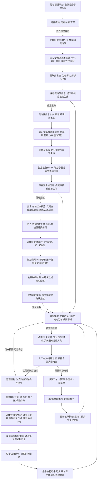

好的，我们来设计 **充电站运营管理流程（信息维护-定价-远程控制）**。

这个流程将涵盖充电站和充电桩从基础信息录入、定价策略制定与生效，到日常运营中的远程监控和故障处理的整个管理生命周期。这是一个典型的B端（后台管理系统）流程。

---

## 6. 充电站运营管理流程 (信息维护-定价-远程控制) (Mermaid Flowchart)

### 流程解释：

1.  **基础信息维护（充电站）：**
    *   **运营管理平台: 登录运营管理系统**: 运维人员或运营经理登录后台管理系统。
    *   **选择模块: 充电站/桩管理**: 进入充电站及充电桩的管理界面。
    *   **充电站信息维护: 新增/编辑充电站**: 进行充电站层面的信息管理。
    *   **输入/更新站基本信息: 名称,地址,坐标,联系方式,图片**: 填写或修改充电站的名称、具体地址、地图坐标、运营电话、站点的实景图片等。
    *   **关联充电桩: 为站绑定/解绑充电桩**: 将物理充电桩（逻辑桩位）与特定的充电站进行逻辑绑定或解除绑定。
    *   **保存充电站信息: 提交审核或直接生效**: 保存以上修改，可能需要经过审核流程才能在C端APP中展示，或直接生效。

2.  **基础信息维护（充电桩）：**
    *   **充电桩信息维护: 新增/编辑充电桩**: 进入充电桩层面的信息管理。
    *   **输入/更新桩基本信息: 桩编号,型号,功率,接口类型**: 填写或修改充电桩的唯一标识（桩编号）、桩的型号、最大输出功率、支持的接口类型（如国标直流、交流）等。
    *   **关联充电站: 为桩指定所属充电站**: 确保每个桩都归属于一个充电站。
    *   **指定设备SN/ID: 绑定物理设备到逻辑桩位**: 最重要的步骤，将后台管理系统中的逻辑桩位与实际物理设备的唯一序列号（SN/ID）进行绑定，实现逻辑与物理设备的匹配。
    *   **保存充电桩信息: 提交审核或直接生效**: 保存修改。

3.  **定价策略管理：**
    *   **充电站/桩状态概览: 实时查看在线/离线,空闲/占用/故障**: 运营人员可以随时查看站和桩的实时运行状态，为定价提供依据。
    *   **进入定价策略管理: 为站/桩设置计费规则**: 切换到定价管理模块。
    *   **选择定价对象: 针对特定站, 桩, 或全局**: 定价策略可以是全局统一的，也可以针对特定充电站或单个充电桩进行差异化定价。
    *   **制定/编辑计费策略: 服务费,电费(阶梯),时间段价格**: 配置充电的费用规则，包括服务费（每度电或每小时）、电费（可能按时间段、按充电量进行阶梯定价）。
    *   **设置生效时间: 立即生效或定时生效**: 定价策略可以立即生效，也可以设定未来某个时间点自动生效。
    *   **保存定价策略: 提交审核或确认生效**: 保存并提交定价策略，可能需要审核。

4.  **远程控制与故障处理：**
    *   **实时监控: 充电桩运行状态,充电订单,故障警报**: 运营管理平台核心功能，实时显示每个充电桩的充电状态（电流、电压、温度）、正在进行的订单、以及任何系统上报的故障或异常警报。
    *   **故障/异常告警: 通过短信/邮件/系统通知运维人员**: 当系统检测到充电桩离线、故障、充电异常等情况时，自动触发告警通知相关运维人员。
    *   **人工介入/远程诊断: 根据告警排查问题**: 运维人员收到告警后，登录管理系统进行初步远程诊断，查看详细日志、历史数据等。
    *   **远程控制: 对充电桩发送操作指令**: 运维人员或运营需求（如测试、停止某个桩服务）时，可以直接向充电桩发送控制指令。
    *   **选择控制对象: 单个桩, 多个桩, 或整个站**: 选择需要操作的充电桩或整个充电站。
    *   **选择控制指令: 启动/停止充电,重启设备,升级固件,远程下电**: 可发送的远程指令类型，例如强制启动/停止充电任务、重启充电桩、远程升级充电桩的固件程序、或远程切断桩的电源。
    *   **发送远程控制指令: 通过协议下发到设备**: 管理系统将指令通过设备接入层和通讯协议下发到对应的物理充电桩。
    *   **设备执行指令: 返回执行结果**: 物理充电桩接收到指令后执行，并将执行结果（成功/失败、具体原因）回传给平台。
    *   **指令执行结果反馈: 平台显示成功/失败及原因**: 运营管理系统显示指令的执行结果，便于运维人员确认操作是否成功。
    *   **派发工单: 通知现场运维人员处理**: 如果远程诊断无法解决问题，或需要物理干预（如硬件更换），则创建并派发工单给现场运维团队。
    *   **现场处理: 维修,更换部件等**: 现场运维人员根据工单前往处理（如检查线路、更换模块，拔插枪）。
    *   **更新故障状态: 运维人员反馈处理结果**: 现场处理完成后，运维人员在系统内更新工单状态及处理结果，关闭故障流程。

这个流程是一个循环，运营管理人员通过持续的监控和远程控制来维护充电站的正常运行，并通过信息维护和定价策略调整来优化服务。