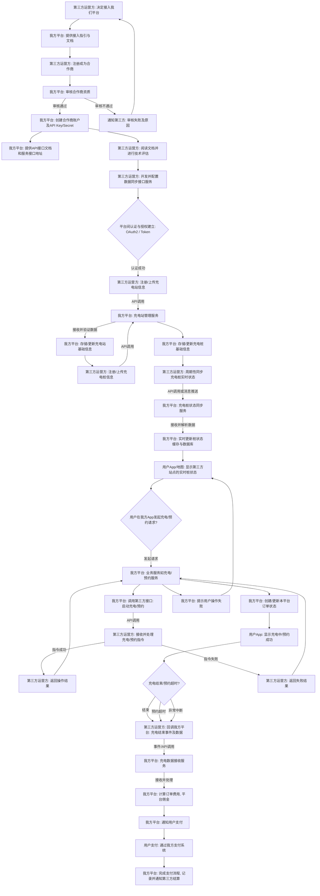

好的，我们来设计 **第三方充电站接入流程**。

这个流程将侧重于数据和业务层面的对接，而非物理设备的直接接入（设备接入已在前面设计）。它主要涉及第三方充电站（运营方）如何在我们的平台上注册、配置并实现数据同步，从而让第三方站点的充电服务能展示给我们的用户。

考虑到合作模式的多样性，我们先涵盖一种比较通用的场景：**第三方通过API或平台集成的方式，将充电站信息、桩状态、充电订单数据等同步给我们平台。**

---

## 4. 第三方充电站接入流程 (Mermaid Flowchart)

### 流程解释：

1.  **合作商注册与资质审核：**
    *   **第三方运营方: 决定接入我们平台**: 第三方充电站运营商希望通过我们的平台获取更多用户。
    *   **我方平台: 提供接入指引与文档**: 我们提供详细的API文档、合作协议和接入指南。
    *   **第三方运营方: 注册成为合作商**: 第三方提交公司信息、资质证明等。
    *   **我方平台: 审核合作商资质**: 我方对第三方进行背景调查、业务能力评估等。
    *   **我方平台: 创建合作商账户及API Key/Secret**: 审核通过后，为其创建专属的平台账户和用于API调用的鉴权凭证（如API Key和Secret）。
    *   **通知第三方: 审核失败及原因**: 审核不通过时，通知对方并说明原因。

2.  **技术对接与信息同步 (初始化)**：
    *   **我方平台: 提供API接口文档和服务接口地址**: 提供详尽的API接口说明，包括数据格式、请求方法、认证方式等。
    *   **第三方运营方: 阅读文档并进行技术评估**: 第三方技术团队理解接口规范并评估开发工作量。
    *   **第三方运营方: 开发并配置数据同步接口服务**: 第三方根据我方API开发相关接口适配器或服务。
    *   **平台间认证与授权建立: OAuth2 / Token**: 两方系统间通过安全机制（如OAuth2或API Key/Secret）建立信任连接。
    *   **第三方运营方: 注册/上传充电站信息**: 第三方通过API接口向我方平台上传其充电站的基本信息（名称、地址、经纬度、图片等）。
    *   **我方平台: 充电站管理服务**: 接收、验证并存储第三方上传的充电站数据。
    *   **我方平台: 存储/更新充电站基础信息**: 将第三方充电站信息录入我方数据库，并标记为第三方管理。
    *   **第三方运营方: 注册/上传充电桩信息**: 第三方通过API接口上传其充电桩的基础信息（桩号、功率、接口类型、费率模板等），并关联到对应的充电站。
    *   **我方平台: 存储/更新充电桩基础信息**: 存储第三方充电桩信息。

3.  **实时状态与指令交互 (运营期)**：
    *   **第三方运营方: 周期性同步充电桩实时状态**: 第三方通过API调用或消息推送（如Webhook），向我方平台实时同步其充电桩的最新状态（空闲、占用、故障）和电价等。
    *   **我方平台: 充电桩状态同步服务**: 接收、解析并快速更新我方系统的桩状态缓存和数据库。
    *   **用户App/地图: 显示第三方站点的实时桩状态**: 我方用户App能够实时查看到第三方充电站和桩的状态。
    *   **用户在我方App发起充电/预约请求?**: 用户在我方App上选择第三方充电站的桩，并点击启动充电或预约。
    *   **我方平台: 业务服务如充电/预约服务**: 我方平台接收用户请求，并判断这属于第三方桩。
    *   **我方平台: 调用第三方接口: 启动充电/预约**: 我方平台通过预设的接口，向第三方运营方发送启动充电或预约的指令。
    *   **第三方运营方: 接收并处理充电/预约指令**: 第三方系统接收指令，并尝试在其内部控制其充电桩执行操作。
    *   **第三方运营方: 返回操作结果**: 第三方系统将指令执行结果（成功/失败）返回给我方平台。
    *   **我方平台: 创建/更新本平台订单状态**: 我方平台根据第三方返回的结果，创建或更新我方平台上的订单状态 (如“充电中”、“预约成功”)。
    *   **用户App: 显示充电中/预约成功**: 用户App及时显示操作结果。

4.  **充电结束与结算：**
    *   **充电结束/预约超时?**: 充电结束后（或预约超时），第三方系统。
    *   **第三方运营方: 回调我方平台: 充电结束事件及数据**: 第三方系统通过回调接口（Webhook）或我方周期性拉取API，将充电完成数据（如充电量、时长、费用明细）发送给我方平台。
    *   **我方平台: 充电数据接收服务**: 接收并验证第三方提供的充电数据。
    *   **我方平台: 计算订单费用, 平台佣金**: 根据第三方数据和我方约定的费率、分成比例，计算最终用户费用和我方应得佣金。
    *   **我方平台: 通知用户支付**: 我方平台向用户展示账单并引导用户完成支付。
    *   **用户支付: 通过我方支付系统**: 用户通过我方支付系统完成支付。
    *   **我方平台: 完成支付流程, 记录并通知第三方结算**: 支付成功后，我方记录交易，并同步给第三方用于对账和结算。

这个流程图描绘了与第三方合作的宏观蓝图。实际实施时，每个API调用、数据同步，都需要处理复杂的错误、幂等性、并发、超时、数据一致性等问题。