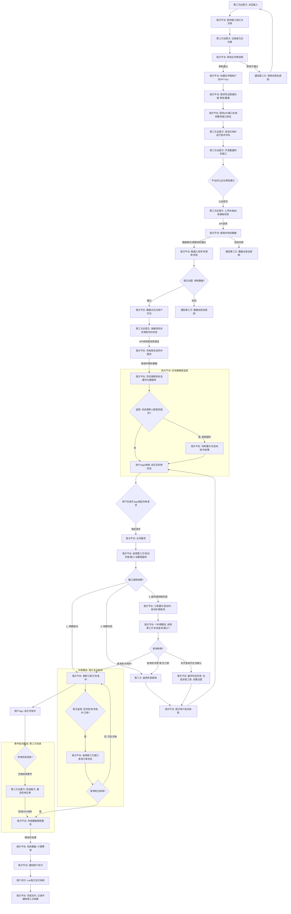

# 第三方充电站风险管理

### 🧑‍💻 User

针对 第三方充电站接入流程 进行深入 风险与异常处理设计.

---

### 🤖 Assistant

  

    
已深度思考

    **Examining Risk &amp; Exceptions**  I&#39;ve begun dissecting the third-party charging station access process. The goal is a robust risk and exception handling design. Currently, I&#39;m breaking down the request to identify potential vulnerabilities. The aim is to achieve a detailed understanding of possible risks, failures, and exceptions within this process. This initial phase is crucial for developing appropriate mitigation strategies.   **Refining the Vulnerability Analysis**  I&#39;m now focusing on the &#39;cooperation registration and qualification review&#39; phase. I&#39;m carefully analyzing each sub-step within the Mermaid flowchart, pinpointing potential failure points. This involves considering scenarios where operator details are incomplete, qualifications are invalid, or API integration issues arise. My aim is to define specific risk categories and exception handling strategies for each. I&#39;m building a robust framework to anticipate and mitigate potential issues effectively.   **Expanding the Scope of Analysis**  I&#39;m now diving deeper into the nuances of each phase of the third-party access process. I&#39;m leveraging the &#39;What if...?&#39; approach to proactively identify risks. The goal is a comprehensive risk register. I&#39;m exploring technical solutions, such as retry mechanisms and robust API design, alongside operational procedures like manual reviews and notification systems.   **Defining Specific Risk Scenarios**  I&#39;m now analyzing the *合作商注册与资质审核* (Onboarding &amp; Qualification) phase in more detail. I&#39;ve begun formulating specific risk scenarios for *Step D (审核)*, focusing on the possibility of fraudulent applications. Mitigation strategies involve multi-level verification processes and secure key management practices for API key generation. I&#39;m also considering potential issues related to technical integration and data synchronization in subsequent steps of the flowchart.   **Refining Risk Scenarios**  I&#39;m now focusing on specific risk scenarios within the &quot;Onboarding &amp; Qualification&quot; phase, particularly Step D (审核). I&#39;m considering scenarios for fraudulent applications and defining mitigation strategies. Also, I&#39;m analyzing the potential for API Key/Secret leakage and the importance of secure key management practices, including key rotation and usage logging. The goal is to create detailed, actionable steps.   **Defining Mitigation Strategies**  I&#39;m now outlining a detailed risk mitigation matrix for the &#39;technical integration and initial data sync&#39; phase.  This involves refining API validation logic and establishing clear error messaging standards to streamline the debugging and support. The goal is a highly reliable and user-friendly system.  I&#39;m also considering logging and alerting mechanisms.   **Developing Mitigation Strategies**  I&#39;m now formulating detailed strategies to handle timeout issues in the charging start process.  The approach includes retrying with exponential backoff,  implementing clear error messages, and designing rollback mechanisms.  Furthermore, I&#39;m defining logging and alerting for efficient troubleshooting. My goal is a robust and resilient system.   **Anticipating and Mitigating Risks**  I&#39;m now focusing on the &quot;实时状态与指令交互&quot; (Real-time Operation &amp; Command Interaction) phase. I&#39;ve begun to define strategies for handling timeout issues in starting a charge. This includes a retry mechanism with exponential backoff and error messages. Moreover, clear logging and alerting mechanisms are essential for swift troubleshooting.   **Enhancing Risk Mitigation Strategies**  I&#39;ve refined the risk scenarios and mitigation tactics for the &quot;Real-time Operation &amp; Command Interaction&quot; phase. Focus is on handling API timeouts with exponential backoff and implementing a comprehensive logging and alerting system. I&#39;m also considering the implications of &quot;Split-brain&quot; scenarios to ensure data consistency.   **Developing Robustness Strategies**  I&#39;m now prioritizing the &quot;Real-time Operation &amp; Command Interaction&quot; phase. I&#39;m focusing on handling API timeouts with exponential backoff and designing a robust logging and alerting system. This will enhance the overall reliability and reduce the risk of failure during the charging process. I&#39;m also planning to incorporate strategies for &quot;Split-brain&quot; scenarios to ensure data consistency.   **Enhancing the Robustness Plan**  I&#39;m now focusing on a more detailed risk mitigation matrix for real-time interaction. I&#39;m exploring various fallback mechanisms and ensuring data integrity with &quot;Split-brain&quot; scenario considerations. Implementing a logging and alerting system and a robust &quot;retries with exponential backoff&quot; strategy further strengthens the design. The end goal is to ensure data consistency in the context of network failures.   
  

好的，我们来对前面设计的 **第三方充电站接入流程** 进行深入的风险分析与异常处理设计。

这是一个至关重要的步骤，因为与第三方系统的交互充满了不确定性。一个健壮的系统不仅要能处理“理想路径”，更要能优雅地处理各种预料之外的异常，保障数据一致性、用户体验和平台信誉。

我们将按照流程的各个阶段，逐一剖析可能遇到的风险点，并设计相应的处理机制。

---

## 第三方充电站接入流程：风险与异常处理设计

### 核心设计原则

1.  **信任边界，永不信任输入 (Zero Trust Input)**：任何来自第三方的数据都必须经过严格的校验和验证。
2.  **我方为主，数据最终解释权 (Our Platform as the Source of Truth)**：面向用户展示的数据、订单状态和计费规则，以我方平台记录为准，避免用户体验不一致。
3.  **异步解耦，具备补偿机制 (Asynchronous & Compensatory)**：核心交互（如启停充电、状态同步）应设计为异步模式，并具备重试、状态查询、手动校正等补偿机制。
4.  **可观测性，全面监控告警 (Observability & Alerting)**：对所有关键交互点建立详细的日志、监控和告警，确保问题能被快速发现、定位和响应。
5.  **明确SLA，建立熔断降级 (SLA & Circuit Breaking)**：与合作方明确服务水平协议（SLA），并建立自动化的熔断和降级机制，防止因第三方服务故障拖垮我方平台。

---

### 各阶段风险与处理方案

#### 阶段一：合作商注册与资质审核

| 流程节点 (Flowchart Step) | 风险点描述 | 潜在影响 | 异常处理与风险规避设计 |
| :--- | :--- | :--- | :--- |
| **D. 审核合作商资质** | 1. **合作方提供虚假资质**：伪造营业执照、运营许可证等。   2. **合作方不具备技术对接能力**：评估时夸大技术实力，导致后期对接困难。 | 1. 平台引入不合规运营商，带来法律和安全风险。  2. 对接周期无限延长，浪费双方资源。 | **运营/业务层面：**  - **多渠道验证**：通过国家企业信用信息公示系统等多方渠道核验其资质真实性。  - **技术能力评估**：要求提供技术方案、过往案例或进行简短的技术问答，评估其团队能力。  - **合同约束**：在合作协议中明确资质的真实性责任及技术对接的时间表和SLA。 |
| **E. 创建API Key/Secret** | **API凭证泄露**：在传输过程中被截获，或第三方存储不当导致泄露。 | 攻击者可冒用第三方身份，向我方平台恶意推送虚假数据（如制造大量虚假充电桩），或进行恶意操作。 | **技术层面：**  - **安全分发**：禁止通过邮件等明文渠道发送凭证。应通过安全的合作方管理后台让其自行查看或下载。  - **凭证管理**：我方平台应支持凭证的**禁用、重置(Re-generate)**。当怀疑泄露时，可立即作废旧凭证。  - **权限分离**：为不同操作（如信息同步、启停控制）生成不同权限的API Key，降低单点泄露风险。  - **访问控制**：支持配置IP白名单，只允许来自第三方约定IP的请求。 |

#### 阶段二：技术对接与信息同步 (初始化)

| 流程节点 | 风险点描述 | 潜在影响 | 异常处理与风险规避设计 |
| :--- | :--- | :--- | :--- |
| **J. 平台间认证** | **认证失败**：第三方因凭证错误、签名算法不一致等原因，持续发起无效认证请求。 | 大量无效请求可能对我方认证服务造成DDoS攻击，影响其他正常合作方的服务。 | **技术层面：**  - **速率限制 (Rate Limiting)**：对认证接口设置严格的请求频率限制（如每分钟N次）。  - **自动封禁**：连续认证失败次数超过阈值（如5次），自动临时封禁该IP或该合作商账户，并发送告警邮件通知双方技术人员。 |
| **K-O. 上传充电站/桩信息** | 1. **数据格式/类型错误**：上传的数据不符合API定义（如经纬度为字符串）。  2. **数据逻辑错误**：数据虽然格式正确但逻辑不合理（如经纬度在中国南海、充电功率为负数）。  3. **数据重复/冲突**：重复上传同一个充电站/桩信息。 | 1. 数据无法入库，同步失败。  2. “脏数据”入库，影响前端展示和用户决策。  3. 造成我方平台数据冗余和混乱。 | **技术层面：**  - **严格的API校验**：在API网关或服务层做彻底的数据格式、类型、范围校验，对无效请求返回明确的错误码和信息（如 `400 Bad Request` - `Invalid GPS format`）。  - **业务逻辑校验**：对关键字段设置业务规则校验（如坐标范围、功率范围、费率合理性）。  - **幂等性设计**：要求第三方为每个站、桩提供唯一的`station_id`和`pile_id`。我方接口根据此ID判断是`创建(Create)`还是`更新(Update)`，避免重复创建。  - **数据隔离与审核**：第三方上传的数据可先进入“待审核”状态，经我方运营人员抽查或系统自动规则校验通过后，才正式上线对用户可见。对关键信息的修改（如地址、费率）也应触发审核。 |

#### 阶段三：实时状态与指令交互 (运营期)

| 流程节点 | 风险点描述 | 潜在影响 | 异常处理与风险规避设计 |
| :--- | :--- | :--- | :--- |
| **P-R. 同步充电桩实时状态** | 1. **状态同步延迟**：第三方状态更新不及时，我方App显示“空闲”，用户到场发现“占用”。  2. **状态同步中断**：第三方系统宕机或网络故障，完全停止推送状态。 | 1. 用户体验极差，平台可信度下降。  2. 我方App上该站点信息完全失效，成为“僵尸数据”。 | **技术/运营层面：**  - **心跳(Heartbeat)机制**：要求第三方接口或我方轮询服务，周期性（如每5分钟）确认服务的存活性。若心跳超时，则启动降级策略。  - **数据新鲜度监控**：记录每个桩状态的最后更新时间戳。若超过阈值（如10分钟）未更新，则自动将该桩状态置为**“状态未知”或“通讯中断”**，并在App上明确展示。  - **SLA告警**：监控状态同步的平均延迟，超出SLA规定（如延迟 > 60秒）则向双方运营团队发送告警。  - **熔断与降级**：若某合作商的站点状态未知比例过高，可临时在地图上**隐藏该站点**，避免误导更多用户。 |
| **V-W. 调用第三方接口：启动充电** | 1. **接口调用超时**：我方发送启动指令，但长时间未收到第三方响应。  2. **状态不一致 (Split-Brain)**：我方调用成功，第三方也启动了充电桩，但响应消息在返回途中丢失。我方认为失败，但用户车辆实际已在充电。  3. **指令执行失败**：第三方返回明确的失败结果（如“桩故障”、“用户未插枪”）。 | 1. 用户在充电桩前干等，体验糟糕。  2. 产生“幽灵订单”，用户无法在我方App内停止充电和支付，造成计费混乱和客诉。  3. 用户操作受挫。 | **技术层面 (这是最关键的环节)：**  - **设置短超时+主动查询**：   1. 我方调用启动接口设置一个较短的超时时间（如15秒）。   2. 若超时或网络错误，**我方订单状态置为“启动中(Pending)”**，并立即调用第三方的**“订单状态查询”接口**进行补偿确认。   3. 在接下来1分钟内，以特定频率（如5s, 15s, 30s）重试查询3次。       - 若查询到“充电中”，则更新我方订单为“充电中”，通知用户成功。       - 若查询到“失败”或“订单不存在”，则更新我方订单为“失败”，通知用户失败。       - 若3次查询后仍无法确认状态，则判定为**“启动失败”**，通知用户：“启动异常，请重试。如已开始充电，请联系客服，您不会被重复扣费。” 同时生成一个异常工单，由运营介入处理。  - **指令失败处理**：接收到明确的失败原因后，需将原因**友好地转译**并展示给用户，同时更新我方缓存的桩状态（如收到“桩故障”，则立即将该桩置为故障状态）。 |

#### 阶段四：充电结束与结算

| 流程节点 | 风险点描述 | 潜在影响 | 异常处理与风险规避设计 |
| :--- | :--- | :--- | :--- |
| **BB-CC. 回调充电结束事件及数据** | 1. **回调丢失**：第三方未发送或因网络问题我方未收到结束回调。  2. **回调数据错误**：收到的充电数据不合逻辑（如电量为负、费用为0但电量>0）。  3. **费用不一致**：第三方传来的费用与我方根据其费率和电量计算的费用不符。 | 1. 我方订单一直处于“充电中”状态，无法结算。  2. 无法生成正确账单，用户无法支付。  3. 引发结算纠纷和财务对账困难。 | **技术/运营层面：**  - **主动轮询+回调互补**：不能只依赖回调。我方应有定时任务，轮询所有“充电中”超过一定时长（如30分钟）的订单，向第三方查询最新状态。若发现已结束，则主动拉取数据完成结算。  - **设置最大充电时长**：为订单设置一个最大允许时长（如24小时）。超过该时长的订单自动置为“异常”，并告警通知运营介入处理。  - **数据校验与争议处理**：收到回调数据后，进行严格的业务逻辑校验。对于费用不一致的情况，**以我方在用户启动充电时展示的费率模板及第三方提供的电量数据计算出的费用为准**，生成账单。将双方的费用差异记录下来，用于后续对账。  - **异常订单队列**：所有数据校验失败的订单都应进入一个“待人工处理”的队列，由客服或运营联系用户和第三方解决。 |

---

### 全局性风险与应对策略

1.  **安全风险**
    *   **风险**：API接口被恶意攻击，如SQL注入、重放攻击、越权访问。
    *   **应对**：
        *   **安全编码**：遵循OWASP Top 10安全实践。
        *   **请求签名**：所有请求必须包含时间戳和签名（HMAC等），防止重放和篡改。
        *   **WAF防护**：部署Web应用防火墙。
        *   **权限校验**：严格校验每个API调用者的身份和其操作权限。

2.  **数据一致性风险**
    *   **风险**：我方与第三方平台的数据（特别是费率、桩状态、订单状态）长期不一致。
    *   **应对**：
        *   **定期对账**：开发自动化的对账工具，每日/每周比对站、桩、订单、账务等核心数据。
        *   **数据核验**：对于费率等关键静态数据，提供一个“一键同步”或“差异比对”功能给运营人员。
        *   **以我为主**：在合作协议中明确，当数据不一致时，以我方平台记录为准进行业务处理，争议后续解决。

3.  **监控与告警**
    *   **风险**：问题发生后，不能第一时间感知和响应。
    *   **应对**：
        *   **业务监控**：监控第三方接口的调用成功率、延迟、TPS等。
        *   **数据监控**：监控状态更新延迟、异常订单数量、数据不一致率。
        *   **分级告警**：建立不同优先级的告警，通过短信、电话、企业微信等方式通知到对应的技术和运营负责人。

通过以上细致的风险识别和异常处理设计，我们可以构建一个更加稳定、可靠的第三方接入体系，从而在扩大服务范围的同时，确保优质的用户体验和平台业务的健康发展。

---

### 🧑‍💻 User

用批判性思维审视你识别出的这些异常和 流程图相矛盾的地方.    
指出异常处理或流程图中不合理的地方,并进行修改

注意: 
1. 流程图中的节点名如果有描述, 用`: `来分隔.  例如:  [节点名:  描述]  
2. 流程图中的注释必须单独占一行, 不得拼写在mermaid代码后面.

---

### 🤖 Assistant

  

    
已深度思考

    **Assessing Contradictions**  I&#39;ve begun dissecting the user&#39;s request, focusing on the core task: a critical review of inconsistencies. I&#39;m actively pinpointing potential areas of conflict between the observed anomalies and the provided flowchart. My primary concern is a nuanced understanding of the user&#39;s need. I am thinking about how I can be most effective.   **Pinpointing Inconsistencies**  I&#39;ve moved deeper into analyzing the user&#39;s request. I&#39;m prioritizing the identification of problematic elements within my previous flowchart. My current focus is how the identified anomalies contradict or align with that flowchart&#39;s structure. I&#39;m actively considering the different perspectives of potential stakeholders, which is guiding my critique.   **Examining Discrepancies**  I&#39;ve further refined my approach, now focusing on a point-by-point comparison between the exception handling document and the original flowchart.  I&#39;m critically analyzing the initial scan of the flowchart, which is a fairly straightforward &quot;happy path&quot; design, noting its linear structure. My goal is to ensure the flowchart comprehensively reflects the nuanced failure scenarios detailed in the handling design. I&#39;m prioritizing thoroughness in this examination.   **Revising the Critique**  I&#39;ve further refined my approach. I&#39;m preparing to provide a more detailed point-by-point critique, structured around the specific risks I&#39;ve identified, and aligning it directly with the flowchart. This involves pinpointing omissions in the original design and documenting those gaps. I&#39;ll focus on creating clear, direct comparisons between the exception handling and the flowchart. I&#39;m prioritizing accuracy and clarity.   **Synthesizing Findings**  I&#39;m now consolidating my analysis into a precise critique. I&#39;ll meticulously compare the exception handling document with the flowchart, point by point. The goal is to highlight omissions and present a revised diagram. My focus is a clear, concise comparison and a direct alignment of the risk document with the chart. I&#39;m prioritizing the creation of a clear narrative that shows how the old flowchart fell short, specifically because it didn&#39;t cover the exception scenarios.   **Evaluating Omissions**  I&#39;m now focusing on a more granular level of analysis. I&#39;m meticulously comparing the provided exception scenarios with the original flowchart, node by node. My goal is to pinpoint specific omissions and areas where the flowchart fails to represent the described failure modes and recovery processes. This involves a systematic review, identifying each discrepancy between the happy path and the exception handling.   **Developing a Detailed Critique**  I&#39;ve now moved into a phase of detailed comparison, examining the specific anomalies and omissions between the exception handling document and the initial flowchart. My goal is to craft a comprehensive, point-by-point critique. I&#39;m focusing on discrepancies and preparing to show a revised diagram. My priority is providing clear and direct comparisons.   **Formulating the Critique**  I&#39;ve been meticulously comparing the exception handling document and the initial flowchart, systematically identifying discrepancies. My plan is to produce a well-structured critique. I&#39;ll highlight omissions and prepare a revised diagram to be clearer. My goal is to use strong language.   **Re-evaluating the Structure**  My current analysis has reached the crucial phase of directly contrasting the exception handling document with my prior flowchart. I&#39;m actively pinpointing significant gaps, especially regarding asynchronous processes. My emphasis now is on improving the diagram.   **Evaluating the Discrepancies**  I&#39;ve continued to refine my comparison, now working to create a detailed critique. I will be looking closely at the original flow&#39;s structure and its failure to capture the nuanced details described in the exception handling. My focus is on achieving a more direct alignment between the exception handling and flowchart.   **Revising the Structure**  I&#39;m now deep into comparing my current flowchart to the exception handling document. I&#39;m actively focusing on the discrepancies related to asynchronous communication and failure modes. My goal is to ensure the revised diagram captures the nuance. I&#39;m prioritizing accuracy and clarity.   
  

好的，这是一个非常棒的要求。用批判性思维审视自己的设计是迭代和优化的核心。经过审视，我发现我之前设计的 **流程图** 和 **风险异常处理设计** 之间确实存在一些 **矛盾和不合理之处**。

核心问题在于：**流程图过于理想化和线性，描绘了“阳光普照”的 happy path，而风险异常处理设计揭示了大量必须存在的“非线性补偿路径”，这些路径在原流程图中没有得到体现。**

以下是我识别出的具体问题及修改方案。

---

### 审视与批判：流程图与异常处理的矛盾点

#### 矛盾一：启动充电流程的过度简化与风险处理的复杂性脱节

*   **不合理之处**:
    *   原流程图 `V -> W -> X -> U` 描绘了一个理想化的同步调用：我方发起请求，第三方处理，返回结果，我方更新状态。这是一个简单的 **“请求-响应”** 模型。
    *   然而，我的异常处理设计中明确指出，这是最危险的环节，必须采用 **“短超时 + 主动查询”** 的补偿机制来处理网络超时和状态不一致（Split-Brain）问题。这需要引入一个中间状态 `启动中(Pending)`，并且在超时后进入一个 **查询循环**。
*   **根本矛盾**: 原流程图隐藏了保证数据最终一致性的核心容错逻辑，让一个异步、带补偿的复杂过程看起来像一个简单的同步过程。

#### 矛盾二：充电结束流程的单点故障风险

*   **不合理之处**:
    *   原流程图 `BB -> CC` 只描绘了 **“第三方回调我方”** 这一条路径来触发充电结束和结算。
    *   我的异常处理设计中强调，不能只依赖回调，因为“回调可能丢失”，必须有 **“我方主动轮询查询”** 作为互补的补偿机制。
*   **根本矛盾**: 流程图设计了一个 **“被动等待”** 的模型，这在分布式系统中是不可靠的。如果第三方回调服务出问题，我们的订单将永远停留在“充电中”，造成业务故障。这是一个典型的 **单点故障** 设计。

#### 矛盾三：数据同步的隐性风险未被揭示

*   **不合理之处**:
    *   **信息同步**: 原流程图 `K -> L -> M`（上传站信息）和 `P -> Q -> R`（同步桩状态）都是直接 `调用 -> 接收 -> 存储`。
    *   我的异常处理设计中提到了几个关键点：
        1.  新上的站点信息应该有 **“待审核”** 状态，防止脏数据直接污染线上。
        2.  实时状态同步如果中断，桩的状态应变为 **“状态未知”**，而不是保持最后一个已知状态。
*   **根本矛盾**: 流程图暗示了所有来自第三方的数据都是可信且即时生效的，这违反了“永不信任输入”和“我方为主”的设计原则。它没有体现出平台对数据的 **生命周期管理（审核）** 和 **时效性管理（心跳/状态降级）**。

#### 矛盾四：API凭证管理的缺失

*   **不合理之处**:
    *   原流程图 `E` 节点只描述了“创建合作商账户及API Key/Secret”，这是一个一次性动作。
    *   异常处理中提到了凭证可能泄露，需要支持 **禁用、重置** 等生命周期管理操作。
*   **根本矛盾**: 流程图忽略了安全凭证的持续性管理，这在长期运营中是一个严重的安全运维缺失。

---

### 修改后的流程图 (Mermaid Flowchart)

基于以上批判性分析，我对流程图进行了大幅修改，以使其更能反映真实世界中的健壮系统设计。我引入了 **状态机** 的概念来表示关键业务流程，并明确了 **补偿路径** 和 **异常状态**。

### 修改总结：

1.  **启动充电 (核心修改)**:
    *   将原先简单的“请求-响应”模型，改为了一个包含 **`Pending` 状态** 和 **`补偿查询` 路径** 的异步状态机。
    *   明确区分了 **明确成功、明确失败、超时/未知** 三种初始结果，并为第三种设计了恢复逻辑。这使得流程图与健壮的异常处理设计保持一致。

2.  **结束充电 (核心修改)**:
    *   增加了 **“我方主动轮询”** 的子图，与 **“第三方回调”** 形成互补。
    *   这两个路径最终都指向同一个 `CC: 充电数据接收服务` 节点，体现了无论通过何种方式获取到结束数据，后续处理流程都是统一的。这解决了单点故障风险。

3.  **数据接入流程**:
    *   加入了 **`待审核`** 状态和 **运营审核** 步骤 (`M -> M_Review -> M_Live`)，确保了数据质量和平台的可控性。

4.  **状态同步可靠性**:
    *   通过 **`状态健康度监控`** 子图，明确展示了 **心跳超时** 会导致桩状态降级为 **`状态未知`**，使流程图反映了对数据时效性的管理。

5.  **凭证管理**:
    *   在创建API Key后增加了一个 `EM: 提供凭证管理功能` 节点，表示这是一个持续性的管理过程，而不仅仅是一次性创建。

通过以上修改，新的流程图不再是一个天真的“理想蓝图”，而是一份更贴近现实、能够指导开发和运维的、考虑了容错和异常处理的 **系统设计蓝图**。

