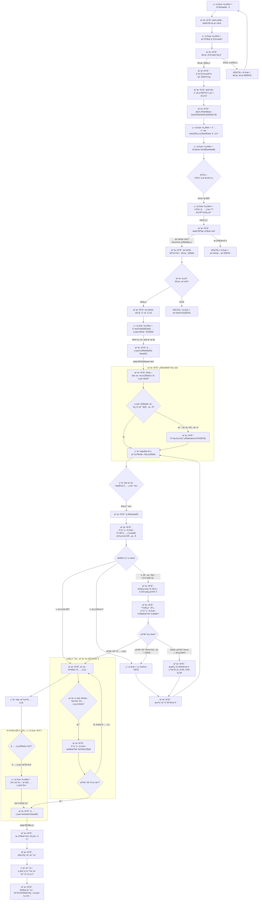

# 第三方充电站é£é™©ç®¡ç†

### 🧑â€ğŸ’» User

针对 第三方充电站æ¥å…¥æµç¨‹ 进行深入 é£é™©ä¸å¼‚常处ç†è®¾è®¡.

---

### 🤖 Assistant

  

    
已深度æ€è€ƒ

    **Examining Risk &amp; Exceptions**  I&#39;ve begun dissecting the third-party charging station access process. The goal is a robust risk and exception handling design. Currently, I&#39;m breaking down the request to identify potential vulnerabilities. The aim is to achieve a detailed understanding of possible risks, failures, and exceptions within this process. This initial phase is crucial for developing appropriate mitigation strategies.   **Refining the Vulnerability Analysis**  I&#39;m now focusing on the &#39;cooperation registration and qualification review&#39; phase. I&#39;m carefully analyzing each sub-step within the Mermaid flowchart, pinpointing potential failure points. This involves considering scenarios where operator details are incomplete, qualifications are invalid, or API integration issues arise. My aim is to define specific risk categories and exception handling strategies for each. I&#39;m building a robust framework to anticipate and mitigate potential issues effectively.   **Expanding the Scope of Analysis**  I&#39;m now diving deeper into the nuances of each phase of the third-party access process. I&#39;m leveraging the &#39;What if...?&#39; approach to proactively identify risks. The goal is a comprehensive risk register. I&#39;m exploring technical solutions, such as retry mechanisms and robust API design, alongside operational procedures like manual reviews and notification systems.   **Defining Specific Risk Scenarios**  I&#39;m now analyzing the *åˆä½œå•†æ³¨å†Œä¸èµ„质审核* (Onboarding &amp; Qualification) phase in more detail. I&#39;ve begun formulating specific risk scenarios for *Step D (审核)*, focusing on the possibility of fraudulent applications. Mitigation strategies involve multi-level verification processes and secure key management practices for API key generation. I&#39;m also considering potential issues related to technical integration and data synchronization in subsequent steps of the flowchart.   **Refining Risk Scenarios**  I&#39;m now focusing on specific risk scenarios within the &quot;Onboarding &amp; Qualification&quot; phase, particularly Step D (审核). I&#39;m considering scenarios for fraudulent applications and defining mitigation strategies. Also, I&#39;m analyzing the potential for API Key/Secret leakage and the importance of secure key management practices, including key rotation and usage logging. The goal is to create detailed, actionable steps.   **Defining Mitigation Strategies**  I&#39;m now outlining a detailed risk mitigation matrix for the &#39;technical integration and initial data sync&#39; phase.  This involves refining API validation logic and establishing clear error messaging standards to streamline the debugging and support. The goal is a highly reliable and user-friendly system.  I&#39;m also considering logging and alerting mechanisms.   **Developing Mitigation Strategies**  I&#39;m now formulating detailed strategies to handle timeout issues in the charging start process.  The approach includes retrying with exponential backoff,  implementing clear error messages, and designing rollback mechanisms.  Furthermore, I&#39;m defining logging and alerting for efficient troubleshooting. My goal is a robust and resilient system.   **Anticipating and Mitigating Risks**  I&#39;m now focusing on the &quot;å®æ—¶çŠ¶æ€ä¸æŒ‡ä»¤äº¤äº’&quot; (Real-time Operation &amp; Command Interaction) phase. I&#39;ve begun to define strategies for handling timeout issues in starting a charge. This includes a retry mechanism with exponential backoff and error messages. Moreover, clear logging and alerting mechanisms are essential for swift troubleshooting.   **Enhancing Risk Mitigation Strategies**  I&#39;ve refined the risk scenarios and mitigation tactics for the &quot;Real-time Operation &amp; Command Interaction&quot; phase. Focus is on handling API timeouts with exponential backoff and implementing a comprehensive logging and alerting system. I&#39;m also considering the implications of &quot;Split-brain&quot; scenarios to ensure data consistency.   **Developing Robustness Strategies**  I&#39;m now prioritizing the &quot;Real-time Operation &amp; Command Interaction&quot; phase. I&#39;m focusing on handling API timeouts with exponential backoff and designing a robust logging and alerting system. This will enhance the overall reliability and reduce the risk of failure during the charging process. I&#39;m also planning to incorporate strategies for &quot;Split-brain&quot; scenarios to ensure data consistency.   **Enhancing the Robustness Plan**  I&#39;m now focusing on a more detailed risk mitigation matrix for real-time interaction. I&#39;m exploring various fallback mechanisms and ensuring data integrity with &quot;Split-brain&quot; scenario considerations. Implementing a logging and alerting system and a robust &quot;retries with exponential backoff&quot; strategy further strengthens the design. The end goal is to ensure data consistency in the context of network failures.   
  

好的，我们æ¥å¯¹å‰é¢è®¾è®¡çš„ **第三方充电站æ¥å…¥æµç¨‹** 进行深入的é£é™©åˆ†æä¸å¼‚常处ç†è®¾è®¡ã€‚

这是一个至关é‡è¦çš„步骤，因为ä¸ç¬¬ä¸‰æ–¹ç³»ç»Ÿçš„交互充满了ä¸ç¡®å®šæ€§ã€‚一个å¥å£®çš„系统ä¸ä»…è¦èƒ½å¤„ç†â€œç†æƒ³è·¯å¾„â€ï¼Œæ›´è¦èƒ½ä¼˜é›…地处ç†å„ç§é¢„料之外的异常，ä¿éšœæ•°æ®ä¸€è‡´æ€§ã€ç”¨æˆ·ä½“验和平å°ä¿¡èª‰ã€‚

我们将按照æµç¨‹çš„å„个阶段，é€ä¸€å‰–æå¯èƒ½é‡åˆ°çš„é£é™©ç‚¹ï¼Œå¹¶è®¾è®¡ç›¸åº”的处ç†æœºåˆ¶ã€‚

---

## 第三方充电站æ¥å…¥æµç¨‹ï¼šé£é™©ä¸å¼‚常处ç†è®¾è®¡

### 核心设计åŸåˆ™

1.  **信任边界，永ä¸ä¿¡ä»»è¾“å…¥ (Zero Trust Input)**：任何æ¥è‡ªç¬¬ä¸‰æ–¹çš„æ•°æ®éƒ½å¿…é¡»ç»è¿‡ä¸¥æ ¼çš„校验和验è¯ã€‚
2.  **我方为主，数æ®æœ€ç»ˆè§£é‡Šæƒ (Our Platform as the Source of Truth)**：é¢å‘用户展示的数æ®ã€è®¢å•çŠ¶æ€å’Œè®¡è´¹è§„则，以我方平å°è®°å½•ä¸ºå‡†ï¼Œé¿å…用户体验ä¸ä¸€è‡´ã€‚
3.  **异步解耦，具备补å¿æœºåˆ¶ (Asynchronous & Compensatory)**：核心交互（如å¯åœå……电ã€çŠ¶æ€åŒæ­¥ï¼‰åº”设计为异步模å¼ï¼Œå¹¶å…·å¤‡é‡è¯•ã€çŠ¶æ€æŸ¥è¯¢ã€æ‰‹åŠ¨æ ¡æ­£ç­‰è¡¥å¿æœºåˆ¶ã€‚
4.  **å¯è§‚测性，全é¢ç›‘æ§å‘Šè­¦ (Observability & Alerting)**：对所有关键交互点建立详细的日志ã€ç›‘æ§å’Œå‘Šè­¦ï¼Œç¡®ä¿é—®é¢˜èƒ½è¢«å¿«é€Ÿå‘ç°ã€å®šä½å’Œå“应。
5.  **æ˜ç¡®SLA，建立熔断é™çº§ (SLA & Circuit Breaking)**：ä¸åˆä½œæ–¹æ˜ç¡®æœåŠ¡æ°´å¹³å议（SLA），并建立自动化的熔断和é™çº§æœºåˆ¶ï¼Œé˜²æ­¢å› ç¬¬ä¸‰æ–¹æœåŠ¡æ•…障拖å®æˆ‘方平å°ã€‚

---

### å„阶段é£é™©ä¸å¤„ç†æ–¹æ¡ˆ

#### 阶段一：åˆä½œå•†æ³¨å†Œä¸èµ„质审核

| æµç¨‹èŠ‚点 (Flowchart Step) | é£é™©ç‚¹æè¿° | æ½œåœ¨å½±å“ | 异常处ç†ä¸é£é™©è§„é¿è®¾è®¡ |
| :--- | :--- | :--- | :--- |
| **D. 审核åˆä½œå•†èµ„è´¨** | 1. **åˆä½œæ–¹æ供虚å‡èµ„è´¨**：伪造è¥ä¸šæ‰§ç…§ã€è¿è¥è®¸å¯è¯ç­‰ã€‚   2. **åˆä½œæ–¹ä¸å…·å¤‡æŠ€æœ¯å¯¹æ¥èƒ½åŠ›**：评估时夸大技术å®åŠ›ï¼Œå¯¼è‡´å期对æ¥å›°éš¾ã€‚ | 1. å¹³å°å¼•å…¥ä¸åˆè§„è¿è¥å•†ï¼Œå¸¦æ¥æ³•å¾‹å’Œå®‰å…¨é£é™©ã€‚  2. 对æ¥å‘¨æœŸæ— é™å»¶é•¿ï¼Œæµªè´¹åŒæ–¹èµ„æºã€‚ | **è¿è¥/业务层é¢ï¼š**  - **多渠é“验è¯**：通过国家ä¼ä¸šä¿¡ç”¨ä¿¡æ¯å…¬ç¤ºç³»ç»Ÿç­‰å¤šæ–¹æ¸ é“核验其资质真å®æ€§ã€‚  - **技术能力评估**：è¦æ±‚æ供技术方案ã€è¿‡å¾€æ¡ˆä¾‹æˆ–进行简短的技术问答，评估其团队能力。  - **åˆåŒçº¦æŸ**：在åˆä½œå议中æ˜ç¡®èµ„质的真å®æ€§è´£ä»»åŠæŠ€æœ¯å¯¹æ¥çš„时间表和SLA。 |
| **E. 创建API Key/Secret** | **API凭è¯æ³„露**：在传输过程中被截è·ï¼Œæˆ–第三方存储ä¸å½“导致泄露。 | 攻击者å¯å†’用第三方身份，å‘我方平å°æ¶æ„æ¨é€è™šå‡æ•°æ®ï¼ˆå¦‚制造大é‡è™šå‡å……电桩），或进行æ¶æ„æ“作。 | **技术层é¢ï¼š**  - **安全分å‘**：ç¦æ­¢é€šè¿‡é‚®ä»¶ç­‰æ˜æ–‡æ¸ é“å‘é€å‡­è¯ã€‚应通过安全的åˆä½œæ–¹ç®¡ç†åå°è®©å…¶è‡ªè¡ŒæŸ¥çœ‹æˆ–下载。  - **凭è¯ç®¡ç†**：我方平å°åº”支æŒå‡­è¯çš„**ç¦ç”¨ã€é‡ç½®(Re-generate)**。当怀疑泄露时，å¯ç«‹å³ä½œåºŸæ—§å‡­è¯ã€‚  - **æƒé™åˆ†ç¦»**：为ä¸åŒæ“作（如信æ¯åŒæ­¥ã€å¯åœæ§åˆ¶ï¼‰ç”Ÿæˆä¸åŒæƒé™çš„API Key，é™ä½å•ç‚¹æ³„露é£é™©ã€‚  - **访问æ§åˆ¶**：支æŒé…ç½®IP白åå•ï¼Œåªå…许æ¥è‡ªç¬¬ä¸‰æ–¹çº¦å®šIP的请求。 |

#### 阶段二：技术对æ¥ä¸ä¿¡æ¯åŒæ­¥ (åˆå§‹åŒ–)

| æµç¨‹èŠ‚点 | é£é™©ç‚¹æè¿° | æ½œåœ¨å½±å“ | 异常处ç†ä¸é£é™©è§„é¿è®¾è®¡ |
| :--- | :--- | :--- | :--- |
| **J. å¹³å°é—´è®¤è¯** | **认è¯å¤±è´¥**：第三方因凭è¯é”™è¯¯ã€ç­¾å算法ä¸ä¸€è‡´ç­‰åŸå› ï¼ŒæŒç»­å‘起无效认è¯è¯·æ±‚。 | 大é‡æ— æ•ˆè¯·æ±‚å¯èƒ½å¯¹æˆ‘方认è¯æœåŠ¡é€ æˆDDoS攻击，影å“其他正常åˆä½œæ–¹çš„æœåŠ¡ã€‚ | **技术层é¢ï¼š**  - **速ç‡é™åˆ¶ (Rate Limiting)**：对认è¯æ¥å£è®¾ç½®ä¸¥æ ¼çš„请求频ç‡é™åˆ¶ï¼ˆå¦‚æ¯åˆ†é’ŸN次）。  - **自动å°ç¦**：è¿ç»­è®¤è¯å¤±è´¥æ¬¡æ•°è¶…过阈值（如5次），自动临时å°ç¦è¯¥IP或该åˆä½œå•†è´¦æˆ·ï¼Œå¹¶å‘é€å‘Šè­¦é‚®ä»¶é€šçŸ¥åŒæ–¹æŠ€æœ¯äººå‘˜ã€‚ |
| **K-O. 上传充电站/æ¡©ä¿¡æ¯** | 1. **æ•°æ®æ ¼å¼/ç±»å‹é”™è¯¯**：上传的数æ®ä¸ç¬¦åˆAPI定义（如ç»çº¬åº¦ä¸ºå­—符串）。  2. **æ•°æ®é€»è¾‘错误**：数æ®è™½ç„¶æ ¼å¼æ­£ç¡®ä½†é€»è¾‘ä¸åˆç†ï¼ˆå¦‚ç»çº¬åº¦åœ¨ä¸­å›½å—æµ·ã€å……电功ç‡ä¸ºè´Ÿæ•°ï¼‰ã€‚  3. **æ•°æ®é‡å¤/冲çª**：é‡å¤ä¸Šä¼ åŒä¸€ä¸ªå……电站/æ¡©ä¿¡æ¯ã€‚ | 1. æ•°æ®æ— æ³•å…¥åº“，åŒæ­¥å¤±è´¥ã€‚  2. “è„æ•°æ®â€å…¥åº“，影å“å‰ç«¯å±•ç¤ºå’Œç”¨æˆ·å†³ç­–。  3. 造æˆæˆ‘方平å°æ•°æ®å†—余和混乱。 | **技术层é¢ï¼š**  - **严格的API校验**：在API网关或æœåŠ¡å±‚åšå½»åº•çš„æ•°æ®æ ¼å¼ã€ç±»å‹ã€èŒƒå›´æ ¡éªŒï¼Œå¯¹æ— æ•ˆè¯·æ±‚è¿”å›æ˜ç¡®çš„错误ç å’Œä¿¡æ¯ï¼ˆå¦‚ `400 Bad Request` - `Invalid GPS format`）。  - **业务逻辑校验**：对关键字段设置业务规则校验（如å标范围ã€åŠŸç‡èŒƒå›´ã€è´¹ç‡åˆç†æ€§ï¼‰ã€‚  - **幂等性设计**：è¦æ±‚第三方为æ¯ä¸ªç«™ã€æ¡©æ供唯一的`station_id`å’Œ`pile_id`。我方æ¥å£æ ¹æ®æ­¤ID判断是`创建(Create)`还是`æ›´æ–°(Update)`，é¿å…é‡å¤åˆ›å»ºã€‚  - **æ•°æ®éš”离ä¸å®¡æ ¸**：第三方上传的数æ®å¯å…ˆè¿›å…¥â€œå¾…审核â€çŠ¶æ€ï¼Œç»æˆ‘æ–¹è¿è¥äººå‘˜æŠ½æŸ¥æˆ–系统自动规则校验通过å，æ‰æ­£å¼ä¸Šçº¿å¯¹ç”¨æˆ·å¯è§ã€‚对关键信æ¯çš„修改（如地å€ã€è´¹ç‡ï¼‰ä¹Ÿåº”触å‘审核。 |

#### 阶段三：å®æ—¶çŠ¶æ€ä¸æŒ‡ä»¤äº¤äº’ (è¿è¥æœŸ)

| æµç¨‹èŠ‚点 | é£é™©ç‚¹æè¿° | æ½œåœ¨å½±å“ | 异常处ç†ä¸é£é™©è§„é¿è®¾è®¡ |
| :--- | :--- | :--- | :--- |
| **P-R. åŒæ­¥å……电桩å®æ—¶çŠ¶æ€** | 1. **状æ€åŒæ­¥å»¶è¿Ÿ**：第三方状æ€æ›´æ–°ä¸åŠæ—¶ï¼Œæˆ‘æ–¹App显示“空闲â€ï¼Œç”¨æˆ·åˆ°åœºå‘ç°â€œå ç”¨â€ã€‚  2. **状æ€åŒæ­¥ä¸­æ–­**：第三方系统宕机或网络故障，完全åœæ­¢æ¨é€çŠ¶æ€ã€‚ | 1. 用户体验æ差，平å°å¯ä¿¡åº¦ä¸‹é™ã€‚  2. 我方App上该站点信æ¯å®Œå…¨å¤±æ•ˆï¼Œæˆä¸ºâ€œåƒµå°¸æ•°æ®â€ã€‚ | **技术/è¿è¥å±‚é¢ï¼š**  - **心跳(Heartbeat)机制**：è¦æ±‚第三方æ¥å£æˆ–我方轮询æœåŠ¡ï¼Œå‘¨æœŸæ€§ï¼ˆå¦‚æ¯5分钟）确认æœåŠ¡çš„存活性。若心跳超时，则å¯åŠ¨é™çº§ç­–略。  - **æ•°æ®æ–°é²œåº¦ç›‘æ§**：记录æ¯ä¸ªæ¡©çŠ¶æ€çš„最å更新时间戳。若超过阈值（如10分钟）未更新，则自动将该桩状æ€ç½®ä¸º**“状æ€æœªçŸ¥â€æˆ–“通讯中断â€**，并在App上æ˜ç¡®å±•ç¤ºã€‚  - **SLAå‘Šè­¦**：监æ§çŠ¶æ€åŒæ­¥çš„å¹³å‡å»¶è¿Ÿï¼Œè¶…出SLA规定（如延迟 > 60秒）则å‘åŒæ–¹è¿è¥å›¢é˜Ÿå‘é€å‘Šè­¦ã€‚  - **熔断ä¸é™çº§**：若æŸåˆä½œå•†çš„站点状æ€æœªçŸ¥æ¯”例过高，å¯ä¸´æ—¶åœ¨åœ°å›¾ä¸Š**éšè—该站点**，é¿å…误导更多用户。 |
| **V-W. 调用第三方æ¥å£ï¼šå¯åŠ¨å……电** | 1. **æ¥å£è°ƒç”¨è¶…æ—¶**：我方å‘é€å¯åŠ¨æŒ‡ä»¤ï¼Œä½†é•¿æ—¶é—´æœªæ”¶åˆ°ç¬¬ä¸‰æ–¹å“应。  2. **状æ€ä¸ä¸€è‡´ (Split-Brain)**：我方调用æˆåŠŸï¼Œç¬¬ä¸‰æ–¹ä¹Ÿå¯åŠ¨äº†å……电桩，但å“应消æ¯åœ¨è¿”å›é€”中丢失。我方认为失败，但用户车辆å®é™…已在充电。  3. **指令执行失败**：第三方返å›æ˜ç¡®çš„失败结æœï¼ˆå¦‚“桩故障â€ã€â€œç”¨æˆ·æœªæ’æªâ€ï¼‰ã€‚ | 1. 用户在充电桩å‰å¹²ç­‰ï¼Œä½“验糟糕。  2. 产生“幽çµè®¢å•â€ï¼Œç”¨æˆ·æ— æ³•åœ¨æˆ‘æ–¹App内åœæ­¢å……电和支付，造æˆè®¡è´¹æ··ä¹±å’Œå®¢è¯‰ã€‚  3. 用户æ“作å—挫。 | **æŠ€æœ¯å±‚é¢ (这是最关键的ç¯èŠ‚)：**  - **设置短超时+主动查询**：   1. 我方调用å¯åŠ¨æ¥å£è®¾ç½®ä¸€ä¸ªè¾ƒçŸ­çš„超时时间（如15秒）。   2. 若超时或网络错误，**我方订å•çŠ¶æ€ç½®ä¸ºâ€œå¯åŠ¨ä¸­(Pending)â€**，并立å³è°ƒç”¨ç¬¬ä¸‰æ–¹çš„**“订å•çŠ¶æ€æŸ¥è¯¢â€æ¥å£**进行补å¿ç¡®è®¤ã€‚   3. 在æ¥ä¸‹æ¥1分钟内，以特定频ç‡ï¼ˆå¦‚5s, 15s, 30s）é‡è¯•æŸ¥è¯¢3次。       - 若查询到“充电中â€ï¼Œåˆ™æ›´æ–°æˆ‘方订å•ä¸ºâ€œå……电中â€ï¼Œé€šçŸ¥ç”¨æˆ·æˆåŠŸã€‚       - 若查询到“失败â€æˆ–“订å•ä¸å­˜åœ¨â€ï¼Œåˆ™æ›´æ–°æˆ‘方订å•ä¸ºâ€œå¤±è´¥â€ï¼Œé€šçŸ¥ç”¨æˆ·å¤±è´¥ã€‚       - è‹¥3次查询åä»æ— æ³•ç¡®è®¤çŠ¶æ€ï¼Œåˆ™åˆ¤å®šä¸º**“å¯åŠ¨å¤±è´¥â€**，通知用户：“å¯åŠ¨å¼‚常，请é‡è¯•ã€‚如已开始充电，请è”系客æœï¼Œæ‚¨ä¸ä¼šè¢«é‡å¤æ‰£è´¹ã€‚†åŒæ—¶ç”Ÿæˆä¸€ä¸ªå¼‚常工å•ï¼Œç”±è¿è¥ä»‹å…¥å¤„ç†ã€‚  - **指令失败处ç†**：æ¥æ”¶åˆ°æ˜ç¡®çš„失败åŸå› å，需将åŸå› **å‹å¥½åœ°è½¬è¯‘**并展示给用户，åŒæ—¶æ›´æ–°æˆ‘方缓存的桩状æ€ï¼ˆå¦‚收到“桩故障â€ï¼Œåˆ™ç«‹å³å°†è¯¥æ¡©ç½®ä¸ºæ•…障状æ€ï¼‰ã€‚ |

#### 阶段四：充电结æŸä¸ç»“ç®—

| æµç¨‹èŠ‚点 | é£é™©ç‚¹æè¿° | æ½œåœ¨å½±å“ | 异常处ç†ä¸é£é™©è§„é¿è®¾è®¡ |
| :--- | :--- | :--- | :--- |
| **BB-CC. å›è°ƒå……电结æŸäº‹ä»¶åŠæ•°æ®** | 1. **å›è°ƒä¸¢å¤±**：第三方未å‘é€æˆ–因网络问题我方未收到结æŸå›è°ƒã€‚  2. **å›è°ƒæ•°æ®é”™è¯¯**：收到的充电数æ®ä¸åˆé€»è¾‘（如电é‡ä¸ºè´Ÿã€è´¹ç”¨ä¸º0但电é‡>0）。  3. **费用ä¸ä¸€è‡´**：第三方传æ¥çš„费用ä¸æˆ‘方根æ®å…¶è´¹ç‡å’Œç”µé‡è®¡ç®—的费用ä¸ç¬¦ã€‚ | 1. 我方订å•ä¸€ç›´å¤„äºâ€œå……电中â€çŠ¶æ€ï¼Œæ— æ³•ç»“算。  2. 无法生æˆæ­£ç¡®è´¦å•ï¼Œç”¨æˆ·æ— æ³•æ”¯ä»˜ã€‚  3. 引å‘结算纠纷和财务对账困难。 | **技术/è¿è¥å±‚é¢ï¼š**  - **主动轮询+å›è°ƒäº’è¡¥**：ä¸èƒ½åªä¾èµ–å›è°ƒã€‚我方应有定时任务，轮询所有“充电中â€è¶…过一定时长（如30分钟）的订å•ï¼Œå‘第三方查询最新状æ€ã€‚è‹¥å‘ç°å·²ç»“æŸï¼Œåˆ™ä¸»åŠ¨æ‹‰å–æ•°æ®å®Œæˆç»“算。  - **设置最大充电时长**：为订å•è®¾ç½®ä¸€ä¸ªæœ€å¤§å…许时长（如24å°æ—¶ï¼‰ã€‚超过该时长的订å•è‡ªåŠ¨ç½®ä¸ºâ€œå¼‚常â€ï¼Œå¹¶å‘Šè­¦é€šçŸ¥è¿è¥ä»‹å…¥å¤„ç†ã€‚  - **æ•°æ®æ ¡éªŒä¸äº‰è®®å¤„ç†**：收到å›è°ƒæ•°æ®å，进行严格的业务逻辑校验。对äºè´¹ç”¨ä¸ä¸€è‡´çš„情况，**以我方在用户å¯åŠ¨å……电时展示的费ç‡æ¨¡æ¿åŠç¬¬ä¸‰æ–¹æ供的电é‡æ•°æ®è®¡ç®—出的费用为准**，生æˆè´¦å•ã€‚å°†åŒæ–¹çš„费用差异记录下æ¥ï¼Œç”¨äºå续对账。  - **异常订å•é˜Ÿåˆ—**：所有数æ®æ ¡éªŒå¤±è´¥çš„订å•éƒ½åº”进入一个“待人工处ç†â€çš„队列，由客æœæˆ–è¿è¥è”系用户和第三方解决。 |

---

### 全局性é£é™©ä¸åº”对策略

1.  **安全é£é™©**
    *   **é£é™©**：APIæ¥å£è¢«æ¶æ„攻击，如SQL注入ã€é‡æ”¾æ”»å‡»ã€è¶Šæƒè®¿é—®ã€‚
    *   **应对**：
        *   **安全编ç **：éµå¾ªOWASP Top 10安全å®è·µã€‚
        *   **请求签å**：所有请求必须包å«æ—¶é—´æˆ³å’Œç­¾å（HMAC等），防止é‡æ”¾å’Œç¯¡æ”¹ã€‚
        *   **WAF防护**：部署Web应用防ç«å¢™ã€‚
        *   **æƒé™æ ¡éªŒ**：严格校验æ¯ä¸ªAPI调用者的身份和其æ“作æƒé™ã€‚

2.  **æ•°æ®ä¸€è‡´æ€§é£é™©**
    *   **é£é™©**：我方ä¸ç¬¬ä¸‰æ–¹å¹³å°çš„æ•°æ®ï¼ˆç‰¹åˆ«æ˜¯è´¹ç‡ã€æ¡©çŠ¶æ€ã€è®¢å•çŠ¶æ€ï¼‰é•¿æœŸä¸ä¸€è‡´ã€‚
    *   **应对**：
        *   **定期对账**：开å‘自动化的对账工具，æ¯æ—¥/æ¯å‘¨æ¯”对站ã€æ¡©ã€è®¢å•ã€è´¦åŠ¡ç­‰æ ¸å¿ƒæ•°æ®ã€‚
        *   **æ•°æ®æ ¸éªŒ**：对äºè´¹ç‡ç­‰å…³é”®é™æ€æ•°æ®ï¼Œæ供一个“一键åŒæ­¥â€æˆ–“差异比对â€åŠŸèƒ½ç»™è¿è¥äººå‘˜ã€‚
        *   **以我为主**：在åˆä½œå议中æ˜ç¡®ï¼Œå½“æ•°æ®ä¸ä¸€è‡´æ—¶ï¼Œä»¥æˆ‘方平å°è®°å½•ä¸ºå‡†è¿›è¡Œä¸šåŠ¡å¤„ç†ï¼Œäº‰è®®å续解决。

3.  **监æ§ä¸å‘Šè­¦**
    *   **é£é™©**：问题å‘生å，ä¸èƒ½ç¬¬ä¸€æ—¶é—´æ„ŸçŸ¥å’Œå“应。
    *   **应对**：
        *   **业务监æ§**：监æ§ç¬¬ä¸‰æ–¹æ¥å£çš„调用æˆåŠŸç‡ã€å»¶è¿Ÿã€TPS等。
        *   **æ•°æ®ç›‘æ§**：监æ§çŠ¶æ€æ›´æ–°å»¶è¿Ÿã€å¼‚常订å•æ•°é‡ã€æ•°æ®ä¸ä¸€è‡´ç‡ã€‚
        *   **分级告警**：建立ä¸åŒä¼˜å…ˆçº§çš„告警，通过短信ã€ç”µè¯ã€ä¼ä¸šå¾®ä¿¡ç­‰æ–¹å¼é€šçŸ¥åˆ°å¯¹åº”的技术和è¿è¥è´Ÿè´£äººã€‚

通过以上细致的é£é™©è¯†åˆ«å’Œå¼‚常处ç†è®¾è®¡ï¼Œæˆ‘们å¯ä»¥æ„建一个更加稳定ã€å¯é çš„第三方æ¥å…¥ä½“系，ä»è€Œåœ¨æ‰©å¤§æœåŠ¡èŒƒå›´çš„åŒæ—¶ï¼Œç¡®ä¿ä¼˜è´¨çš„用户体验和平å°ä¸šåŠ¡çš„å¥åº·å‘展。

---

### 🧑â€ğŸ’» User

用批判性æ€ç»´å®¡è§†ä½ è¯†åˆ«å‡ºçš„这些异常和 æµç¨‹å›¾ç›¸çŸ›ç›¾çš„地方.    
指出异常处ç†æˆ–æµç¨‹å›¾ä¸­ä¸åˆç†çš„地方,并进行修改

注æ„: 
1. æµç¨‹å›¾ä¸­çš„节点å如æœæœ‰æè¿°, 用`: `æ¥åˆ†éš”.  例如:  [节点å:  æè¿°]  
2. æµç¨‹å›¾ä¸­çš„注释必须å•ç‹¬å ä¸€è¡Œ, ä¸å¾—拼写在mermaid代ç åé¢.

---

### 🤖 Assistant

  

    
已深度æ€è€ƒ

    **Assessing Contradictions**  I&#39;ve begun dissecting the user&#39;s request, focusing on the core task: a critical review of inconsistencies. I&#39;m actively pinpointing potential areas of conflict between the observed anomalies and the provided flowchart. My primary concern is a nuanced understanding of the user&#39;s need. I am thinking about how I can be most effective.   **Pinpointing Inconsistencies**  I&#39;ve moved deeper into analyzing the user&#39;s request. I&#39;m prioritizing the identification of problematic elements within my previous flowchart. My current focus is how the identified anomalies contradict or align with that flowchart&#39;s structure. I&#39;m actively considering the different perspectives of potential stakeholders, which is guiding my critique.   **Examining Discrepancies**  I&#39;ve further refined my approach, now focusing on a point-by-point comparison between the exception handling document and the original flowchart.  I&#39;m critically analyzing the initial scan of the flowchart, which is a fairly straightforward &quot;happy path&quot; design, noting its linear structure. My goal is to ensure the flowchart comprehensively reflects the nuanced failure scenarios detailed in the handling design. I&#39;m prioritizing thoroughness in this examination.   **Revising the Critique**  I&#39;ve further refined my approach. I&#39;m preparing to provide a more detailed point-by-point critique, structured around the specific risks I&#39;ve identified, and aligning it directly with the flowchart. This involves pinpointing omissions in the original design and documenting those gaps. I&#39;ll focus on creating clear, direct comparisons between the exception handling and the flowchart. I&#39;m prioritizing accuracy and clarity.   **Synthesizing Findings**  I&#39;m now consolidating my analysis into a precise critique. I&#39;ll meticulously compare the exception handling document with the flowchart, point by point. The goal is to highlight omissions and present a revised diagram. My focus is a clear, concise comparison and a direct alignment of the risk document with the chart. I&#39;m prioritizing the creation of a clear narrative that shows how the old flowchart fell short, specifically because it didn&#39;t cover the exception scenarios.   **Evaluating Omissions**  I&#39;m now focusing on a more granular level of analysis. I&#39;m meticulously comparing the provided exception scenarios with the original flowchart, node by node. My goal is to pinpoint specific omissions and areas where the flowchart fails to represent the described failure modes and recovery processes. This involves a systematic review, identifying each discrepancy between the happy path and the exception handling.   **Developing a Detailed Critique**  I&#39;ve now moved into a phase of detailed comparison, examining the specific anomalies and omissions between the exception handling document and the initial flowchart. My goal is to craft a comprehensive, point-by-point critique. I&#39;m focusing on discrepancies and preparing to show a revised diagram. My priority is providing clear and direct comparisons.   **Formulating the Critique**  I&#39;ve been meticulously comparing the exception handling document and the initial flowchart, systematically identifying discrepancies. My plan is to produce a well-structured critique. I&#39;ll highlight omissions and prepare a revised diagram to be clearer. My goal is to use strong language.   **Re-evaluating the Structure**  My current analysis has reached the crucial phase of directly contrasting the exception handling document with my prior flowchart. I&#39;m actively pinpointing significant gaps, especially regarding asynchronous processes. My emphasis now is on improving the diagram.   **Evaluating the Discrepancies**  I&#39;ve continued to refine my comparison, now working to create a detailed critique. I will be looking closely at the original flow&#39;s structure and its failure to capture the nuanced details described in the exception handling. My focus is on achieving a more direct alignment between the exception handling and flowchart.   **Revising the Structure**  I&#39;m now deep into comparing my current flowchart to the exception handling document. I&#39;m actively focusing on the discrepancies related to asynchronous communication and failure modes. My goal is to ensure the revised diagram captures the nuance. I&#39;m prioritizing accuracy and clarity.   
  

好的，这是一个é常棒的è¦æ±‚。用批判性æ€ç»´å®¡è§†è‡ªå·±çš„设计是迭代和优化的核心。ç»è¿‡å®¡è§†ï¼Œæˆ‘å‘ç°æˆ‘之å‰è®¾è®¡çš„ **æµç¨‹å›¾** å’Œ **é£é™©å¼‚常处ç†è®¾è®¡** 之间确å®å­˜åœ¨ä¸€äº› **矛盾和ä¸åˆç†ä¹‹å¤„**。

核心问题在äºï¼š**æµç¨‹å›¾è¿‡äºç†æƒ³åŒ–和线性，æ绘了“阳光普照â€çš„ happy path，而é£é™©å¼‚常处ç†è®¾è®¡æ­ç¤ºäº†å¤§é‡å¿…须存在的“é线性补å¿è·¯å¾„â€ï¼Œè¿™äº›è·¯å¾„在åŸæµç¨‹å›¾ä¸­æ²¡æœ‰å¾—到体ç°ã€‚**

以下是我识别出的具体问题åŠä¿®æ”¹æ–¹æ¡ˆã€‚

---

### 审视ä¸æ‰¹åˆ¤ï¼šæµç¨‹å›¾ä¸å¼‚常处ç†çš„矛盾点

#### 矛盾一：å¯åŠ¨å……电æµç¨‹çš„过度简化ä¸é£é™©å¤„ç†çš„å¤æ‚性脱节

*   **ä¸åˆç†ä¹‹å¤„**:
    *   åŸæµç¨‹å›¾ `V -> W -> X -> U` æ绘了一个ç†æƒ³åŒ–çš„åŒæ­¥è°ƒç”¨ï¼šæˆ‘æ–¹å‘起请求，第三方处ç†ï¼Œè¿”å›ç»“æœï¼Œæˆ‘方更新状æ€ã€‚这是一个简å•çš„ **“请求-å“应â€** 模å‹ã€‚
    *   然而，我的异常处ç†è®¾è®¡ä¸­æ˜ç¡®æŒ‡å‡ºï¼Œè¿™æ˜¯æœ€å±é™©çš„ç¯èŠ‚，必须采用 **“短超时 + 主动查询â€** çš„è¡¥å¿æœºåˆ¶æ¥å¤„ç†ç½‘络超时和状æ€ä¸ä¸€è‡´ï¼ˆSplit-Brain）问题。这需è¦å¼•å…¥ä¸€ä¸ªä¸­é—´çŠ¶æ€ `å¯åŠ¨ä¸­(Pending)`，并且在超时å进入一个 **查询循ç¯**。
*   **根本矛盾**: åŸæµç¨‹å›¾éšè—了ä¿è¯æ•°æ®æœ€ç»ˆä¸€è‡´æ€§çš„核心容错逻辑，让一个异步ã€å¸¦è¡¥å¿çš„å¤æ‚过程看起æ¥åƒä¸€ä¸ªç®€å•çš„åŒæ­¥è¿‡ç¨‹ã€‚

#### 矛盾二：充电结æŸæµç¨‹çš„å•ç‚¹æ•…éšœé£é™©

*   **ä¸åˆç†ä¹‹å¤„**:
    *   åŸæµç¨‹å›¾ `BB -> CC` åªæ绘了 **“第三方å›è°ƒæˆ‘æ–¹â€** 这一æ¡è·¯å¾„æ¥è§¦å‘充电结æŸå’Œç»“算。
    *   我的异常处ç†è®¾è®¡ä¸­å¼ºè°ƒï¼Œä¸èƒ½åªä¾èµ–å›è°ƒï¼Œå› ä¸ºâ€œå›è°ƒå¯èƒ½ä¸¢å¤±â€ï¼Œå¿…须有 **“我方主动轮询查询â€** 作为互补的补å¿æœºåˆ¶ã€‚
*   **根本矛盾**: æµç¨‹å›¾è®¾è®¡äº†ä¸€ä¸ª **“被动等待â€** 的模å‹ï¼Œè¿™åœ¨åˆ†å¸ƒå¼ç³»ç»Ÿä¸­æ˜¯ä¸å¯é çš„。如æœç¬¬ä¸‰æ–¹å›è°ƒæœåŠ¡å‡ºé—®é¢˜ï¼Œæˆ‘们的订å•å°†æ°¸è¿œåœç•™åœ¨â€œå……电中â€ï¼Œé€ æˆä¸šåŠ¡æ•…障。这是一个典å‹çš„ **å•ç‚¹æ•…éšœ** 设计。

#### 矛盾三：数æ®åŒæ­¥çš„éšæ€§é£é™©æœªè¢«æ­ç¤º

*   **ä¸åˆç†ä¹‹å¤„**:
    *   **ä¿¡æ¯åŒæ­¥**: åŸæµç¨‹å›¾ `K -> L -> M`（上传站信æ¯ï¼‰å’Œ `P -> Q -> R`（åŒæ­¥æ¡©çŠ¶æ€ï¼‰éƒ½æ˜¯ç›´æ¥ `调用 -> æ¥æ”¶ -> 存储`。
    *   我的异常处ç†è®¾è®¡ä¸­æ到了几个关键点：
        1.  新上的站点信æ¯åº”该有 **“待审核â€** 状æ€ï¼Œé˜²æ­¢è„æ•°æ®ç›´æ¥æ±¡æŸ“线上。
        2.  å®æ—¶çŠ¶æ€åŒæ­¥å¦‚æœä¸­æ–­ï¼Œæ¡©çš„状æ€åº”å˜ä¸º **“状æ€æœªçŸ¥â€**，而ä¸æ˜¯ä¿æŒæœ€å一个已知状æ€ã€‚
*   **根本矛盾**: æµç¨‹å›¾æš—示了所有æ¥è‡ªç¬¬ä¸‰æ–¹çš„æ•°æ®éƒ½æ˜¯å¯ä¿¡ä¸”å³æ—¶ç”Ÿæ•ˆçš„，这è¿å了“永ä¸ä¿¡ä»»è¾“å…¥â€å’Œâ€œæˆ‘方为主â€çš„设计åŸåˆ™ã€‚它没有体ç°å‡ºå¹³å°å¯¹æ•°æ®çš„ **生命周期管ç†ï¼ˆå®¡æ ¸ï¼‰** å’Œ **时效性管ç†ï¼ˆå¿ƒè·³/状æ€é™çº§ï¼‰**。

#### 矛盾四：API凭è¯ç®¡ç†çš„缺失

*   **ä¸åˆç†ä¹‹å¤„**:
    *   åŸæµç¨‹å›¾ `E` 节点åªæ述了“创建åˆä½œå•†è´¦æˆ·åŠAPI Key/Secretâ€ï¼Œè¿™æ˜¯ä¸€ä¸ªä¸€æ¬¡æ€§åŠ¨ä½œã€‚
    *   异常处ç†ä¸­æ到了凭è¯å¯èƒ½æ³„露，需è¦æ”¯æŒ **ç¦ç”¨ã€é‡ç½®** 等生命周期管ç†æ“作。
*   **根本矛盾**: æµç¨‹å›¾å¿½ç•¥äº†å®‰å…¨å‡­è¯çš„æŒç»­æ€§ç®¡ç†ï¼Œè¿™åœ¨é•¿æœŸè¿è¥ä¸­æ˜¯ä¸€ä¸ªä¸¥é‡çš„安全è¿ç»´ç¼ºå¤±ã€‚

---

### 修改åçš„æµç¨‹å›¾ (Mermaid Flowchart)

基äºä»¥ä¸Šæ‰¹åˆ¤æ€§åˆ†æ，我对æµç¨‹å›¾è¿›è¡Œäº†å¤§å¹…修改，以使其更能å映真å®ä¸–界中的å¥å£®ç³»ç»Ÿè®¾è®¡ã€‚我引入了 **状æ€æœº** 的概念æ¥è¡¨ç¤ºå…³é”®ä¸šåŠ¡æµç¨‹ï¼Œå¹¶æ˜ç¡®äº† **è¡¥å¿è·¯å¾„** å’Œ **异常状æ€**。

### 修改总结：

1.  **å¯åŠ¨å……电 (核心修改)**:
    *   å°†åŸå…ˆç®€å•çš„“请求-å“应â€æ¨¡å‹ï¼Œæ”¹ä¸ºäº†ä¸€ä¸ªåŒ…å« **`Pending` 状æ€** å’Œ **`è¡¥å¿æŸ¥è¯¢` 路径** 的异步状æ€æœºã€‚
    *   æ˜ç¡®åŒºåˆ†äº† **æ˜ç¡®æˆåŠŸã€æ˜ç¡®å¤±è´¥ã€è¶…æ—¶/未知** 三ç§åˆå§‹ç»“æœï¼Œå¹¶ä¸ºç¬¬ä¸‰ç§è®¾è®¡äº†æ¢å¤é€»è¾‘。这使得æµç¨‹å›¾ä¸å¥å£®çš„异常处ç†è®¾è®¡ä¿æŒä¸€è‡´ã€‚

2.  **结æŸå……电 (核心修改)**:
    *   å¢åŠ äº† **“我方主动轮询â€** çš„å­å›¾ï¼Œä¸ **“第三方å›è°ƒâ€** å½¢æˆäº’补。
    *   这两个路径最终都指å‘åŒä¸€ä¸ª `CC: 充电数æ®æ¥æ”¶æœåŠ¡` 节点，体ç°äº†æ— è®ºé€šè¿‡ä½•ç§æ–¹å¼è·å–到结æŸæ•°æ®ï¼Œå续处ç†æµç¨‹éƒ½æ˜¯ç»Ÿä¸€çš„。这解决了å•ç‚¹æ•…éšœé£é™©ã€‚

3.  **æ•°æ®æ¥å…¥æµç¨‹**:
    *   加入了 **`待审核`** 状æ€å’Œ **è¿è¥å®¡æ ¸** 步骤 (`M -> M_Review -> M_Live`)，确ä¿äº†æ•°æ®è´¨é‡å’Œå¹³å°çš„å¯æ§æ€§ã€‚

4.  **状æ€åŒæ­¥å¯é æ€§**:
    *   通过 **`状æ€å¥åº·åº¦ç›‘æ§`** å­å›¾ï¼Œæ˜ç¡®å±•ç¤ºäº† **心跳超时** 会导致桩状æ€é™çº§ä¸º **`状æ€æœªçŸ¥`**，使æµç¨‹å›¾å映了对数æ®æ—¶æ•ˆæ€§çš„管ç†ã€‚

5.  **凭è¯ç®¡ç†**:
    *   在创建API Keyåå¢åŠ äº†ä¸€ä¸ª `EM: æ供凭è¯ç®¡ç†åŠŸèƒ½` 节点，表示这是一个æŒç»­æ€§çš„管ç†è¿‡ç¨‹ï¼Œè€Œä¸ä»…仅是一次性创建。

通过以上修改，新的æµç¨‹å›¾ä¸å†æ˜¯ä¸€ä¸ªå¤©çœŸçš„“ç†æƒ³è“图â€ï¼Œè€Œæ˜¯ä¸€ä»½æ›´è´´è¿‘ç°å®ã€èƒ½å¤ŸæŒ‡å¯¼å¼€å‘å’Œè¿ç»´çš„ã€è€ƒè™‘了容错和异常处ç†çš„ **系统设计è“图**。

