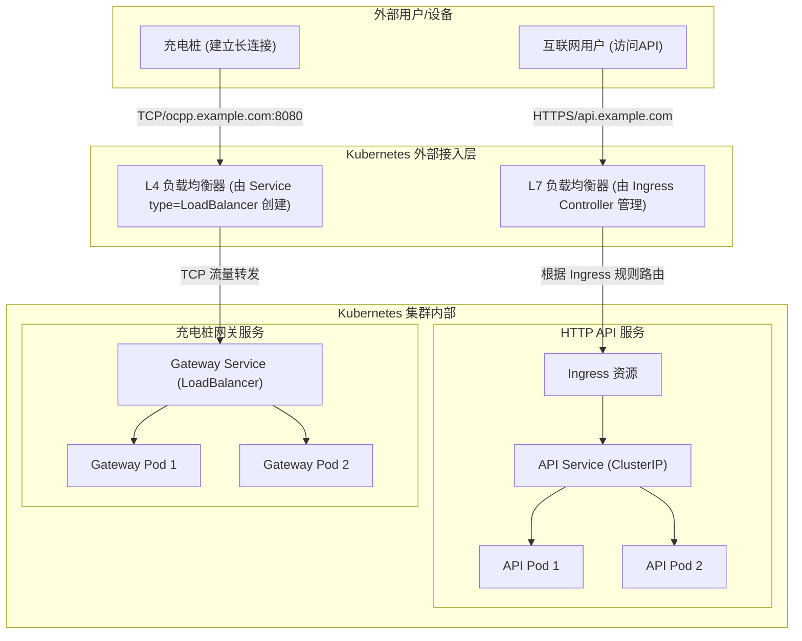
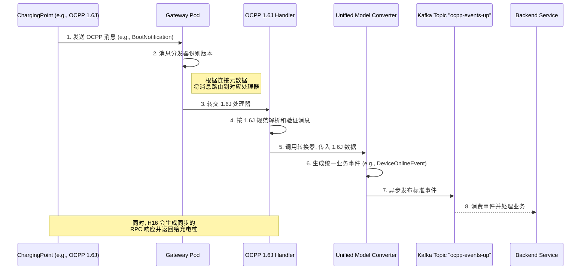
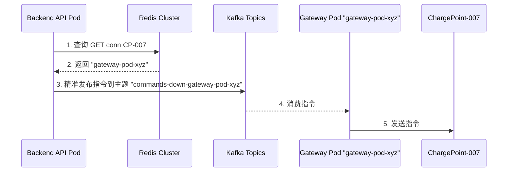

# 高可用充电桩网关 - Kubernetes 原生架构设计

## 1. 概述

本文档旨在为支持数十万乃至百万级充电桩连接的高性能、高可用网关系统，提供一套基于 Kubernetes 的原生架构设计方案。方案的核心目标是实现水平可伸缩性、高可用性、低延迟和可维护性。

## 2. 核心设计原则

*   **云原生优先**: 全面拥抱 Kubernetes 生态，利用其内置能力（服务发现、配置管理、弹性伸缩、自愈）简化系统架构和运维。
*   **无状态网关**: 网关节点（Pod）自身不存储任何关键业务状态，使其可以被随意替换、扩展或缩减，为高可用和弹性伸缩奠定基础。
*   **分层解耦**: 严格划分接入层、网关逻辑层、消息总线和后端服务层，确保各层可以独立演进和扩展。
*   **消息驱动**: 上下行数据流均通过消息队列（Kafka）进行异步解耦，提升系统整体的韧性和吞吐能力。

## 3. 最终架构方案

系统完全部署在 Kubernetes 集群之上，并针对不同类型的流量采用最优的暴露策略。

### 3.1. 整体架构图

### 3.2. 关键组件职责

*   **L4 负载均衡器**: 由 `Service` of `type: LoadBalancer` 自动创建和管理。负责处理充电桩的 TCP 长连接，以 TCP 透传模式工作，性能极高。
*   **L7 负载均衡器**: 由 `Ingress Controller` (如 Nginx, Traefik) 负责管理。负责处理所有后端的 HTTP/HTTPS 流量，提供基于域名和路径的智能路由。
*   **Gateway Pods**:
    *   无状态的网关应用实例，是整个网关的核心逻辑载体。
    *   **连接管理**: 维护与充电桩的 WebSocket 长连接。
    *   **消息分发与版本处理**: 内部分层，包含一个统一的 **消息分发器**，以及针对不同 OCPP 版本（如 1.6J, 2.0.1）的 **版本处理器 (Version Handler)**。
    *   **协议转换**: 版本处理器负责解析特定版本的 OCPP 消息，并调用 **统一业务模型转换器 (Unified Model Converter)**，将其转换为平台内部标准的业务事件（如 `DeviceOnlineEvent`, `MeterValuesEvent`）。
    *   **消息发布**: 将转换后的标准业务事件发布到 Kafka 的上行主题。
    *   **指令消费**: 订阅属于自己的下行指令 Kafka 主题，并将标准指令通过“版本处理器”逆向转换为特定版本的 OCPP 消息后下发。
*   **API Pods**: 后端业务逻辑服务，如用户、订单、计费等。
*   **Redis Cluster**: 作为分布式状态存储，核心是存储充电桩与 Gateway Pod 的动态映射关系，为下行指令路由提供支持。
*   **Kafka Cluster**: 作为系统的消息总线，解耦上行数据流和下行指令流。

## 4. 核心流程设计

### 4.1. 上行数据流 (网关内部逻辑)

上行数据流的核心在于 Gateway Pod 内部的分层处理逻辑，它将 `充电桩网关数据流概述.md` 中的设计思想落地。

**流程图**:

**工作流程详解**:

1.  **消息接收与分发**: 充电桩的 OCPP 消息通过 WebSocket 到达 Gateway Pod。Pod 内的**消息分发器**根据连接建立时确定的协议版本（如 OCPP 1.6J），将消息路由给对应的**版本处理器**（`Ocpp16Handler`）。
2.  **版本特定处理**: `Ocpp16Handler` 负责该版本协议的所有细节，包括报文的合法性校验、字段解析等。
3.  **模型转换**: 解析完成后，`Ocpp16Handler` 会调用**统一业务模型转换器**，将版本特定的数据结构（如 1.6J 的 `BootNotification` Payload）转换为平台内部统一的、与协议版本无关的业务模型（例如 `DeviceOnlineEvent`）。
4.  **事件发布**: 转换器将这个标准化的业务事件发布到 Kafka 的上行主题（如 `ocpp-events-up`）。
5.  **后端消费**: 后端业务服务（API Pods）订阅此主题，消费标准化的事件进行业务处理。它们无需关心事件最初来自哪个 OCPP 版本，实现了彻底的解耦。
6.  **同步响应**: 与此同时，`Ocpp16Handler` 会根据 OCPP 的 RPC 规范，生成一个同步的响应消息（如 `BootNotification.conf`），通过原路返回给充电桩。

### 4.2. 下行指令路由 (方案B: 目标路由)

我们采用性能和扩展性更优的目标路由方案。

**工作流程**:

1.  **连接注册**: 当充电桩 `CP-007` 连接到 `gateway-pod-xyz` 时，该 Pod 在 Redis 中注册映射关系：`SET conn:CP-007 gateway-pod-xyz`。
2.  **指令发布**:
    *   后端 API 服务在发送指令前，**先查询 Redis**：`GET conn:CP-007`，得到结果 `gateway-pod-xyz`。
    *   根据查询结果，后端服务将指令**精确地发布**到目标主题 `commands-down-gateway-pod-xyz`。
3.  **指令处理**:
    *   只有 `gateway-pod-xyz` 会订阅并收到这条指令。
    *   `gateway-pod-xyz` 收到后，通过内存中的 WebSocket 连接句柄，将指令准确下发给 `CP-007`。

**时序图**:

### 4.3. 节点故障转移

Kubernetes 的自愈能力与我们的无状态设计相结合，实现了自动化的故障转移。

1.  **故障检测**: K8s 的 `kubelet` 会检测到某个 Gateway Pod 异常，并将其标记为不健康。`Service` 会自动停止向其转发流量。
2.  **自动重连**: 充电桩发现 TCP 连接断开，会发起自动重连。
3.  **重新路由与注册**:
    *   重连请求通过 L4 负载均衡器被路由到一个新的、健康的 Gateway Pod。
    *   新的 Gateway Pod 与充电桩建立连接，并**更新 Redis 中的连接映射**，将桩的归属指向自己。
4.  **系统自愈**: 系统恢复正常，后续的下行指令会通过新的映射关系被正确路由。

## 5. 总结

本方案利用 Kubernetes 的核心能力，构建了一个健壮、可扩展、易于维护的充电桩网关系统。通过将网关无状态化，并采用基于 Redis 和 Kafka 的目标路由方案，我们成功地将复杂的分布式系统问题分解为一系列清晰、可管理的模块，为未来业务的增长奠定了坚实的基础。

