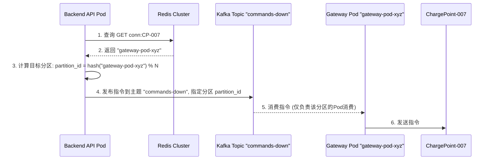
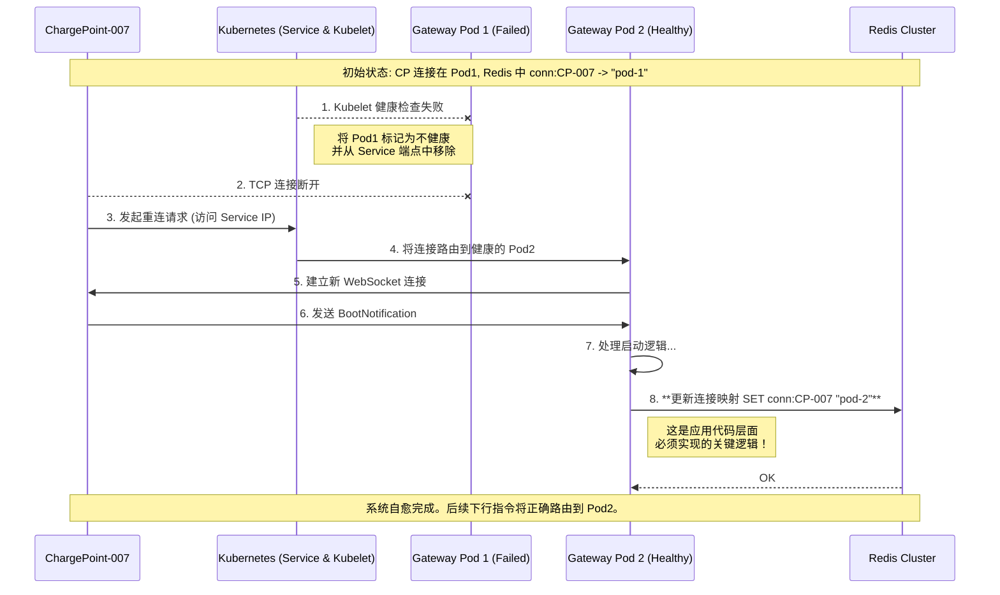

# 高可用充电桩网关 - Kubernetes 原生架构设计

## 1. 概述

本文档旨在为支持数十万乃至百万级充电桩连接的高性能、高可用网关系统，提供一套基于 Kubernetes 的原生架构设计方案。方案的核心目标是实现水平可伸缩性、高可用性、低延迟和可维护性。

## 2. 核心设计原则

*   **云原生优先**: 全面拥抱 Kubernetes 生态，利用其内置能力（服务发现、配置管理、弹性伸缩、自愈）简化系统架构和运维。
*   **无状态网关**: 网关节点（Pod）自身不存储任何关键业务状态，使其可以被随意替换、扩展或缩减，为高可用和弹性伸缩奠定基础。
*   **分层解耦**: 严格划分接入层、网关逻辑层、消息总线和后端服务层，确保各层可以独立演进和扩展。
*   **消息驱动**: 上下行数据流均通过消息队列（Kafka）进行异步解耦，提升系统整体的韧性和吞吐能力。

## 3. 最终架构方案

系统完全部署在 Kubernetes 集群之上，并针对不同类型的流量采用最优的暴露策略。

### 3.1. 整体架构图


### 3.2. 关键组件职责

*   **L4 负载均衡器**: 由 `Service` of `type: LoadBalancer` 自动创建和管理。负责处理充电桩的 TCP 长连接，以 TCP 透传模式工作，性能极高。
*   **L7 负载均衡器**: 由 `Ingress Controller` (如 Nginx, Traefik) 负责管理。负责处理所有后端的 HTTP/HTTPS 流量，提供基于域名和路径的智能路由。
*   **Gateway Pods**:
    *   无状态的网关应用实例，是整个网关的核心逻辑载体。
    *   **连接管理**: 维护与充电桩的 WebSocket 长连接。
    *   **消息分发与版本处理**: 内部分层，包含一个统一的 **消息分发器**，以及针对不同 OCPP 版本（如 1.6J, 2.0.1）的 **版本处理器 (Version Handler)**。
    *   **协议转换**: 版本处理器负责解析特定版本的 OCPP 消息，并调用 **统一业务模型转换器 (Unified Model Converter)**，将其转换为平台内部标准的业务事件（如 `DeviceOnlineEvent`, `MeterValuesEvent`）。
    *   **消息发布**: 将转换后的标准业务事件发布到 Kafka 的上行主题。
    *   **指令消费**: 订阅属于自己的下行指令 Kafka 主题，并将标准指令通过“版本处理器”逆向转换为特定版本的 OCPP 消息后下发。
*   **API Pods**: 后端业务逻辑服务，如用户、订单、计费等。
*   **Redis Cluster**: 作为分布式状态存储，核心是存储充电桩与 Gateway Pod 的动态映射关系，为下行指令路由提供支持。
*   **Kafka Cluster**: 作为系统的消息总线，解耦上行数据流和下行指令流。

## 4. 核心流程设计

### 4.1. 上行数据流 (网关内部逻辑)

上行数据流的核心在于 Gateway Pod 内部的分层处理逻辑，它将 `充电桩网关数据流概述.md` 中的设计思想落地。

**流程图**:


**工作流程详解**:

1.  **消息接收与分发**: 充电桩的 OCPP 消息通过 WebSocket 到达 Gateway Pod。Pod 内的**消息分发器**根据连接建立时确定的协议版本（如 OCPP 1.6J），将消息路由给对应的**版本处理器**（`Ocpp16Handler`）。
2.  **版本特定处理**: `Ocpp16Handler` 负责该版本协议的所有细节，包括报文的合法性校验、字段解析等。
3.  **模型转换**: 解析完成后，`Ocpp16Handler` 会调用**统一业务模型转换器**，将版本特定的数据结构（如 1.6J 的 `BootNotification` Payload）转换为平台内部统一的、与协议版本无关的业务模型（例如 `DeviceOnlineEvent`）。
4.  **事件发布**: 转换器将这个标准化的业务事件发布到 Kafka 的上行主题（如 `ocpp-events-up`）。
5.  **后端消费**: 后端业务服务（API Pods）订阅此主题，消费标准化的事件进行业务处理。它们无需关心事件最初来自哪个 OCPP 版本，实现了彻底的解耦。
6.  **同步响应**: 与此同时，`Ocpp16Handler` 会根据 OCPP 的 RPC 规范，生成一个同步的响应消息（如 `BootNotification.conf`），通过原路返回给充电桩。

### 4.2. 下行指令路由 (方案B: 目标路由 - 共享主题 + 分区路由)

为了解决 Kafka 主题爆炸问题 (R002)，我们采用更具扩展性和运维友好性的“共享主题 + 分区路由”方案。

**工作流程**:

1.  **连接注册**: 当充电桩 `CP-007` 连接到 `gateway-pod-xyz` 时，该 Pod 在 Redis 中注册映射关系：`SET conn:CP-007 gateway-pod-xyz`。
2.  **指令发布**:
    *   后端 API 服务在发送指令前，**先查询 Redis**：`GET conn:CP-007`，得到目标 `gateway-pod-xyz`。
    *   后端服务对目标 `gateway-pod-xyz` 进行哈希计算，并根据预设的分区总数（例如 128 个分区）确定目标分区号：`partition_id = hash("gateway-pod-xyz") % 128`。
    *   后端服务将指令发布到**统一的下行主题** `commands-down`，并指定发送到计算出的 `partition_id`。
3.  **指令处理**:
    *   每个 Gateway Pod 在启动时，会根据自己的 Pod ID 计算出自己负责消费的特定分区范围。
    *   只有负责该 `partition_id` 的 Gateway Pod 会订阅并收到这条指令。
    *   该 Gateway Pod 收到后，通过内存中的 WebSocket 连接句柄，将指令准确下发给 `CP-007`。

**时序图**:



### 4.3. 节点故障转移 (Failover)

Kubernetes 的自愈能力与我们“无状态网关+外部状态存储”的应用设计相结合，实现了自动化的、无缝的故障转移。这正是本架构高可用设计的核心体现。

**流程图**:



**工作流程详解**:

1.  **故障检测 (基础设施层)**: K8s 的 `kubelet` 通过健康检查发现 `Gateway Pod 1` 异常。K8s 控制平面会立即将其从 `Service` 的可用端点 (Endpoints) 列表中移除。从此，新的流量不会再被路由到这个故障 Pod。
2.  **连接中断**: 所有与 `Gateway Pod 1` 保持连接的充电桩会发现 TCP 连接断开。
3.  **自动重连 (设备层)**: 根据 OCPP 规范，充电桩在连接断开后会立即发起自动重连。它访问的仍然是 K8s `Service` 对外暴露的那个稳定 IP 地址。
4.  **重新路由 (基础设施层)**: K8s `Service` 接收到重连请求，并将其转发到一个当前健康的 `Gateway Pod`，例如 `Gateway Pod 2`。
5.  **逻辑恢复 (应用代码层)**:
    *   `Gateway Pod 2` 接收到新的连接，并处理充电桩发送的第一个 `BootNotification` 消息。
    *   在处理逻辑中，`Gateway Pod 2` 的代码会**主动地、强制地**去 Redis 中执行 `SET conn:<ChargePointID> <自己的PodID>` 操作。
    *   这个 `SET` 操作会**覆盖**掉之前由 `Gateway Pod 1` 写入的旧值，从而将充电桩的“逻辑归属”更新为自己。
6.  **系统自愈**: 至此，故障转移的“物理链路”和“逻辑链路”都已完全恢复。当后端平台下次需要给该桩发送指令时，会从 Redis 查询到最新的、正确的 Pod 地址，实现指令的准确投递。

## 5. 总结

本方案利用 Kubernetes 的核心能力，构建了一个健壮、可扩展、易于维护的充电桩网关系统。通过将网关无状态化，并采用基于 Redis 和 Kafka 的目标路由方案，我们成功地将复杂的分布式系统问题分解为一系列清晰、可管理的模块，为未来业务的增长奠定了坚实的基础。


---

## 6. 详细技术设计与选型 (Go)

本章节规定了项目实现阶段的具体技术选型、目录结构和核心接口定义，作为编码工作的核心准则。

### 6.1. 推荐技术栈

为确保项目的稳定性、高性能和可维护性，我们选用以下在 Go 社区中经过广泛验证的库：

*   **WebSocket**: `gorilla/websocket` - Go 社区事实上的标准库，功能强大且稳定。
*   **Kafka**: `Shopify/sarama生态较小` - 一个现代化的、高性能的 Kafka 客户端。
*   **Redis**: `go-redis/redis` - 功能最全面的 Redis 客户端，支持哨兵和集群模式。
*   **配置管理**: `spf13/viper` - 强大的配置解决方案，能从文件、环境变量等多种来源读取配置。
*   **日志**: `rs/zerolog` - 一个零内存分配的、高性能的结构化日志库，非常适合生产环境。
*   **HTTP 路由 (用于健康检查等)**: `gorilla/mux` - 一个强大且灵活的 HTTP 路由器，可以与 `gorilla/websocket` 很好地配合。

### 6.2. 项目目录结构

我们将遵循标准的 Go 项目布局，以实现关注点分离和高内聚、低耦合的目标：

```
charge-point-gateway/
├── cmd/
│   └── gateway/
│       └── main.go         # 程序入口, 负责组装和启动所有服务
├── internal/
│   ├── domain/             # 统一业务模型 (OCPP 结构体, 统一事件模型)
│   ├── gateway/            # WebSocket 服务器, 连接管理, 读写循环
│   ├── handler/            # OCPP 版本处理器 (Handler), 业务模型转换器 (Converter)
│   ├── message/            # Kafka 生产者和消费者客户端
│   └── storage/            # Redis 客户端及相关操作 (e.g., SET/GET 连接映射)
├── pkg/                    # (可选) 未来可供外部使用的代码
├── api/                        # API定义和文档
│   ├── openapi.yaml           # HTTP API规范
│   └── kafka-schemas/         # Kafka消息Schema
├── configs/                    # 配置文件
├── deployments/               # 部署配置
│   ├── k8s/                   # Kubernetes配置
│   └── docker-compose.yml     # 本地开发环境
├── scripts/                   # 构建和部署脚本
├── docs/                      # 网关专用文档
├── go.mod
└── Dockerfile
```


---

## 7. 架构风险评估与缓解

本章节整合了对当前充电桩网关架构设计的批判性审视，识别并分析其中存在的关键风险点和潜在的不合理之处。理解这些风险有助于我们在实施阶段进行更精细的设计和更全面的考量。

### 7.1. 风险评估矩阵

| 风险ID | 风险描述 | 风险等级 | 影响程度 | 发生概率 | 优先级 |
|--------|----------|----------|----------|----------|--------|
| R001 | 故障转移期间指令丢失 | 严重 | 高 | 中 | P1 |
| R002 | Kafka主题爆炸问题 | 严重 | 高 | 高 | P1 |
| R003 | Redis连接映射一致性问题 | 高 | 中 | 中 | P2 |
| R004 | 缺少背压和流控机制 | 高 | 中 | 高 | P2 |
| R005 | 监控和可观测性不足 | 中 | 中 | 高 | P3 |
| R006 | 安全性设计缺失 | 中 | 高 | 低 | P3 |
| R007 | 技术选型潜在问题 | 中 | 低 | 中 | P4 |

### 7.2. 详细风险分析

#### 🚨 R001: 故障转移期间指令丢失风险 (严重)

**风险描述**: 
在Gateway Pod故障转移过程中，存在一个"指令黑洞窗口期"。当充电桩正在重连但Redis映射尚未更新时，后端发送的指令会路由到已故障的Pod，导致指令永久丢失。

**业务影响**:
- 关键指令（紧急停止、远程启动）丢失
- 用户无法正常使用充电服务
- 可能导致安全事故
- 客户投诉和品牌声誉损失

**技术影响**:
- 系统可靠性严重下降
- 故障恢复时间延长
- 运维复杂度增加

**发生场景**:
```
时刻T1: CP-007连接在Pod1，Redis中conn:CP-007 -> pod-1
时刻T2: Pod1故障，CP-007连接断开
时刻T3: 后端发送指令，查询Redis得到pod-1
时刻T4: 指令发送到commands-down-pod-1主题，但无消费者
时刻T5: CP-007重连到Pod2，更新Redis为conn:CP-007 -> pod-2
结果: T3-T5期间的指令全部丢失
```

**缓解措施**:
1.  **指令确认和重试机制**: 后端服务发送指令后，应等待网关的确认。如果未收到确认或收到失败确认，则进行重试。
2.  **指令超时和死信队列**: 为指令设置合理的超时时间。超时未处理的指令应进入死信队列，以便人工干预或后续分析。
3.  **指令状态追踪**: 在后端维护指令的生命周期状态（待发送、已发送、已确认、失败），方便追踪和排查。
4.  **指令优先级机制**: 区分紧急指令和非紧急指令，对紧急指令采用更严格的重试和监控策略。

#### 🚨 R002: Kafka主题爆炸问题 (严重)

**风险描述**:
当前设计为每个Gateway Pod创建专用的Kafka主题，导致主题数量随Pod数量线性增长。

**业务影响**:
- 系统扩展性受限
- 运维成本急剧增加
- 新Pod启动时间延长

**技术影响**:
- Kafka集群性能下降
- 内存和存储资源浪费
- 主题管理复杂度指数级增长

**数量级分析**:
```
100个Pod = 100个主题 (可接受)
1000个Pod = 1000个主题 (性能下降)
10000个Pod = 10000个主题 (不可行)
```

**缓解措施 (推荐)**:
1.  **使用分片主题替代专用主题**: 放弃“一 Pod 一主题”的模型。只创建一个统一的下行主题，例如 `commands-down`，但为其分配大量的分区（如 128 个）。
2.  **消息路由机制**: 后端服务查询 Redis 得到目标 Pod ID (`gateway-pod-xyz`) 后，对 Pod ID 进行哈希计算，`hash("gateway-pod-xyz") % <分区总数>`，得到一个分区号，然后将指令**精确地发送到该分区**。
3.  **消费逻辑**: 每个 Gateway Pod 在启动时，也通过哈希计算得知自己应该消费哪个分区，并只从该分区拉取消息。
4.  **动态主题管理**: 尽管推荐使用分片主题，但如果确实需要动态主题，则必须实现自动化的主题创建和清理机制（例如，通过 K8s Operator 或定时任务）。

#### ⚠️ R003: Redis连接映射一致性问题 (高)

**风险描述**:
连接映射更新缺乏原子性和一致性保证，可能导致脑裂、并发更新冲突等问题。

**业务影响**:
- 指令路由错误
- 设备状态不一致
- 用户体验下降

**技术影响**:
- 数据一致性问题
- 调试困难
- 系统稳定性下降

**问题场景**:
```
脑裂场景:
T1: Pod1网络分区但进程存活
T2: CP-007重连到Pod2，Redis更新为pod-2
T3: Pod1网络恢复，错误地重新注册为pod-1
T4: 指令路由混乱
```

**缓解措施**:
1.  **使用 Lua 脚本确保原子性**: 在 Redis 中使用 Lua 脚本执行复合操作（如检查旧值并更新），确保操作的原子性。
2.  **添加时间戳和版本控制**: 在 Redis 映射值中包含时间戳或版本号。Gateway Pod 在更新时，只更新比当前 Redis 中记录的时间戳更新的连接信息。
3.  **实现 TTL 机制**: 为 Redis 中的连接映射设置合理的过期时间 (TTL)。即使 Pod 异常退出未能清理，映射也会自动失效，避免“僵尸”数据。
4.  **定期一致性检查**: 后端服务或独立的后台任务定期扫描 Redis 映射，与实际连接状态（通过网关的内部 API 或 K8s Pod 状态）进行比对，纠正不一致的数据。

#### ⚠️ R004: 缺少背压和流控机制 (高)

**风险描述**:
系统缺乏过载保护机制，在高并发场景下可能导致服务崩溃。

**业务影响**:
- 服务不可用
- 响应时间急剧增加
- 级联故障风险

**技术影响**:
- 内存溢出
- CPU使用率过高
- 连接泄漏

**缓解措施**:
1.  **实现连接数限制**: 在 WebSocket 服务器层面限制单个 Gateway Pod 可以接受的最大并发连接数。
2.  **添加消息处理速率限制**: 对单个充电桩或整个网关的消息处理速率进行限制，防止恶意或异常的流量冲击。
3.  **实现优雅降级**: 在系统过载时，可以优先处理关键消息，对非关键消息进行丢弃或延迟处理。
4.  **添加熔断机制**: 当下游依赖（如 Kafka, Redis）出现故障或延迟时，网关应能及时熔断对这些依赖的调用，防止自身被拖垮。
5.  **使用 Go 的 Context 和 Goroutine 池**: 限制并发 Goroutine 的数量，避免无限创建 Goroutine 导致资源耗尽。

#### R005: 监控和可观测性不足 (中)

**风险描述**:
当前设计中，监控和可观测性方面描述不足，可能导致问题发现不及时、排查困难。

**业务影响**:
- 故障发现延迟
- 故障恢复时间延长
- 运维效率低下

**技术影响**:
- 无法有效评估系统性能
- 难以定位瓶颈和异常

**缓解措施**:
1.  **定义关键指标**: 明确网关层面的核心指标，包括连接数、消息吞吐量（上行/下行）、消息处理延迟、错误率、CPU/内存使用率、GC 情况等。
2.  **实现监控大盘**: 使用 Prometheus + Grafana 等工具构建全面的监控大盘，实时展示系统健康状况。
3.  **配置告警规则**: 基于关键指标设置告警阈值，并通过短信、邮件、钉钉等方式及时通知运维人员。
4.  **建立日志规范**: 统一日志格式（结构化日志，如 JSON），包含 Trace ID，方便分布式追踪和日志分析。
5.  **引入分布式追踪**: 使用 OpenTelemetry 等工具实现分布式追踪，帮助追踪请求在各个服务间的流转，快速定位问题。

#### R006: 安全性设计缺失 (中)

**风险描述**:
当前架构设计中，安全性方面描述不足，可能存在潜在的安全漏洞。

**业务影响**:
- 数据泄露
- 服务被攻击或滥用
- 法律合规风险

**技术影响**:
- 系统被入侵
- 资源被非法占用

**缓解措施**:
1.  **设备认证与授权**: 严格执行 OCPP 协议中的设备认证机制（如基于证书的 TLS 客户端认证），确保只有合法充电桩才能连接。
2.  **消息加密**: 确保 WebSocket 连接使用 TLS/WSS 进行加密传输，保护数据在传输过程中的机密性。
3.  **DDoS 防护**: 在 L4/L7 负载均衡器层面配置 DDoS 防护策略。
4.  **输入校验与过滤**: 对所有来自充电桩的输入数据进行严格的格式和内容校验，防止注入攻击或畸形数据导致服务崩溃。
5.  **最小权限原则**: 网关 Pod 运行在最小权限的 Kubernetes Service Account 下。
6.  **安全审计**: 定期进行安全审计和漏洞扫描。

#### R007: 技术选型潜在问题 (中)

**风险描述**:
尽管已选择 Go 语言，但团队对新语言的学习曲线、特定库的潜在问题、以及未来维护的挑战仍是潜在风险。

**业务影响**:
- 开发效率初期下降
- 项目延期风险
- 招聘难度增加

**技术影响**:
- 代码质量不稳定
- 难以快速解决复杂问题

**缓解措施**:
1.  **加强团队培训**: 提供 Go 语言和相关库的培训，组织内部知识分享。
2.  **代码审查**: 严格执行代码审查，确保代码质量和规范。
3.  **引入静态分析工具**: 使用 Go Lint, Go Vet 等工具进行代码静态分析。
4.  **小步快跑**: 初期选择核心功能进行迭代开发，逐步积累经验。
5.  **社区参与**: 积极关注 Go 社区和所选库的更新，及时获取支持。

## 8. 总结

这份风险评估报告是对我们架构设计的一次重要补充。通过系统性地识别和分析这些风险，并制定相应的缓解策略，我们可以构建一个更加健壮、可靠和安全的充电桩网关系统。这些风险点将指导我们在后续的实施和运维阶段进行更精细的考量和投入。
