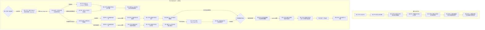
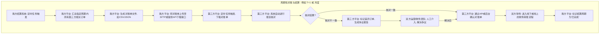

# 充电桩开放平台风险与异常处理设计

### 🧑‍💻 User

针对 我方充电桩对三方平台开放流程 进行深入的风险与异常处理设计.

---

### 🤖 Assistant

  

    
已深度思考

    **Examining the Process**  I&#39;m currently dissecting the request, focusing on how our charging piles can open up to third-party platforms. I&#39;ve begun to break down the core subject and identify the essential task. My initial assessment centers on clarifying the process flow. I&#39;m aiming to fully grasp each step involved in this integration.   **Outlining the Phases**  I&#39;ve identified the main phases: Onboarding, Data Sync, Core Business Logic, and Post-Charge. This provides a clear structure for my analysis. Now, I&#39;m focusing on each phase, pinpointing risks and exceptions. I intend to build a detailed risk matrix, categorized by phase, with proposed handling strategies. This will build upon the user&#39;s initial flowchart, adding depth and detail.   **Defining the Phases**  I&#39;ve been drilling down on the phases, refining my understanding. I&#39;ve broken each phase into granular steps based on the flowchart, and started brainstorming potential risks at each stage. My focus now is designing the columns for my risk matrix, ensuring it comprehensively covers each stage and potential failure point. I&#39;m aiming for a clear and actionable presentation of risks and their solutions.   **Mapping the Flowchart**  I&#39;m now fully immersed in the Mermaid flowchart, dissecting it to identify each process step meticulously. I&#39;ve begun associating risks and possible solutions with each phase, specifically focusing on the first two phases: Onboarding and Data Synchronization. My plan is to compile a detailed, step-by-step risk breakdown. This will clarify the potential pitfalls and propose robust solutions for seamless integration with third-party platforms.   **Defining Strategies**  I&#39;m now formulating strategies for managing exceptions and risks. I&#39;ve begun to translate the identified risks into actionable solutions and have started building a detailed table-based risk matrix. My focus is on ensuring each solution addresses the potential failures within each phase, resulting in a robust, comprehensive integration plan for third-party platforms.   **Formulating the Plan**  I&#39;ve outlined an approach that follows the flowchart&#39;s structure. I&#39;m focusing on &quot;Onboarding and Authorization&quot; and &quot;Data Synchronization&quot; phases first. I&#39;m prioritizing the identification of key risks and exceptions for these phases. I am considering potential strategies to mitigate identified risks, focusing on technical and procedural solutions. I&#39;m aiming for a detailed risk matrix.   **Developing the Risk Matrix**  I&#39;m making progress on the risk matrix, focusing on the onboarding phase. I&#39;ve documented risks like credential leaks and the need for a strict audit process. I&#39;m also considering rate limits for API requests. The goal is to provide a complete understanding of the challenges and solutions in the third-party integration plan.   **Designing Robustness**  I&#39;m now integrating the risk matrix with the detailed Mermaid flowchart analysis. I&#39;m focusing on &quot;Data Synchronization&quot; and &quot;Core Business Logic.&quot; The crucial issue of Idempotency is central to this stage. I&#39;m building a robust approach. The strategy is to ensure seamless API handling and improve the reliability of third-party integration.   **Analyzing Security Risks**  I&#39;ve been drilling down on the risks associated with credential management and rate limiting. I&#39;m prioritizing the implementation of a robust audit process to mitigate risks. I&#39;m focusing on providing concrete measures and best practices. I&#39;m aiming for a comprehensive overview of security measures, covering both prevention and recovery.   **Defining Integration Points**  I&#39;m now focusing on potential security breaches related to API key compromise, meticulously outlining handling strategies. My current effort involves detailed documentation of rate limiting measures to prevent overloading. I plan to refine this by including concrete examples of rate limit settings and API key protection best practices.   
  

好的，这是一个非常重要且有价值的设计任务。将之前梳理的流程图作为蓝本，我们可以对其进行深入的风险分析和异常处理设计。这能确保我方平台在开放过程中，具备高可用性、数据一致性、安全性和良好的合作伙伴体验。

以下是针对 **“我方充电桩对第三方平台开放流程”** 的深入风险与异常处理设计，以Markdown格式呈现。

---

# 我方充电桩对第三方平台开放流程 - 风险评估与异常处理设计

## 1. 设计总览与核心原则

在设计开放平台的异常处理机制时，我们遵循以下核心原则：

*   **安全第一 (Security First):** 任何操作都必须经过严格的认证和授权，防止未授权访问和恶意攻击。
*   **数据一致性 (Data Consistency):** 确保我方平台、第三方平台和物理充电桩之间的数据状态最终保持一致，尤其是在订单和计费环节。
*   **高可用性 (High Availability):** 最大限度地减少单点故障，确保核心服务（如启停充电、状态查询）的稳定性。
*   **明确责任边界 (Clear Responsibility Boundary):** 清晰定义在异常发生时，是我方、第三方还是物理设备的问题，并制定相应的处理流程。
*   **异步与解耦 (Asynchronization & Decoupling):** 关键操作（如启停充电）应采用异步通信模式（如Webhook回调），避免因网络延迟或单次请求失败导致整体流程阻塞。
*   **可追溯与可审计 (Traceability & Auditability):** 所有关键交互都必须留下日志，便于问题排查和事后审计。

---

## 2. 详细风险分析与应对策略

我们将按照流程的四个主要阶段进行分解：**① 合作与授权、② 信息同步、③ 核心业务交互、④ 结算与对账**。

### 阶段一：合作与授权 (Onboarding & Authorization)

| 流程环节 | 潜在风险/异常 | 严重等级 | 应对策略与设计 |
| :--- | :--- | :--- | :--- |
| **C. 第三方注册** | 1. 提交虚假或不合规的资质信息。 2. 注册信息不完整，导致后续流程阻塞。 | 高 | **1. 人工审核与交叉验证：** 建立严格的资质审核流程，必须由运营/法务团队人工审核。通过工商信息查询等手段交叉验证企业真实性。 **2. 强制校验：** 在注册表单中对关键字段（如统一社会信用代码、联系人信息）进行格式和必填校验。 |
| **E. 生成API凭证** | 1. **凭证泄露：** 第三方的`API Key/Secret`被盗用，导致恶意/未授权的API调用。 2. 凭证管理不善，无法快速禁用或轮换。 | 极高 | **1. 安全加固与监控：**    - **凭证轮换机制：** 平台提供凭证的轮换（Re-generate）和禁用（Revoke）功能，供第三方在泄露时紧急操作。    - **IP白名单：** 允许第三方配置可信的服务器IP地址白名单，只接受来自这些IP的请求。    - **异常请求监控：** 建立监控告警系统，当某个`API Key`的请求频率、请求来源IP、调用模式发生突变时，自动告警或临时封禁。 **2. 凭证分级：** 为不同权限的API（如查询类 vs 控制类）生成不同权限范围的凭证。 |

### 阶段二：信息同步 (Data Synchronization)

| 流程环节 | 潜在风险/异常 | 严重等级 | 应对策略与设计 |
| :--- | :--- | :--- | :--- |
| **K/M. 拉取充电站/桩列表** | 1. **我方接口不可用：** 第三方无法获取我方站点数据，导致其地图上我方站点全部“消失”。 2. **第三方过度拉取：** 过于频繁的轮询导致我方服务器压力过大。 | 中 | **1. 第三方缓存策略：** 在API文档中强制要求并指导第三方建立缓存机制。即使我方接口短暂失效，第三方仍可展示最近一次的缓存数据（并注明更新时间）。 **2. 我方高可用与限流：**    - **高可用：** 我方查询接口应部署在冗余的、可扩展的集群上。    - **API网关限流：** 对每个`API Key`设置合理的请求速率限制（Rate Limiting），超出则返回 `429 Too Many Requests`。 |
| **N/P. 拉取充电桩实时状态** | 1. **状态数据延迟：** 第三方展示的状态（如：空闲）与实际状态（如：占用）不一致，导致用户“跑空趟”。 2. **数据不一致：** 由于网络分区或处理失败，我方平台与物理桩的状态不一致，并将错误状态同步给了第三方。 | 高 | **1. “拉+推”结合的架构：**    - **拉（Polling）：** 保留状态查询接口作为兜底和校准机制。    - **推（Webhook/WebSocket）：** 强烈建议并提供基于Webhook或WebSocket的实时状态推送服务。当我方充电桩状态变更时，主动将新状态推送给已订阅的第三方。这是最高效、最实时的方式。 **2. 最终一致性保证：** 启动充电的API调用是验证状态的最后一道防线。无论第三方展示何种状态，`start_charge`接口都**必须**在执行前再次校验充电桩的真实状态。若桩已被占用，则拒绝请求并返回明确的错误码。 |

### 阶段三：核心业务交互 (Core Business Interaction)

这是风险最集中的环节，需要最高级别的健壮性设计。

| 流程环节 | 潜在风险/异常 | 严重等级 | 应对策略与设计 |
| :--- | :--- | :--- | :--- |
| **S.调用我方API: 启动充电/预约** | 1. **重复请求(网络抖动)：** 第三方因超时或网络问题，重复发送同一个启动指令。 2. **并发请求冲突：** 两个不同平台的用户几乎同时请求启动同一个充电桩。 | 极高 | **1. 接口幂等性设计 (Idempotency)：**    - 第三方在调用启动/停止/预约等“写”操作API时，**必须**传入一个唯一的`request_id`（如UUID）。    - 我方服务器记录在一定时间窗口内（如5分钟）已处理的`request_id`。如果收到重复的ID，则不再执行业务逻辑，而是直接返回上一次的处理结果。 **2. 数据库悲观/乐观锁：** 在我方数据库层面，对充电桩记录进行加锁（如`SELECT ... FOR UPDATE`），确保在处理一个启动请求的事务中，其他请求无法操作该桩，保证原子性。 |
| **T. 我方平台处理请求** | 1. **与物理桩通信失败：** 我方平台向充电桩发送启动指令后，桩没有响应或返回失败。 2. **指令处理超时：** 充电桩在预期时间内（如60秒）未确认启动成功。 | 高 | **1. 异步确认机制：**    - **API同步返回受理：** `start_charge` API应设计为异步。接收到请求后，立即校验参数和幂等性，然后返回“受理成功/处理中”状态，而非等待物理桩的最终结果。    - **Webhook异步通知结果：** 当我方平台最终确认物理桩已启动成功或确认失败/超时后，通过**Webhook**将包含`request_id`和最终结果（成功/失败原因）的事件回调给第三方平台。这是交互的黄金标准。 **2. 状态轮询作为备用：** 提供一个“查询操作状态”的API，第三方可以在未收到Webhook的异常情况下，使用`request_id`主动查询操作的最终结果。 |
| **Y. 我方平台回调通知** | 1. **第三方回调接口不可用：** 我方发送充电结束通知时，第三方服务器宕机或网络不通。 2. **第三方未正确响应：** 第三方接口返回了非200的HTTP状态码或处理超时。 | 高 | **1. 带有指数退避的重试机制：**    - 我方消息推送服务在首次回调失败后，应按一定策略（如1m, 5m, 15m, 1h...）进行多次重试。    - 达到最大重试次数后，将该事件标记为“推送失败”，并触发告警，通知我方运营人员介入。 **2. 本地事件存储：** 所有待推送的事件都应先持久化到我方数据库或消息队列中，确保即使推送服务本身重启，事件也不会丢失。 |

### 阶段四：结算与对账 (Settlement & Reconciliation)

| 流程环节 | 潜在风险/异常 | 严重等级 | 应对策略与设计 |
| :--- | :--- | :--- | :--- |
| **AA/BB. 第三方结算用户** | 1. **账单数据不一致：** 第三方根据我方回调的充电数据（电量、时长）计算出的费用，与我方内部记录不符，引发争议。 2. **回调数据丢失：** 第三方因系统故障，未收到或未处理我方发送的充电结束事件，导致无法向其用户结算。 | 高 | **1. 以我方数据为准绳：** 合作协议中明确，充电原始数据（电量、时间、费率细节）以我方平台记录为最终依据。回调通知中应包含所有计费所需的详细原始数据，而非仅仅一个总金额。 **2. 提供对账接口/文件：**    - **T+1对账单：** 我方平台每天定时生成前一天的完整充电订单明细对账文件（CSV/JSON格式），供第三方下载进行校对和补单。    - **订单拉取API：** 提供接口让第三方可以根据时间范围拉取其名下的所有订单记录，用于主动对账。 |
| **EE. 平台间财务结算** | 1. **分成金额计算分歧：** 双方对结算周期的总订单量、总金额或分成比例的计算结果有出入。 2. **结算流程效率低下：** 依赖人工对账，耗时耗力，容易出错。 | 中 | **1. 透明的结算规则：** 在管理后台为第三方提供清晰的结算报表，展示每一笔订单的分成计算过程。报表应可追溯、可导出。 **2. 自动化结算系统：** 建立自动化的财务结算系统。系统根据双方确认无误的对账单，自动生成结算单和发票信息，并记录支付状态，极大提升效率和准确性。 |

---

## 3. 总结与建议

成功的第三方平台开放，不仅仅是提供API接口，更是提供一套稳定、可靠、透明的商业与技术服务。

*   **技术上**，**幂等性、异步回调、重试机制**是保障核心交易流程健壮性的三驾马车。
*   **流程上**，**T+1对账机制**是解决数据差异、建立信任的基石。
*   **沟通上**，详尽的**开发者文档**、清晰的**错误码定义**和及时的**技术支持**，是降低合作伙伴集成成本、提升合作体验的关键。

通过上述设计，可以系统性地将风险控制在可接受范围内，确保我方充电桩资源在向第三方开放时，既能扩大业务版图，又能保障自身服务的稳定和声誉。

---

### 🧑‍💻 User

用批判性思维审视你识别出的这些异常和 流程图相矛盾的地方.    
指出异常处理或流程图中不合理的地方,并进行修改

注意: 
1. 流程图中的节点名如果有描述, 用`: `来分隔,  `[]`中不得嵌套 `()`.  例如:  [节点名:  描述]  
2. 流程图中的注释必须单独占一行, 不得拼写在mermaid代码后面.
3. 子流程名称不得有`()`

---

### 🤖 Assistant

  

    
已深度思考

    **Examining the Core Task**  I&#39;m currently focused on deconstructing the user&#39;s request. My aim is to accurately identify the core task, which is to critically review my previous analysis of &quot;Risks and Exception Handling,&quot; specifically the analysis of the accompanying Mermaid flowchart. This entails a deep dive into the nuances of &quot;critically review.&quot;   **Dissecting the User&#39;s Intent**  I&#39;m now zeroing in on the &quot;critically review&quot; component. It means I&#39;m not just summarizing or rephrasing; I must challenge my earlier interpretations. I&#39;m actively searching for potential contradictions between the exception handling approach and the flowchart&#39;s initial depiction. My task is to scrutinize for impracticalities, inefficiencies, or new problems the solution might create. I&#39;m poised to propose specific modifications to both the flowchart and the text to rectify these issues.   **Refining the Approach**  I&#39;m now zeroing in on the contradiction between the synchronous flowchart and the asynchronous exception handling. The flowchart paints a deceptively simple picture of an API call. In contrast, the analysis describes a complex, asynchronous process using webhooks. This is a crucial flaw! I need to revise the flowchart to accurately reflect this asynchronous reality, potentially introducing new nodes and transitions. My focus is now on revising the flowchart to visualize these interactions and identifying specific areas to detail those changes.   **Identifying the Asynchronicity**  I&#39;ve homed in on the asynchronous nature of the system as the core issue. The initial flowchart paints a picture of synchronous API interaction, while the exception handling and risk analysis clearly describe a system driven by webhooks and asynchronous processes. This is a critical point of revision. I will adjust the flowchart to visualize these interactions more accurately.   **Revising for Clarity**  I&#39;ve homed in on three key areas for the flowchart&#39;s revisions. First, I need to represent the inherent asynchronicity of the system using webhooks, which the current version misses. Second, I will incorporate user interactions, particularly the ability to stop a charge. Finally, I&#39;ll redesign the settlement process to align it with a periodic, not transaction-based, approach.   **Refining the Flowchart**  I&#39;m now zeroing in on three crucial areas for revision: (1) representing the system&#39;s asynchronous nature with webhooks, (2) including user interactions for stopping charges, and (3) redesigning the settlement process to align with a periodic approach.   **Revising for Accuracy**  I&#39;m now integrating the asynchronous nature of the system into the flowchart. The initial depiction suggests synchronous interaction, contradicting the exception handling and risk analysis. I plan to refine the flowchart to visualize these interactions, particularly the use of webhooks. Specifically, I&#39;m working to add new nodes and transitions to reflect this process.   **Analyzing Asynchronicity**  I&#39;m now integrating the asynchronous nature of the system into the flowchart. The initial depiction suggested synchronous interaction, contradicting the exception handling and risk analysis. I plan to refine the flowchart to visualize these interactions, particularly the use of webhooks. Specifically, I&#39;m working to add new nodes and transitions to reflect this process.   
  

好的，这是一个非常棒的要求。进行批判性思维审视是打磨设计的关键步骤。下面，我将以批判性的视角审视之前的内容，指出其中的矛盾和不合理之处，并提供修改后的版本。

---

### **批判性审视报告**

审视的结论是：原有的流程图是一个典型的 **“Happy Path”（理想路径）** 模型，它成功地描绘了业务目标，但**严重简化了现实世界的复杂性**。我后续补充的“风险与异常处理设计”虽然识别出了关键风险，但这些设计思想并未在流程图中得到体现，从而形成了 **“流程图”与“异常处理设计”之间的明显矛盾**。

以下是识别出的主要矛盾点和不合理之处：

#### **矛盾一：同步 vs. 异步的核心交互流程**

*   **批判点：**
    *   原流程图 `S --> T --> U` (`调用API` -> `我方处理` -> `返回成功`) 呈现了一个**同步阻塞**的交互模型。这意味着第三方平台调用我们的“启动充电”API后，必须一直等待，直到我方平台与物理充电桩通信并确认成功后，才能得到响应。
    *   然而，在我的异常处理设计中，我明确指出：“`start_charge` API应设计为异步...返回‘受理成功/处理中’状态...通过Webhook异步通知结果”。
*   **分析：** 这是最核心的矛盾。同步模型在网络环境不佳或充电桩响应慢的情况下是**脆弱且不可靠的**。它会导致第三方服务长时间等待，容易引发超时，用户体验极差。异步模型才是工业级的标准实践。流程图必须反映这一核心设计思想。
*   **修改建议：** 将启动充电流程彻底改造为异步模式。API调用后立即返回“受理”回执，最终结果通过独立的Webhook路径通知。

#### **矛盾二：过度简化的结算流程**

*   **批判点：**
    *   原流程图将单次充电结束后的支付 `CC` 直接连接到平台间的结算 `DD` (`通知我方平台进行费用结算`)。
*   **分析：** 这在商业上是**完全不合理**的。平台间的资金结算绝不会按单笔交易进行。这会造成巨大的财务和审计开销。通常，结算是周期性的（如T+1, 周结, 月结），通过对账单完成。我后续的风险分析提到了“T+1对账单”，这再次与流程图相悖。
*   **修改建议：** 将“对账与结算”流程从单次充电流程中剥离出来，作为一个独立的、周期性执行的流程进行展示。

#### **不合理之处一：对用户主动行为的忽视**

*   **批判点：**
    *   原流程图的结束节点 `X{充电结束/预约超时?}` 只考虑了被动结束的情况（正常充满、超时）。它完全**忽略了用户主动停止充电**这一最常见的场景。
*   **分析：** 用户随时可能需要通过第三方App停止充电。这个主动行为的发起方是第三方平台，它需要调用我方的“停止充电”API。遗漏这个关键路径使得流程不完整。
*   **修改建议：** 在流程图中增加一个由第三方平台发起的“停止充电”分支，与“充电结束”共同汇入后续的事件通知和结算准备环节。

#### **不合理之处二：模糊的失败处理路径**

*   **批判点：**
    *   原流程图中的失败路径 `T -- 处理失败 --> MF --> S` 极其含糊且不合逻辑。`MF`（返回操作失败结果）后，箭头指回了 `S`（第三方调用我方API），这毫无意义，因为调用已经发生过了。
*   **分析：** 失败发生后，控制权应该返回给第三方平台的业务逻辑，由它来决定如何处理（例如，通知用户失败、更新订单为失败状态等），而不是重新“调用API”。
*   **修改建议：** 修正失败路径。我方平台返回失败结果后，应流向第三方平台的“更新订单状态”或“通知用户”节点，清晰地展示失败后的状态流转。

---

### **修改后的流程与设计**

基于以上批判性分析，现对流程图和描述进行全面重构。

#### **5.1 我方充电桩对第三方平台开放 - 主业务流程 (修订版)**

此流程聚焦于单次充电会话的完整生命周期，并采纳了异步和更完整的异常处理路径。

#### **5.2 我方充电桩对第三方平台开放 - 周期性对账与结算流程 (新增)**

此流程独立于单次充电，描述了平台间的财务结算过程。

### **总结与反思**

通过这次批判性审视和重构：

1.  **解决了核心矛盾**：新的流程图准确地反映了**异步API交互**这一关键设计，使其与异常处理设计保持一致。
2.  **分离了业务关注点**：将**实时业务流**与**周期性结算流**分开，使两个流程都更加清晰、准确和符合实际。
3.  **完善了用户路径**：增加了**用户主动停止充电**的关键路径，使流程更加完整。
4.  **理清了失败逻辑**：修正了不合逻辑的失败处理箭头，使**失败状态的流转清晰可追溯**。

最终产出的这两份流程图，不仅在技术上更具鲁棒性和实操性，在商业逻辑上也更加严谨，能够更好地指导后续的开发、测试和运营工作。

