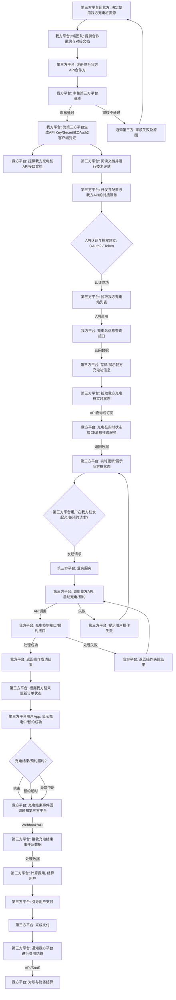

好的，流程名可以优化为：

**我方充电桩对第三方平台开放流程**

或者更具体一些：

**我方充电桩资源第三方平台调用流程** (这个更侧重技术接口调用)

我选择第一个，更加简洁明了，且能体现我们平台作为资源提供方。

---

## 5. 我方充电桩对第三方平台开放流程 (Mermaid Flowchart)

这个流程主要描述了：其他充电服务提供商（第三方平台）如何通过我们的API接口，调用、使用并控制我们自营的充电站和充电桩资源。这与之前第三方接入我们平台是镜像关系。

### 流程解释：

1.  **合作洽谈与授权：**
    *   **第三方平台运营方: 决定使用我方充电桩资源**: 其他平台看到我方充电桩的优势，希望将其整合到自家服务中。
    *   **我方平台D端团队: 提供合作邀约与对接文档**: 我方市场/业务团队向潜在合作方提供合作模式、商业条款和初步的技术对接文档。
    *   **第三方平台: 注册成为我方API合作方**: 第三方平台提交相关企业资质和业务需求。
    *   **我方平台: 审核第三方平台资质**: 我方对第三方进行资质审核、安全评估，并评估商业可行性。
    *   **我方平台: 为第三方平台生成API Key/Secret或OAuth2客户端凭证**: 审核通过后，为合作方生成用于API调用的凭证，这是其对我方接口进行鉴权的依据。
    *   **通知第三方: 审核失败及原因**: 审核不通过时的反馈。

2.  **技术对接与信息获取：**
    *   **我方平台: 提供我方充电桩API接口文档**: 提供详细的API接口文档，说明如何查询充电站信息、桩状态，以及如何发送充电控制指令等。
    *   **第三方平台: 阅读文档并进行技术评估**: 第三方技术团队研究我方API，评估其与自身系统的兼容性和开发工作量。
    *   **第三方平台: 开发并配置与我方API的对接服务**: 第三方根据我方API开发适配器或服务来调用我方接口。
    *   **API认证与授权建立: OAuth2 / Token**: 第三方系统使用其获得的凭证，通过OAuth2流程或直接携带Token来访问我方API，确保通信安全。
    *   **第三方平台: 拉取我方充电站列表**: 第三方通过我方API获取我方自营充电站的基本信息（名称、地址、经纬度、充电站内桩数量等）。
    *   **我方平台: 充电站信息查询接口**: 响应第三方请求，返回我方站点的公开信息。
    *   **第三方平台: 存储/展示我方充电站信息**: 第三方在其C端App或平台中展示我方充电站的信息。
    *   **第三方平台: 拉取我方充电桩实时状态**: 第三方周期性或通过订阅方式（如果我方支持）获取我方充电桩的实时状态（空闲、占用、故障）和价格信息。
    *   **我方平台: 充电桩实时状态接口/消息推送服务**: 响应第三方请求或主动推送状态更新。
    *   **第三方平台: 实时更新/展示我方桩状态**: 第三方在其C端App上实时更新并展示我方充电桩的状态，供其用户选择。

3.  **充电/预约指令与结果同步：**
    *   **第三方平台用户在我方桩发起充电/预约请求?**: 第三方平台的用户在其App上选择我方运营的充电桩，并点击启动充电或预约。
    *   **第三方平台: 业务服务**: 第三方平台接收其用户请求。
    *   **第三方平台: 调用我方API: 启动充电/预约**: 第三方平台通过我方提供的API，将用户的充电/预约请求转发给我方平台。
    *   **我方平台: 充电控制接口/预约接口**: 我方平台接收到第三方平台的指令，处理该请求。这涉及我方内部的充电桩控制逻辑、桩状态检查、预约创建等。
    *   **我方平台: 返回操作成功结果**: 如果指令成功执行（充电桩启动或预约成功），我方返回成功状态。
    *   **第三方平台: 根据我方结果 更新订单状态**: 第三方平台根据我方返回的结果更新其内部订单状态。
    *   **第三方平台用户App: 显示充电中/预约成功**: 第三方用户通过其App看到操作结果。

4.  **充电结束与结算：**
    *   **充电结束/预约超时?**: 我方充电桩实际的充电结束后，或预约超时。
    *   **我方平台: 充电结束事件回调通知第三方平台**: 最好的方式是我方平台通过Webhook或类似的回调机制，主动将充电结束事件（包括充电量、时长、费用明细等关键数据）通知给第三方平台。也可以是第三方周期性拉取。
    *   **第三方平台: 接收充电结束事件及数据**: 第三方平台接收并处理我方提供的充电结束数据。
    *   **第三方平台: 计算费用, 结算用户**: 第三方平台根据我方提供的原始数据和其自身的计费规则，向其用户进行结算并收费。
    *   **第三方平台: 引导用户支付**: 用户通过第三方平台完成支付。
    *   **第三方平台: 完成支付**: 第三方平台完成向其用户的收款。
    *   **第三方平台: 通知我方平台进行费用结算**: 第三方平台定期（如月结）或在某些事件发生后，与我方平台进行费用结算。
    *   **我方平台: 对账与财务结算**: 我方平台根据实际充电数据和约定的分成比例，与第三方平台进行对账和财务结算。

这个流程详细描绘了我们作为充电桩资源提供方，如何与外部平台进行技术和业务上的协作，实现资源共享和收益分成。