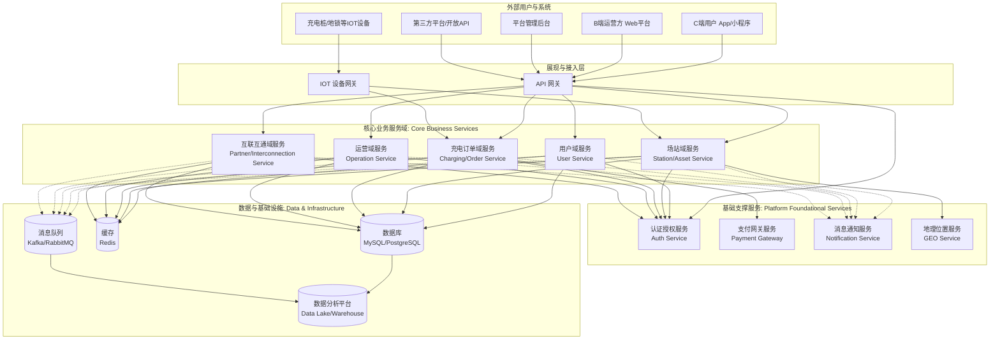

# 智能充电服务平台架构设计与划分

### 🧑‍💻 User

根据需求规划出 顶层的架构概念,  核心功能模块划分或是服务域

---

### 🤖 Assistant

  

    
已深度思考

    **Analyzing the Document**  I&#39;ve carefully reviewed the user&#39;s provided document, focusing on the high-level requirements for the smart EV charging platform. My analysis is progressing well; I&#39;m starting to understand the key functionalities and user needs outlined within the Markdown structure. I&#39;m paying close attention to the platform&#39;s features.   **Identifying Core Components**  I&#39;m now focusing on extracting the core architectural components from the requirements. I&#39;m moving beyond simple feature listing and grouping functionalities into logical modules. The initial review reveals several key actors that need consideration, shaping the structure of the high-level design. These include the users, charging stations, and the platform itself. I&#39;m drilling down to understand their roles within the system.   **Structuring the Domains**  I&#39;m now focusing on categorizing the identified components into logical service domains. These domains include User Experience, Station Operations, Platform Management, and Interconnectivity. I&#39;m prioritizing the design of C-end facing user flows, understanding the critical touchpoints. I&#39;ve also begun to sketch out basic API contracts needed for interactions between these domains. I&#39;m focusing on clarifying how different actors interact within these primary domains.   **Refining Architectural Domains**  I&#39;m now refining the architectural domains. I&#39;ve broken down the user&#39;s requirements into key business areas, including User Experience (C-end), Station Operations (B-end), Platform Management (Admin), and Interconnectivity. My focus has shifted to establishing interactions between these domains and outlining necessary APIs. I&#39;m prioritizing user flows and non-functional requirements to create a robust structure for the smart EV charging platform.   **Formulating the Architecture**  I&#39;m now formulating a high-level architectural overview based on the identified core domains. My focus has shifted towards defining the interaction points and outlining potential API contracts. I&#39;m prioritizing the establishment of key touchpoints for C-end users and their flow within the platform. I&#39;m paying attention to scalability and maintainability considerations.   **Formulating Service Domains**  I&#39;m now consolidating the user&#39;s requirements into logical service domains. These include: User, Charging, Station/Asset, Operations &amp; Pricing, Interconnection, and Admin &amp; RBAC. I&#39;m focusing on how these domains encapsulate specific business functionalities and support critical user interactions. I&#39;m also ensuring the inclusion of foundational platform services that support these core domains.   **Refining Service Boundaries**  I&#39;m now focusing on refining the boundaries of each service domain. For each business capability, I&#39;m defining a set of core API endpoints. I&#39;m prioritizing interactions and dependencies between the user-facing and back-end services. I&#39;m focusing on defining clear communication flows within the distributed architecture. I&#39;m clarifying how each domain supports the core functions.   **Formulating Service Architecture**  I&#39;m now focusing on a robust architecture that meets the project&#39;s requirements. My latest progress involves a layered approach with well-defined service domains, separating concerns for scalability. I&#39;m prioritizing interactions between services and integrating essential platform services for enhanced performance. My focus is on creating a streamlined system.   **Defining the Service Domains**  I&#39;m now consolidating the user&#39;s requirements into service domains, specifically User, Charging, Station/Asset, Operations &amp; Pricing, Interconnection, and Admin &amp; RBAC, while also integrating foundational platform services. I&#39;m focusing on clarifying how these domains support core business functionalities and ensuring critical user interactions are supported. This approach will provide a solid foundation for the platform.   
  

非常棒！您提供的这份顶层需求梳理文档非常清晰和全面，为架构设计奠定了坚实的基础。

基于这份详尽的需求，我现在为您规划出**顶层的架构概念和核心功能模块（服务域）的划分**。这种划分方式采用了**微服务和领域驱动设计（DDD）**的思想，旨在构建一个高内聚、低耦合、易于扩展和维护的系统。

---

# 智能电动汽车充电服务平台 - 顶层架构概念与服务域划分

## 1. 总体架构理念

采用**面向服务的分布式微服务架构**。将整个复杂的业务系统，按照业务边界和职责，拆分成一系列独立、自治的服务域。每个服务域都可以独立开发、测试、部署和扩展。

*   **前端（展现层）**：负责用户交互和数据展示，通过API网关与后端服务通信。
*   **后端（服务层）**：由一系列微服务组成，是业务逻辑的核心。
*   **基础平台（支撑层）**：提供所有微服务共享的技术能力和中间件。
*   **数据层**：提供持久化存储、缓存和数据分析能力。

## 2. 顶层架构图

## 3. 核心服务域 (Core Service Domain) 划分详解

下面是根据您的需求文档，对核心服务域的具体职责划分。

### 3.1 用户域服务 (User Service)
*   **职责**：管理所有与“人”相关的信息和关系。
*   **对应需求**：`1.7 用户管理`
*   **核心功能**：
    *   用户注册、登录、会话管理。
    *   用户个人资料管理（昵称、头像等）。
    *   用户车辆信息管理。
    *   用户账户（余额、优惠券）管理。

### 3.2 场站域服务 (Station/Asset Service)
*   **职责**：管理所有“物”（充电场站、充电桩、地锁）的静态和动态信息。是平台资产的数据中心。
*   **对应需求**：`1.1 搜索与发现`, `2.1 自营充电站管理`, `2.2 第三方充电站接入`
*   **核心功能**：
    *   充电站/桩信息管理（增删改查）。
    *   充电桩实时状态管理（通过IOT网关接收心跳和状态变更）。
    *   第三方充电站/桩数据聚合与同步。
    *   提供充电站/桩的地理位置搜索、条件筛选接口。
    *   地锁/道闸等附属设备信息与状态管理。

### 3.3 充电订单域服务 (Charging/Order Service)
*   **职责**：处理核心的充电业务流程，管理从充电请求到结束结算的全过程。
*   **对应需求**：`1.2 预约充电`, `1.3 即时充电`, `1.4 支付与结算`, `1.5 充电状态监控`, `1.6 历史记录查询`
*   **核心功能**：
    *   充电预约处理（创建、取消、超时管理）。
    *   扫码充电流程控制（发起、鉴权、启动）。
    *   实时充电数据记录（与IOT网关交互）。
    *   充电结束与订单生成。
    *   费用计算（调用运营域获取价格策略）。
    *   充电订单、支付订单、历史记录的管理与查询。

### 3.4 运营域服务 (Operation Service)
*   **职责**：为平台运营方(B端)提供管理和决策支持工具。
*   **对应需求**：`2.1 价格策略`, `2.1 运营数据`, `2.2 费用结算`, `4.4 数据统计与报表`
*   **核心功能**：
    *   计费模型与价格策略管理（分时电价、服务费等）。
    *   优惠活动、优惠券策略管理。
    *   与第三方平台的结算规则管理与对账单生成。
    *   运营数据统计与分析（为管理后台提供数据源）。
    *   设备故障告警规则与处理流程。

### 3.5 互联互通域服务 (Partner/Interconnection Service)
*   **职责**：处理与第三方充电平台的互联互通、数据漫游和结算。
*   **对应需求**：`3. 平台间的互联互通`, `2.2 第三方充电站接入与管理`
*   **核心功能**：
    *   管理第三方平台的认证与授权。
    *   提供标准化的开放 API（如查询本平台自营站信息）。
    *   适配和调用其他平台的 API。
    *   处理跨平台的用户认证、充电请求和订单同步。

## 4. 基础支撑服务 (Foundational Services) 划分

这些服务为上层业务提供通用的技术能力。

### 4.1 认证授权服务 (Auth Service)
*   **职责**：提供统一的身份认证和权限控制。
*   **对应需求**：`4.1/4.2/4.3/5.8`
*   **核心功能**：
    *   C端用户/B端用户/后台管理员的身份验证（Authentication）。
    *   基于角色(RBAC)的权限管理和授权（Authorization）。
    *   API访问令牌（Token）的生成与校验。

### 4.2 IOT 设备网关 (IOT Gateway)
*   **职责**：作为物理世界和数字世界的桥梁，负责与所有物联网设备通信。
*   **对应需求**：`2.1 远程控制`, `5.5 统一设备接入层`
*   **核心功能**：
    *   协议适配：兼容国标、OCPP等多种充电桩协议及不同厂商的地锁协议。
    *   设备连接管理：维护与设备的长连接。
    *   双向通信：下发指令（启停充电、解锁），上报数据（心跳、状态、充电数据）。

### 4.3 其他支撑服务
*   **支付网关服务 (Payment Gateway)**：封装微信、支付宝等多种支付渠道，为订单域提供统一的支付接口。 (`1.4`)
*   **消息通知服务 (Notification Service)**：负责发送短信、App Push、邮件等各类通知。 (`1.8`)
*   **地理位置服务 (GEO Service)**：集成高德、百度等地图服务，提供位置解析、路线规划、POI搜索等能力。 (`5.7`)

---

### 总结

这份架构规划将您提出的需求映射到了具体的、高内聚的服务域中。

*   **清晰的职责划分**：每个服务域关注一个特定的业务问题，便于团队分工和技术选型。
*   **高度的可扩展性**：当充电订单量激增时，可以独立扩展**充电订单域服务**和相关的数据库，而无需改动其他服务。
*   **灵活性**：未来若要接入新的充电桩协议，只需在**IOT设备网关**中增加新的适配器；若要接入新的支付方式，只需修改**支付网关服务**。

这个架构为构建一个健壮、灵活且能够应对未来业务发展的智能充电平台提供了坚实的蓝图。

