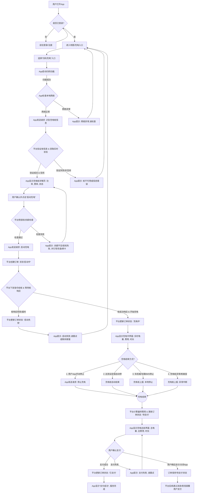
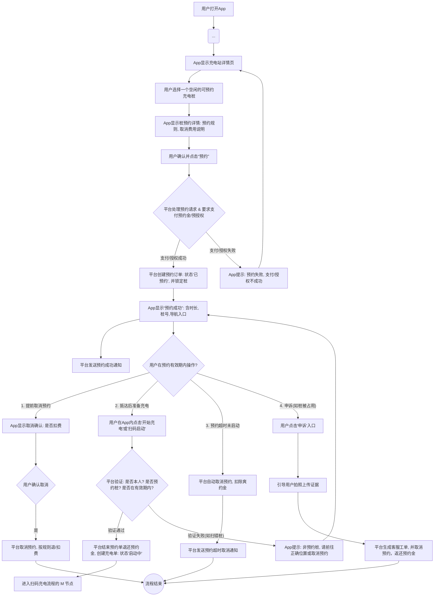

好的，我们来设计 **用户扫码充电流程** 和 **用户预约充电流程**。

由于 Mermaid 流程图的特性，更适合表达清晰的步骤和决策路径。对于更复杂、涉及多系统交互的流程，通常会拆分为几个子流程或使用 BPMN 等更专业的工具。这里我将力求清晰地展示核心逻辑。

---

## 1. 用户扫码充电流程 (Mermaid Flowchart)

这个流程图将涵盖用户从打开 App 到完成充电支付的主要步骤。

### 流程解释：
1.  **准备阶段：** 用户打开App并登录。
2.  **扫码启动：** 用户通过App扫码，App将扫码结果发送给平台，平台验证桩信息并获取实时状态。
3.  **启动确认：** App显示桩详情，用户确认后点击启动，平台发送启动指令给充电桩。
4.  **充电进行中：** 充电成功启动后，App实时显示充电状态。
5.  **充电结束：** 充电可由多种方式（自动、手动、异常）结束。
6.  **费用结算与支付：** 平台计算最终费用，用户在App中完成支付。

---

## 2. 用户预约充电流程 (Mermaid Flowchart)

这个流程图将涵盖用户从搜索到预约充电，以及后续操作的主要步骤。

### 流程解释：
1.  **搜寻与选择：** 用户通过筛选找到合适的充电站和空闲的可预约充电桩。
2.  **发起预约：** 用户确认预约详情后，App发送预约请求，平台处理并创建预约订单。
3.  **成功预约：** App显示预约成功信息，并收到通知。
4.  **预约提醒与抵达：** 平台在预约时间前发送提醒，用户抵达后前往预约桩。
5.  **启动充电：** 用户操作启动充电，平台验证预约并下发启动指令。
6.  **充电进行与结束：** 成功启动后，进入与扫码充电类似的充电流程。
7.  **预约超时处理：** 如果用户在规定时间内未启动充电，平台会自动取消预约并可能收取费用。

---

这些流程图为我们提供了用户视角下的核心操作路径。在后续的详细设计中，我们将基于这些流程图，进一步拆解需求，设计细化的API接口、数据库模型、错误处理机制、以及后台管理逻辑。