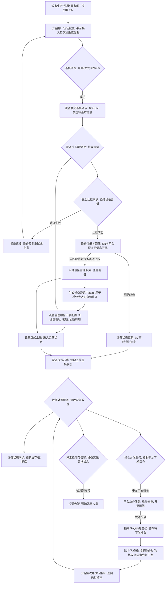

好的，我们来设计 **设备接入流程**。这个流程将涵盖物理设备的注册、认证、上线和数据上报的关键环节。考虑到充电桩、地锁、道闸等设备的异构性，我们将尽力抽象出通用的接入流程。

## 3. 设备接入流程 (Mermaid Flowchart)

### 流程解释：

1.  **设备准备与联网：**
    *   **设备生产/部署: 具备唯一序列号/SN**: 每个物理设备在生产或部署时分配一个全球唯一的序列号或ID。
    *   **设备出厂/现场配置: 平台接入参数预设或配置**: 设备在出厂或现场激活前，会预设或手动配置平台接入所需的网络参数、平台地址等。
    *   **连接网络: 蜂窝/以太网/Wi-Fi**: 设备尝试建立网络连接。

2.  **设备身份认证与注册：**
    *   **设备发起连接请求: 携带SN, 类型等基本信息**: 设备通过预设的接入点发起连接请求，并携带其唯一标识和设备类型。
    *   **设备接入层/网关: 接收连接**: 统一的设备接入层（例如物联网网关服务）接收来自所有设备的连接请求。
    *   **安全认证模块: 验证设备身份**: 在设备接入层内部，安全模块会验证设备的合法性（例如通过预置证书、Token或SN与配置白名单比对）。
    *   **拒绝连接: 设备反复重试或告警**: 如果认证失败，连接将被拒绝，设备可能会重试或通过指示灯/日志进行告警。
    *   **设备注册与匹配: SN与平台预注册信息匹配**: 认证成功后，平台会检查该设备的SN是否已在设备管理系统中注册。
    *   **平台设备管理服务: 注册设备**: 如果是首次上线或未注册的设备，设备管理服务会进行注册，并分配一个内部ID。
    *   **生成设备密钥/Token: 用于后续会话加密和认证**: 为保证后续通信安全，平台会为设备生成唯一的会话密钥或Token。
    *   **设备管理服务下发配置: 如通信地址, 密钥, 心跳周期**: 平台将生成的密钥、更新的通信参数、心跳周期等配置信息下发给设备。

3.  **设备上线与数据交互：**
    *   **设备状态更新: 从“离线”到“在线”**: 匹配成功后，设备在平台的状态更新为“在线”。
    *   **设备正式上线: 进入运营状态**: 设备完成所有配置和认证，正式进入可运营状态。
    *   **设备保持心跳: 定期上报连接状态**: 设备周期性发送心跳包，维持连接并向平台报告在线状态。
    *   **数据处理服务: 接收设备数据**: 平台的数据处理服务接收来自设备的状态数据、充电数据、故障告警等。
    *   **设备状态同步: 更新缓存/数据库**: 实时同步设备状态（如空闲、充电中、故障）到缓存和数据库，供业务查询。
    *   **指令分发服务: 接收平台下发指令**: 用于接收来自上层业务服务的指令。
    *   **平台业务服务: 启动充电, 开落闸等**: 各业务服务（如充电服务、停车服务）根据用户操作生成设备控制指令。
    *   **指令队列/消息总线: 暂存待下发指令**: 指令通过消息队列异步发送，保证可靠性和高吞吐。
    *   **指令下发器: 根据设备类型/协议封装指令并下发**: 指令下发器接收指令，并根据目标设备的类型和协议进行封装，然后通过设备接入层下发给物理设备。
    *   **设备接收并执行指令: 返回执行结果**: 设备接收指令并执行，将执行结果上报给平台。

4.  **异常处理与告警：**
    *   **异常检测与告警: 设备离线, 异常状态**: 平台持续监控设备状态和上报数据，例如心跳超时判断为离线，或收到设备故障告警。
    *   **发送告警: 通知运维人员**: 检测到异常时，通过多种方式（短信、邮件、App通知等）及时通知运维人员进行处理。

这个流程图为设备从“裸机”到“在线运营”的全生命周期接入提供了一个高层概览。在实际设计中，每个步骤都会有更细致的错误处理、重试机制、安全性考量和数据结构定义。