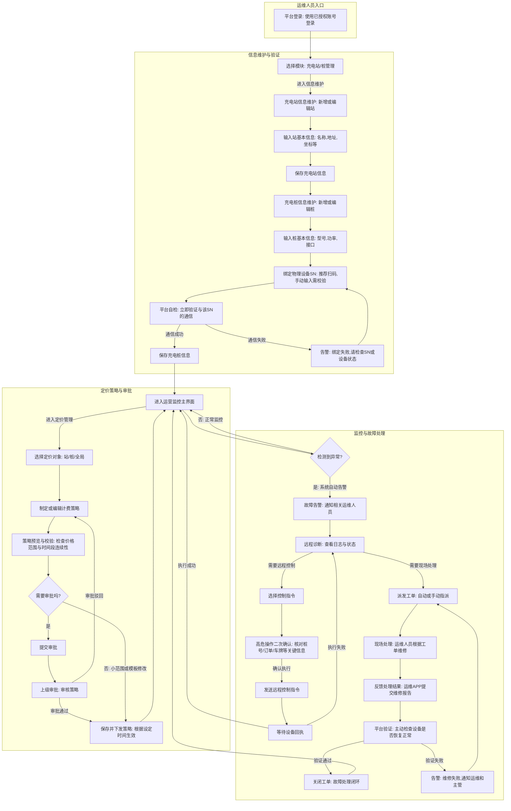

# 运营管理流程风险处理设计

### 🧑‍💻 User

针对 运营管理流程 进行深入的风险与异常处理设计.

---

### 🤖 Assistant

  

    
已深度思考

    **Deconstructing the Request**  I&#39;m focusing now on the fundamental elements of the &quot;运营管理流程.&quot; I&#39;ve begun to break down the request into its core components. My initial assessment centers on identifying the key operational management areas. I&#39;m aiming to uncover the critical functions, sub-processes, and data flows involved. The goal is to establish a solid foundation for robust risk and exception design.   **Defining Key Operational Areas**  I&#39;m now zeroing in on defining the essential operational areas within the `充电站运营管理流程.md` document. I&#39;m focusing on the sub-stages within &quot;信息维护&quot; and &quot;定价策略管理.&quot; The objective is to identify potential risks and exceptions in each area. I aim to create a detailed map of the process, which is the cornerstone for my risk and exception design. I&#39;m leveraging the Mermaid flowchart as my primary guide.   **Exploring Potential Failure Points**  I&#39;m now diving deeper into the potential failure points within &quot;信息维护&quot; and &quot;定价策略管理.&quot; I&#39;m identifying specific risks. I&#39;m focusing on &quot;充电站信息维护&quot; errors and &quot;充电桩信息维护&quot; inconsistencies. My aim is to develop detailed risk scenarios. I&#39;m considering scenarios for typos in station coordinates, data integrity breaches, and logical pile-to-physical device mismatches.   **Mapping Risk Scenarios**  Now I&#39;m delving deeper into the potential risks within &quot;远程控制与故障处理.&quot; Specifically, I&#39;m focusing on scenarios for real-time monitoring and remote control commands. My aim is to define the critical failure scenarios to drive the exception handling design. This step is pivotal for ensuring a robust and reliable operational process.   **Unpacking Potential Errors**  I&#39;m now delving into the &quot;实时监控&quot; aspect of &quot;远程控制与故障处理&quot; within the process. I&#39;m focusing on potential communication issues. I&#39;m considering scenarios for command failures. I&#39;m analyzing the possible implications of delayed status updates. My primary goal is to assess all possible error conditions and communication gaps.   **Mapping Mitigation Strategies**  I&#39;m now focusing on mapping mitigation strategies for the identified risks. I&#39;ll be detailing specific exception handling measures. My focus is on ensuring robustness in areas like network communication. I aim to provide comprehensive, actionable recommendations to improve operational reliability.   **Mapping Solution Approaches**  I&#39;m now formulating concrete solutions for the identified risks within each operational stage.  I&#39;m focusing on &quot;事前预防,&quot; &quot;事中监测,&quot; and &quot;事后处理&quot; for each potential failure. I&#39;m prioritizing human error mitigation and building robust monitoring systems. My aim is to deliver actionable, detailed exception handling measures within the document.   **Finalizing the Document Structure**  I&#39;ve completed the initial mapping of risks and exceptions across the key stages. I&#39;m now in the process of finalizing the structure for my Markdown document. I&#39;m focusing on &quot;设计原则&quot; (Design Principles). I plan to detail how to apply fail-safe and auditability for each of the core workflows.   **Expanding Mitigation Strategies**  Now I&#39;m focusing on specific mitigation strategies to ensure data integrity. I&#39;m prioritizing data validation at every stage. I&#39;m focusing on pre-validation, exception handling, and post-validation checks. My aim is to create a robust system with proactive detection, notification, and mitigation measures.   **Finalizing Mitigation Measures**  Now I&#39;m focusing on defining audit trails and logging strategies. I&#39;m focusing on how and what data should be logged at each stage. I am building actionable exception handling measures for each identified risk. My aim is to create a robust and reliable design.   
  

好的，这是一个非常关键和专业的步骤。基于我们已经梳理的运营管理流程，现在我们将对其进行深入的风险分析和异常处理设计。

这份设计文档将是保障平台稳定、减少运营损失、提升用户体验的核心。

---

# 运营管理流程 - 风险与异常处理设计

## 1. 设计目标与原则

*   **目标：** 识别在充电站信息维护、定价策略管理、远程控制与故障处理流程中可能出现的各类风险和异常，并设计相应的预防、监测、处理和恢复机制，确保运营流程的健壮、安全和高效。
*   **设计原则：**
    *   **预防优于治疗 (Prevention First):** 通过流程设计、权限控制和系统校验，从源头减少异常发生的可能性。
    *   **快速响应 (Rapid Response):** 建立实时监控和告警机制，确保异常能在第一时间被发现和响应。
    *   **影响最小化 (Impact Minimization):** 异常处理方案应优先考虑将对用户和业务的负面影响降到最低。
    *   **操作可追溯 (Auditability):** 所有关键操作和异常处理过程都应有详细日志记录，便于事后审计和追责。
    *   **安全冗余 (Fail-Safe):** 在关键环节设计冗余和回滚方案，确保在极端情况下系统仍能保持基本可用或可以快速恢复。

## 2. 详细风险分析与处理设计

我们将按照运营管理流程的三个核心阶段进行分析。

### 阶段一：信息维护流程 (充电站/桩)

| 风险点 (Risk Point) | 可能原因 | 影响评估 | 异常处理机制 |
| :--- | :--- | :--- | :--- |
| **1. 充电站/桩信息录入错误** (如地址坐标偏差、功率/接口类型错误) | 人工操作失误 | **中-高** | **事前预防:** - **输入校验:** 对地理坐标、功率等关键字段设置合理性校验规则。 - **标准化选项:** 接口类型、桩型号等使用下拉菜单选择，而非手动输入。 - **UI/UX优化:** 提供地图点选功能获取坐标，减少手动输入。  **事中监测:** - 暂无有效的实时监测，主要依赖事后发现。 **事后处理:** - **便捷的编辑功能:** 提供给有权限的运营人员快速修正错误信息。 - **用户反馈渠道:** App端提供“信息纠错”入口，激励用户上报错误。 |
| **2. 充电桩物理设备SN与平台逻辑桩位绑定错误** | 人工操作失误 | **严重** | **事前预防:** - **二次确认:** 在执行绑定操作时，弹窗要求操作员二次确认SN和桩位号。 - **扫码绑定:** 推荐使用运维App扫描物理桩身上的二维码进行绑定，避免手动输入SN。 - **唯一性校验:** 系统层面确保一个SN只能绑定到一个有效的逻辑桩位。 **事中监测:** - **绑定后自检:** 绑定成功后，平台应立即向该SN设备发起一次心跳或状态查询指令，确认通信正常。 **事后处理:** - **解绑/重绑工具:** 提供给高级运维人员进行解绑和重新绑定的后台功能。 - **操作日志:** 详细记录谁在何时进行了绑定/解绑操作，便于追溯。 |
| **3. 信息更新延迟或失败** (后台修改后，App端或充电桩未及时同步) | 网络延迟、缓存问题、消息队列阻塞、设备离线 | **中** | **事前预防:** - **强一致性设计:** 对关键信息（如启停用状态）的更新，采用强制刷新缓存等策略。 - **设备离线预警:** 充电桩离线时，后台应有明显标识，并禁止对其进行某些信息变更。 **事中监测:** - **状态同步确认机制:** 平台下发信息更新指令后，应有等待设备回执确认的机制，并设置超时告警。 **事后处理:** - **手动同步按钮:** 为运维人员提供针对单个离线桩的“上线后立即同步”或手动重试同步的按钮。 - **数据校对任务:** 定期运行后台任务，比对平台与充电桩本地缓存的关键信息，发现不一致则告警。 |

### 阶段二：定价策略管理流程

| 风险点 (Risk Point) | 可能原因 | 影响评估 | 异常处理机制 |
| :--- | :--- | :--- | :--- |
| **1. 配置了错误的计费价格** (如0元、天价、时间段重叠/遗漏) | 人工操作失误、系统逻辑漏洞 | **严重** | **事前预防:** - **价格阈值校验:** 设置合理的价格范围（如0.01元/度 ~ 5元/度），超出范围需二次确认或触发审批。 - **策略预览功能:** 在价格策略生效前，提供预览功能，可视化展示24小时内的价格曲线。 - **时间段连续性检查:** 系统自动检查时间段配置是否完整覆盖24小时，且无重叠。 - **权限与审批流:** 重大价格策略变更（如全局调价）必须经过上级审批才能生效。 **事中监测:** - **变更告警:** 任何价格策略的创建或修改，都通过系统消息或邮件通知相关负责人。 **事后处理:** - **紧急回滚机制:** 提供“一键回滚至上一版”或“一键恢复默认”的功能。 - **账单冲正与补偿:** 对因错误价格产生的错误账单，提供批量冲正、退款和发放优惠券补偿的工具。 |
| **2. 定价策略未能按时生效或下发失败** | 定时任务调度失败、消息队列阻塞、目标充电桩离线 | **高** | **事前预防:** - **高可用定时任务集群:** 确保定时任务调度系统自身稳定。 - **指令下发前状态预检:** 在下发价格前，检查目标桩群的在线率，若在线率过低则告警提示操作员。 - **离线设备策略缓存:** 充电桩应能缓存多套价格策略，对于离线后上线的桩，平台应主动下发最新价格。 **事中监测:** - **下发回执监控:** 监控价格策略下发后，各充电桩的成功回执比例，低于阈值则告警。 **事后处理:** - **手动重发:** 提供针对失败桩或整个站的手动重新下发价格策略的功能。 - **账单核对:** 若发现有用户在策略切换期间按旧价格计费，需进行账单调整。 |
| **3. 充电过程中价格发生变更** | 用户充电跨越了不同价格的时间段 | **低 (属于正常业务)** | **设计要求 (非异常):** - **计费引擎逻辑:** 计费引擎必须能精确地按充电发生的实际时间段，采用分段计费。 - **App端明确提示:** 在充电开始前，应明确告知用户当前及后续可能的价格变化。充电详情页应实时分段显示电量和费用。 - **最终账单清晰:** 结算账单中必须清晰列出每个时间段的充电量、单价和费用。 |

### 阶段三：远程控制与故障处理流程

| 风险点 (Risk Point) | 可能原因 | 影响评估 | 异常处理机制 |
| :--- | :--- | :--- | :--- |
| **1. 远程控制指令发送给错误的目标** (如远程停止了正常用户的充电) | 人工操作失误 | **严重** | **事前预防:** - **高危操作二次确认:** 对“远程停止充电”、“设备重启”等高危操作，必须弹窗显示目标桩的详细信息（如站名、桩号、当前订单号、车牌号），要求操作员二次确认。 - **权限分离:** 普通客服只能查看，高级运维才能执行远程控制。 - **操作界面优化:** 在操作界面上用醒目的颜色和标签区分不同状态的桩。 **事中监测:** - 暂无，操作瞬间完成。 **事后处理:** - **完整的操作审计日志:** 记录操作人、操作时间、目标设备、操作指令、执行结果，用于快速追溯。 - **紧急联系与补偿预案:** 建立流程，一旦误操作发生，客服应能立即联系用户道歉，并给予免单或优惠券补偿。 |
| **2. 远程指令下发失败或设备未响应** | 网络中断、设备离线/死机、协议解析错误 | **中-高** | **事前预防:** - **指令下发前状态预检:** 执行操作前，系统自动检查目标设备的在线状态，若离线则直接禁止操作并提示。 **事中监测:** - **指令超时与重试机制:** 指令下发后，平台应在设定时间内（如30秒）等待设备回执。若超时，可自动重试1-2次。 - **明确的失败状态回显:** 若最终失败，应在界面明确提示“指令失败”及可能的原因（如设备不在线、设备拒绝执行）。 **事后处理:** - **故障诊断引导:** 提示操作员转入故障诊断流程，查看设备日志或创建现场工单。 - **记录失败日志:** 将失败的指令及返回信息存入日志，供技术人员分析。 |
| **3. 故障告警风暴或漏报** | 网络区域性抖动、设备固件BUG、告警阈值配置不当 | **高** | **事前预防:** - **告警收敛/抑制:** 对于同一设备在短时间内产生的重复告警进行合并。对于区域性网络问题（如整个站掉线），合并为一条“站点离线”告警。 - **告警规则精细化配置:** 允许配置不同的告警级别、延迟时间和通知方式。 **事中监测:** - **心跳监控:** 不仅监控设备心跳，还应监控告警系统本身是否在正常工作（元监控）。 **事后处理:** - **告警知识库:** 对频繁出现的告警，建立知识库（SOP），指导运维人员如何处理。 - **定期复盘告警规则:** 运营和技术团队定期回顾告警情况，优化阈值和规则。 |
| **4. 现场工单处理不及时或信息不畅** | 流程不规范、人员职责不清、信息同步工具缺失 | **高**| **事前预防:** - **建立SLA（服务水平协议）:** 定义不同级别故障的响应时间和解决时间。 - **自动化派单:** 系统根据故障类型和站点位置，自动推荐或指派最合适的运维人员。 **事中监测:** - **工单状态追踪:** 管理后台清晰展示所有工单的状态（待处理、处理中、已解决、已关闭），并对即将超时的工单进行高亮和升级告警。 **事后处理:** - **闭环管理:** 要求现场人员处理完毕后，必须在运维App中拍照、填写处理结果，才能关闭工单。平台侧确认故障恢复后，工单才算最终闭环。 - **绩效考核:** 将工单处理的及时率和完成质量纳入运维团队的绩效考核。 |

---
## 3. 总结

这份风险与异常处理设计构成了运营管理平台的“免疫系统”。它并非一成不变，而应随着业务的发展、新技术的引入和运营经验的积累，进行持续的迭代和优化。将这些机制融入到产品设计和研发的每一个环节，是保障平台长期稳定健康运行的关键。

---

### 🧑‍💻 User

用批判性思维审视你识别出的这些异常和 流程图相矛盾的地方.    
指出风险异常处理设计或流程图中不合理的地方,并进行修改

用批判性思维审视你识别出的这些异常和 流程图相矛盾的地方.    
指出异常处理或流程图中不合理的地方,并进行修改

注意: 
1. 流程图中的节点名如果有描述, 用`: `来分隔,  `[]`中不得嵌套 `()`.  例如:  [节点名:  描述]  
2. 流程图中的注释必须单独占一行, 不得拼写在mermaid代码后面.
3. 子流程名称不得有`()`

---

### 🤖 Assistant

  

    
已深度思考

    **Reviewing the Artifacts**  I&#39;ve been meticulously deconstructing the user&#39;s request, focusing on its core components. My aim is to critically review the provided artifacts, specifically the flowchart and risk analysis. I&#39;m pinpointing potential contradictions and inconsistencies within the two items. This initial analysis will lay the groundwork for a thorough evaluation.   **Examining the Relationship**  I&#39;m now carefully examining the connection between the flowchart and the risk analysis. I&#39;m actively seeking specific contradictions, focusing on steps in the flowchart and their associated risks. My goal is to determine if the flowchart adequately addresses the risks identified in the analysis. This comparative approach is proving fruitful in uncovering inconsistencies.   **Addressing the Missing Details**  I&#39;m now zeroing in on the flaws within my earlier work.  Specifically, the flowchart neglects critical risk mitigation steps, particularly those related to SN binding and information verification during data entry.  The &quot;save or submit&quot; step in the flowchart has been identified as a significant simplification.  I&#39;m now focused on revising the flowchart to explicitly address the risk analysis findings. I will modify the flowchart to handle data entry errors more clearly.   **Identifying Key Inconsistencies**  I&#39;m now carefully examining the relationship between the identified risks and the steps depicted in the flowchart. I&#39;ve pinpointed a key area of improvement: the &quot;Save&quot; function. The current flowchart is oversimplified. It presents a &quot;save and done&quot; approach, when in actuality there are nuanced steps. I&#39;ve identified that the flowchart&#39;s handling of direct vs. audit validation is too implicit. Also missing is the vital &quot;post-binding self-check&quot; step, which directly addresses SN binding and communication verification risks.   **Refining the Workflow**  I&#39;m currently engaged in a deep dive into the flowchart, using the identified risks as my compass. I&#39;m zeroing in on areas where the current flowchart falters in addressing risks, especially SN binding, communication verification, and policy preview processes. I&#39;m actively modifying the flowchart to incorporate critical missing steps. These include explicit self-checks and a clearer delineation between direct and audited saving paths. My focus is on robustly reflecting risk mitigation strategies.   **Improving the Flow**  I&#39;m now revising the flowchart and addressing critical omissions. I&#39;ve pinpointed an oversimplification in the handling of both information entry and pricing strategy. The previous flowchart failed to adequately reflect crucial steps for risk mitigation. I am now incorporating explicit policy preview and approval processes. I&#39;m also ensuring the chart accurately depicts the nuances of audit validation and post-binding self-checks. The &quot;save and done&quot; approach is being meticulously refactored.   **Improving the Analysis**  I&#39;m now carefully revisiting the flowchart, focusing on the identified areas of weakness. The &quot;save&quot; function is significantly oversimplified, as is the handling of information validation and pricing policies. The current chart lacks key steps for policy preview and approval. I am actively revising the flowchart to incorporate critical audit validations and post-binding self-checks, to ensure the process better reflects real-world complexities.   **Improving the Analysis**  I&#39;ve been deeply analyzing the flowchart, particularly the data entry and pricing policy steps. I&#39;ve found an oversimplification in the &quot;save&quot; function. It neglects crucial policy preview and audit validation processes. I&#39;m now actively revising the flowchart to include these critical elements, ensuring the process more accurately reflects real-world complexities and risk mitigation strategies.   **Improving the Refinement**  I&#39;m now zeroing in on key omissions within the original flowchart, specifically those pertaining to audit trails and secondary validation. For example, direct and audited save paths are not clearly distinguished, especially during data entry. The current flowchart lacks a mandatory &quot;post-binding self-check&quot; to address SN binding risks. I&#39;m actively revising the flowchart to include these critical elements, ensuring the process is more robust.   
  

好的，这是一个绝佳的练习，用批判性思维来审视和优化自己的设计是通往卓越的必经之路。

我将以一个外部顾问的视角，严格审视我之前给出的流程图和风险分析，找出其中隐含的矛盾、不合理之处，并提出修改方案。

---

## 1. 批判性审视与矛盾点分析

经过审视，我识别出原始流程图和风险分析之间存在以下几个核心矛盾点和不合理之处。主要问题在于：**流程图过于“理想化”和“线性化”，未能将风险分析中提到的关键【预防】和【校验】措施作为强制步骤体现在流程中，导致流程存在安全和质量隐患。**

### 矛盾点 1：信息维护流程缺少“验证”闭环

*   **问题描述:** 流程图中，`[J: 指定设备SN/ID]` 之后直接就是 `[K: 保存充电桩信息]`。这是一个巨大的风险点。而我的风险分析（风险点1.2）中明确提到了“绑定后自检”和“扫码绑定”作为预防措施。流程图完全没有体现这个至关重要的验证步骤。
*   **为何不合理:** 如果SN绑定错误（运维人员手动输错一位），充电桩将无法与平台通信。按照现有流程，这个错误直到保存后才会被动地发现（通过监控桩离线），而不是在操作的当下主动预防。这会导致无效的配置上线，增加后期排错成本。
*   **结论:** 流程图在最关键的“物理-逻辑”绑定环节，过于简化，缺少了必要的验证闭环，与风险分析中的“预防优于治疗”原则相悖。

### 矛盾点 2：定价策略流程缺少“审批”与“预览”安全门

*   **问题描述:** 流程图中，`[O: 制定/编辑计费策略]` 之后直接就是 `[P: 设置生效时间]` 和 `[Q: 保存定价策略]`。这相当于赋予了操作员可以随意修改并立即生效价格的“上帝权限”。而我的风险分析（风险点2.1）中强调了“策略预览功能”和“权限与审批流”的重要性。
*   **为何不合理:** 价格是极其敏感的核心数据。一个错误的价格配置（例如，小数点错位）可能会在几分钟内给平台造成巨大的经济损失或用户信任危机。现有流程没有为这种高危操作设置任何“减速带”或“安全审核”环节。
*   **结论:** 流程图在定价这一核心商业环节，严重缺乏风险控制设计，将风险分析中提到的安全措施完全架空，设计上存在严重缺陷。

### 矛盾点 3：远程控制流程缺少“二次确认”强制环节

*   **问题描述:** 流程图中，`[W: 选择控制指令]` 后直接就是 `[X: 发送远程控制指令]`。正如风险分析（风险点3.1）中所述，这是一个极度危险的操作流程。例如，运维人员想重启`001`号桩，但手滑点到了正在为用户充电的`002`号桩，直接点击发送，就会导致该用户的充电被无故中断。
*   **为何不合理:** 对用户有影响或对设备有风险的远程操作（特别是停止充电、重启、下电），必须有强制性的信息核对与二次确认步骤。这是行业后台设计的最佳实践，也是避免严重运营事故的最后一道防线。现有流程图缺失了这道防线。
*   **结论:** 流程图对高危操作的设计过于草率，没有体现出风险分析中强调的“安全第一”原则，容易引发严重的运营事故。

### 矛盾点 4：故障处理流程未能形成“验证闭环”

*   **问题描述:** 流程图中，现场处理工单的最后一个节点是 `[CC: 更新故障状态]`，然后直接循环回 `[R: 实时监控]`。
*   **为何不合理:** 现场运维人员在App上点击“处理完毕”并不代表设备真的恢复正常了。可能是他自己判断失误，或者还有其他潜在问题。一个健壮的流程应该是在运维人员反馈处理结果后，由**平台侧自动发起一次验证**（例如检查心跳、状态、甚至尝试一次远程启动命令），确认设备真正恢复服务后，工单才能最终关闭。
*   **结论:** 流程图中的故障处理没有形成一个从“上报->处理->验证->关闭”的完整闭环，可能导致“假性修复”的问题。

---

## 2. 修改后的流程与设计

基于以上批判性分析，我对流程图和设计进行了重大修改，将风险控制措施深度整合到流程中。

### 修改后的充电站运营管理流程 (Mermaid Flowchart)

### 修改说明 (Modification Explanation)

1.  **【核心修改 1】新增绑定自检流程 (J_Verify):**
    *   在运维人员绑定SN后，流程不再直接保存，而是强制进入 `[J_Verify: 平台自检]` 节点。
    *   平台会立即尝试与该SN的设备建立通信（如发送一个心跳或状态查询指令）。
    *   **成功**，则证明绑定正确，流程继续到 `[K: 保存信息]`。
    *   **失败**，则流程走向 `[J_Alert: 告警]`，并返回到绑定步骤 `[J]`，强制操作员重新检查。
    *   **价值:** 将被动的“事后发现”变为主动的“事前预防”，确保了每一个保存到系统的绑定关系都是有效的，极大降低了后续的运营和排错成本。

2.  **【核心修改 2】新增定价预览与审批(O_Preview, O_Approve):**
    *   在制定完策略后，强制进入 `[O_Preview: 策略预览与校验]` 节点。系统在此处会自动检查价格是否在安全阈值内、24小时时间段是否配置完整无重叠，并以可视化的方式供操作员确认。
    *   预览后，通过 `[O_Approve{需要审批吗?}]` 决策节点。简单的修改可直接生效，而重要的（如全局或大幅度调价）则必须走向 `[P_Submit: 提交审批]` -> `[P_Audit: 上级审批]` 的路径。
    *   **价值:** 为敏感的价格配置增加了两道“安全门”（机器校验+人工审批），有效防止了因操作失误或恶意操作导致的的重大经济损失。

3.  **【核心修改 3】新增高危操作二次确认 (V_Confirm):**
    *   在运维人员选择了高危指令（如停止充电、重启设备）后，强制进入 `[V_Confirm: 高危操作二次确认]` 节点。
    *   系统会弹出一个包含详细信息的确认框（如`“您确定要停止【A站-02号桩】上属于【沪A·XXXXX】的充电订单吗？”`），操作员必须明确点击“确认”才能继续。
    *   **价值:** 这是避免严重运营事故的最后一道防线，通过强制核对信息，最大限度地减少了误操作对正常充电用户的影响。

4.  **【核心修改 4】新增工单验证闭环 (DD):**
    *   现场运维反馈处理结果 `[CC]` 后，流程进入 `[DD: 平台验证]` 节点。
    *   平台会自动对修复的设备进行一系列健康检查。
    *   **验证通过**，`[EE: 关闭工单]`，流程才算真正结束。
    *   **验证失败**，则触发新的告警 `[FF]`，并重新派发工单，可能还会通知其主管介入。
    *   **价值:** 确保了故障处理的真实有效性，形成了“发现-派单-处理-验证-关闭”的完整、可靠的运维闭环，提升了故障修复的质量。

通过以上批判性的修改，新的流程图不再是一个简单的“Happy Path”，而是一个内置了**校验、审批、确认、闭环**等关键风险控制节点的、更加健壮和安全的实际运营操作指南。它与风险异常处理设计形成了相互支撑、内在统一的整体。

