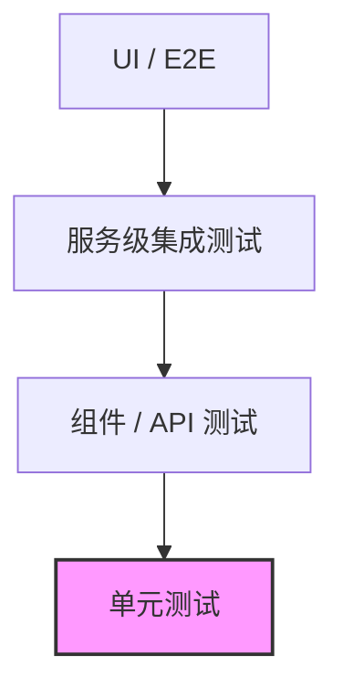

# 测试指南


---

## 目录

- [测试指南](#测试指南)
  - [目录](#目录)
  - [测试金字塔概览](#测试金字塔概览)
  - [主要测试框架及场景](#主要测试框架及场景)
  - [单元测试样板](#单元测试样板)
    - [1. 纯业务类测试](#1-纯业务类测试)
    - [2. 使用 Mockito Mock 依赖](#2-使用-mockito-mock-依赖)
  - [Spring Boot 组件测试样板](#spring-boot-组件测试样板)
    - [1. `@WebMvcTest` – Controller 层](#1-webmvctest--controller-层)
    - [2. `@DataJpaTest` – Repository 层](#2-datajpatest--repository-层)
  - [集成测试样板（Testcontainers）](#集成测试样板testcontainers)
  - [外部服务 Mock（WireMock）](#外部服务-mockwiremock)
  - [异步场景测试（Awaitility）](#异步场景测试awaitility)
  - [测试最佳实践清单](#测试最佳实践清单)

---

## 测试金字塔概览



* *单元测试* 数量最多、执行最快；专注于业务逻辑正确性。
* *组件/API 测试* 校验 Spring MVC、Filter、Interceptor 等协作。
* *服务级集成测试* 使用 Testcontainers/WireMock 还原真实依赖环境。
* *UI/E2E* 数量最少，验证端到端用户流程。

> _设计考量：遵循“金字塔”形状可以在保证覆盖率的同时控制测试执行时长。_

---

## 主要测试框架及场景

| 框架 | Maven/Gradle GAV | 适用层级 | 关键能力 |
|------|-----------------|---------|----------|
| **JUnit 5** | `org.junit.jupiter:junit-jupiter:5.10.x` | 所有 | 断言、生命周期管理、参数化测试 |
| **Mockito** | `org.mockito:mockito-core:5.8.x` | 单元 | Mock 依赖对象、行为验证 |
| **Spring Boot Test** | `org.springframework.boot:spring-boot-starter-test:3.2.x` | 组件 | `@WebMvcTest`, `@DataJpaTest`, `@SpringBootTest` |
| **Testcontainers** | `org.testcontainers:junit-jupiter:1.19.x` | 集成 | Docker 化真实依赖（MySQL、Redis…） |
| **WireMock** | `com.github.tomakehurst:wiremock-jre8:3.3.x` | 集成 | HTTP 服务模拟 |
| **Awaitility** | `org.awaitility:awaitility:4.2.x` | 单元/集成 | 等待异步结果 |

---

## 单元测试样板

### 1. 纯业务类测试

```java
@DisplayName("价格计算器 - 单元测试")
class PriceCalculatorTest {

    private final PriceCalculator calculator = new PriceCalculator();

    @ParameterizedTest(name = "场景 {index}: 商品价={0}, 折扣={1}")
    @CsvSource({
        "100,0.0,100",
        "200,0.2,160"
    })
    void should_calculate_price_correctly(BigDecimal price, BigDecimal discount, BigDecimal expected) {
        // when
        BigDecimal actual = calculator.calculate(price, discount);
        // then
        assertThat(actual).isEqualByComparingTo(expected);
    }
}
```

> **为什么这么做**：`@ParameterizedTest` 帮助一次性覆盖多组输入，提升测试覆盖率同时减小样板代码量。

### 2. 使用 Mockito Mock 依赖

```java
@ExtendWith(MockitoExtension.class)
class OrderServiceTest {

    @Mock
    private PaymentGateway paymentGateway;

    @InjectMocks
    private OrderService orderService;

    @Test
    void should_create_order_and_charge_successfully() {
        // given
        Order order = new Order("user-1", BigDecimal.valueOf(99));
        when(paymentGateway.charge(order)).thenReturn(ChargeResult.success());

        // when
        Order result = orderService.create(order);

        // then
        assertThat(result.getStatus()).isEqualTo(Order.Status.PAID);
        verify(paymentGateway).charge(order);
    }
}
```

> _设计考量：Mock 仅针对外部依赖（如支付网关），保持被测类内部逻辑的真实执行。_

---

## Spring Boot 组件测试样板

### 1. `@WebMvcTest` – Controller 层

```java
@WebMvcTest(StationController.class)
class StationControllerTest {

    @Autowired
    private MockMvc mockMvc;

    @MockBean
    private StationService stationService;

    @Test
    void should_return_station_info() throws Exception {
        given(stationService.findById(1L)).willReturn(new StationVO(1L, "上海充电站"));

        mockMvc.perform(get("/stations/1"))
               .andExpect(status().isOk())
               .andExpect(jsonPath("$.name").value("上海充电站"));
    }
}
```

### 2. `@DataJpaTest` – Repository 层

```java
@DataJpaTest
class StationRepositoryTest {

    @Autowired
    private StationRepository repository;

    @Test
    void should_save_and_query_station() {
        StationEntity entity = new StationEntity(null, "杭州充电站");
        repository.save(entity);

        Optional<StationEntity> found = repository.findById(entity.getId());
        assertThat(found).isPresent();
    }
}
```

> _为什么这么做：`@DataJpaTest` 启动嵌入式数据库（H2）且仅扫描 JPA 相关 Bean，启动速度快。_

---

## 集成测试样板（Testcontainers）

```java
@Testcontainers
@SpringBootTest
class StationIntegrationTest {

    @Container
    static MySQLContainer<?> mysql = new MySQLContainer<>(DockerImageName.parse("mysql:8.0.37"))
            .withDatabaseName("station")
            .withUsername("test")
            .withPassword("test");

    @Autowired
    private StationService stationService;

    @Test
    void should_persist_and_query_station_with_real_mysql() {
        StationVO vo = stationService.create("深圳充电站");
        StationVO found = stationService.get(vo.id());
        assertThat(found.name()).isEqualTo("深圳充电站");
    }
}
```

> **设计考量**：真实 MySQL 容器让映射、SQL、索引等问题在测试阶段即可暴露，避免环境不一致。

---

## 外部服务 Mock（WireMock）

```java
@SpringBootTest(webEnvironment = SpringBootTest.WebEnvironment.RANDOM_PORT)
@Testcontainers
class PricingClientTest {

    @Container
    static GenericContainer<?> pricingService = new GenericContainer<>("wiremock/wiremock:3.3.1")
            .withExposedPorts(8080)
            .withClasspathResourceMapping("pricing-mappings", "/home/wiremock", BindMode.READ_ONLY);

    @Autowired
    private PricingClient pricingClient;

    @Test
    void should_get_price_from_mock_service() {
        BigDecimal price = pricingClient.getPrice("station-1");
        assertThat(price).isEqualByComparingTo("0.66");
    }
}
```

---

## 异步场景测试（Awaitility）

```java
class NotificationServiceAsyncTest {

    private final NotificationService service = new NotificationService();

    @Test
    void should_send_message_async() {
        // when
        service.sendAsync("hello");

        // then
        await().atMost(3, SECONDS)
               .untilAsserted(() -> assertThat(service.getSentMessages()).contains("hello"));
    }
}
```

> _Awaitility 轮询断言，优雅替代 Thread.sleep。_

---

## 测试最佳实践清单

- **命名规范**：`should_xxx_when_yyy` 明确行为与场景。
- **一个测试只关心一个业务场景**，避免“大杂烩”。
- **保持测试独立**：不依赖执行顺序、不共享状态。
- 使用 **TestDataBuilder** 或 **ObjectMother** 构造复杂对象。
- 针对异常场景编写测试，保证覆盖率>80%。


