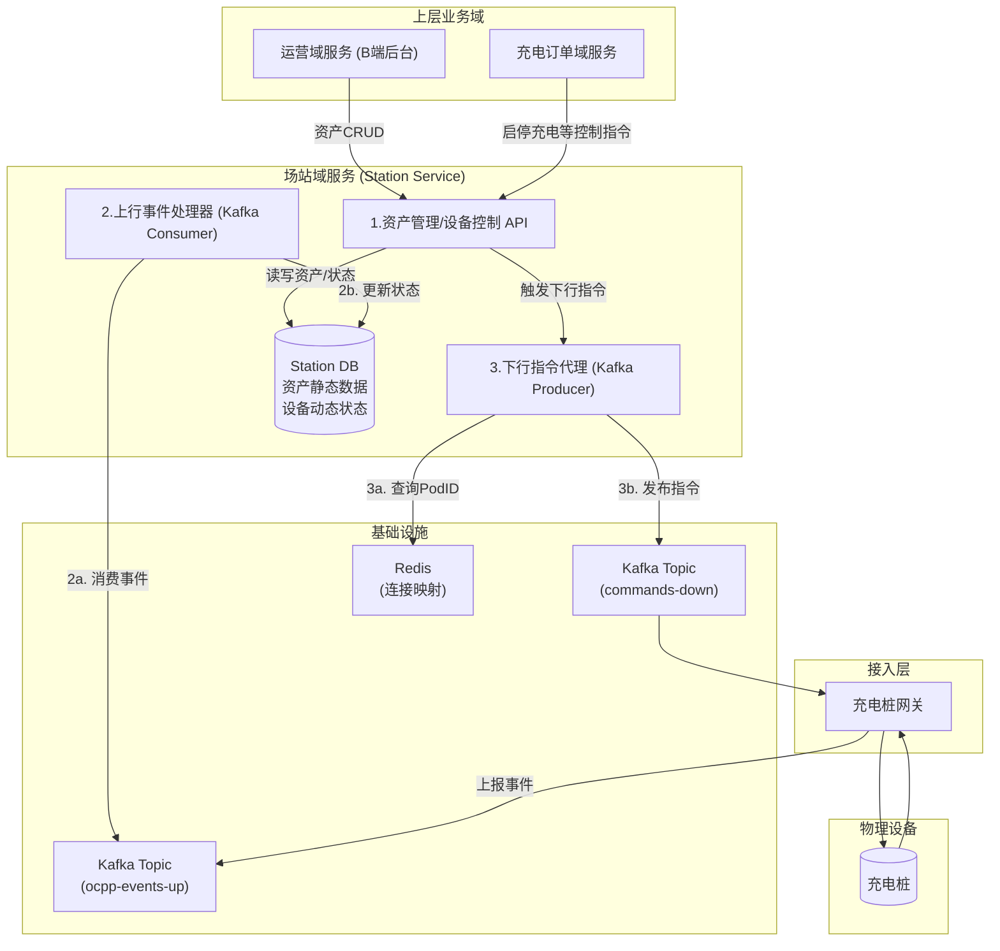
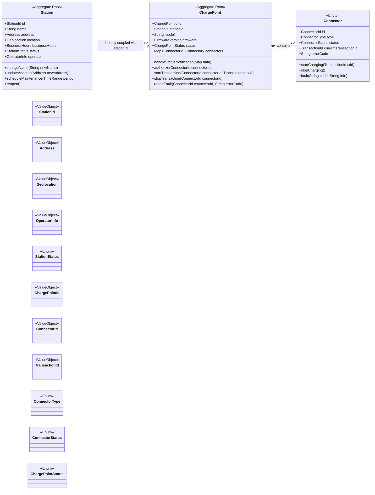
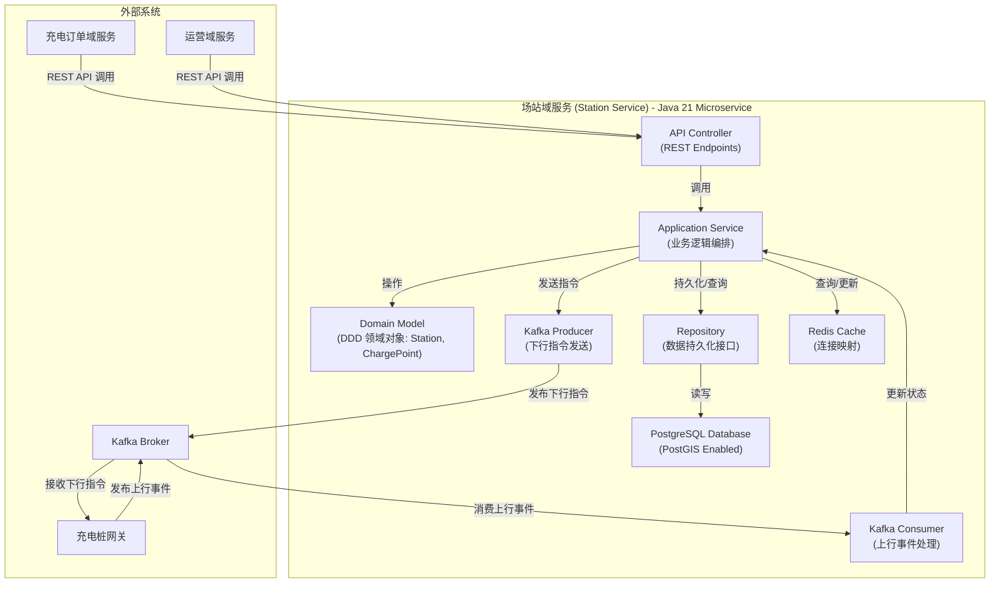

# 场站域服务 (Station Service) 架构设计 V0.2

**版本：0.2**
**日期：2025-07-23**

## 更新日志
- **V0.2 (2025-07-23)**:
  - 新增 **架构设计决策** 章节。
  - 根据5000站/10万桩规模，明确了性能与规模假设。
  - 确定了 `Station` 和 `ChargePoint` 的DDD聚合关系。
  - 完成数据库技术选型，推荐使用 PostgreSQL + PostGIS。
  - 详细阐述了在K8s环境下的高可用与弹性设计方案。
  - 新增C4 Container图，可视化架构组件。
  - **新增搜索能力设计，详细说明PostgreSQL对搜索需求的支持。**
- **V0.1 (2025-07-23)**: 初始版本，定义服务定位、边界和核心职责。

---

## 1. 服务定位与边界

### 1.1 服务核心定位：资产与状态中心

在整个智能充电服务平台中，场站域服务（Station Service）的核心定位是 **物理世界充电资产在数字世界的唯一权威镜像**。它扮演着承上启下的“资产与状态中心”角色，对内管理所有硬件资产的静态数据和动态状态，对外为上层业务提供统一、标准的资产信息和设备控制能力。

- **对下（物理世界）**: 它是物联网关（IOT Gateway）上报事件的核心消费者，负责将物理设备的实时状态（如在线、离线、空闲、充电、故障等）准确、及时地反映到平台数据库中，实现数字孪生。
- **对上（业务世界）**: 它是充电订单、运营管理等上层服务的“设备能力提供者”。它封装了与底层硬件和网关通信的复杂性，提供简洁的API，供其他服务查询资产信息和下发控制指令。

### 1.2 服务边界划分

为确保“高内聚、低耦合”，Station Service 的职责边界被严格限定。以下能力 **不属于** 本服务范畴：

- **❌ 充电业务流程管理**: 充电订单的创建、计费、结算等业务逻辑由 **充电订单域服务 (Charging Service)** 负责。Charging Service 会 *调用* 本服务的API来控制充电桩。
- **❌ 定价与计费策略管理**: 服务费、电价等计费模型的管理由 **运营域服务 (Operation Service)** 负责。本服务不关心充电价格。
- **❌ 用户信息管理**: C端用户信息、账户、车辆信息等由 **用户域服务 (User Service)** 负责。
- **❌ 直接与设备通信**: 本服务 **不直接** 与充电桩建立连接。所有与设备的交互都通过 **充电桩网关** 进行解耦。

---

## 2. 核心职责与数据流

### 2.1 核心职责

Station Service 的核心职责可归纳为以下三点：

1.  **资产管理 (Asset Management)**
    - **描述**: 作为平台唯一的资产数据源（Single Source of Truth），提供对充电站、充电桩、充电枪等资产的增、删、改、查（CRUD）API。
    - **数据**: 管理资产的静态属性，如：充电站的地理位置、名称、营业时间；充电桩的型号、功率、序列号；充电枪的接口类型、编号等。
    - **用户**: 主要供运营管理后台（B端）调用，用于资产的录入和维护。

2.  **状态同步 (State Synchronization)**
    - **描述**: 实时同步物理设备的动态状态，确保数字世界与物理世界的一致性。
    - **数据流 (上行)**: 作为Kafka消费者，订阅充电桩网关发布的上行事件主题（如 `ocpp-events-up`）。实时消费 `DeviceOnlineEvent`、`StatusNotificationEvent` 等事件，并将其解析、持久化到数据库，更新对应资产的实时状态。
    - **核心价值**: 为整个平台提供可靠、实时的设备状态数据，是实现精细化运营和良好用户体验的基础。

3.  **设备控制代理 (Device Control Proxy)**
    - **描述**: 为上层业务服务提供一个统一、简化的设备控制入口。
    - **数据流 (下行)**: 对内部（如Charging Service）暴露标准的控制API（如 `startTransaction`, `stopTransaction`, `rebootDevice`）。当接收到API调用时，本服务负责完成所有与充电桩网关的交互细节：
        1.  根据充电桩ID，查询Redis获取其当前连接的 `Gateway Pod ID`。
        2.  根据 `Gateway Pod ID` 计算出目标Kafka分区。
        3.  将业务指令（如“开始充电”）转换为充电桩网关定义的标准指令格式。
        4.  将指令发布到下行指令主题（如 `commands-down`）的指定分区。
    - **核心价值**: 封装底层通信协议和路由细节，使上层业务无需关心复杂的网关实现，从而实现业务与设备控制的彻底解耦。

### 2.2 宏观数据流图 (C4-Context)

---

## 3. 架构设计决策 (V0.2)

本章节将详细阐述针对性能、领域模型、数据存储和高可用性的核心架构决策。

### 3.1 性能与规模假设

基于 `5000座充电站` / `10万个充电桩` 的业务规模，我们做出以下合理假设以指导设计：

- **并发在线率**: 高峰期 `20%` 的充电桩处于活跃状态（在线且通信），即 **20,000** 个并发连接。
- **上行消息吞吐量 (TPS)**:
  - **状态心跳**: 假设充电桩每 `5分钟` 上报一次状态。TPS = 20,000 / 300s ≈ `70 TPS`。
  - **电度表值**: 充电中的桩（假设占活跃数的50%）每 `1分钟` 上报一次电度。TPS = 10,000 / 60s ≈ `170 TPS`。
  - **其他事件**: 启停、鉴权等事件，预估 `60 TPS`。
  - **总计上行吞吐量**: 约 **300 TPS**，峰值按 **600 TPS** 进行容量规划。
- **API 性能要求**:
  - **查询类 API** (如查站点详情、查桩状态): P99 响应时间 `< 200ms`。
  - **控制类 API** (如远程启停): P99 响应时间 `< 500ms` (指从API接收到指令并成功推送到Kafka)。
- **数据同步延迟**: 从设备上报事件到数据库状态更新完成，P99 延迟 `< 3秒`。

### 3.2 领域驱动设计（DDD）聚合划分

**核心问题**: `充电站 (Station)` 和 `充电桩 (ChargePoint)` 应如何划定聚合边界？

**决策**: **将 `Station` 和 `ChargePoint` 设计为两个独立的聚合根 (Aggregate Root)。**

**决策理由**:

1.  **生命周期和变更频率不一致**: `ChargePoint` 的状态（`status`）是整个系统变更最频繁的数据（每分钟都在变），而 `Station` 的信息（名称、地址等）几乎不变。如果将 `ChargePoint` 作为 `Station` 聚合的一部分，任何一个充电桩的状态更新都需要加载并锁定整个 `Station` 聚合，在拥有数十个桩的大型场站中，这将导致严重的性能瓶颈和并发冲突。
2.  **职责单一性**: `ChargePoint` 自身具备完整的业务不变量（如：充电桩不能同时服务两辆车）。`Station` 的核心职责是“位置”和“组织”的集合，它不应直接干涉 `ChargePoint` 内部的状态流转。
3.  **可扩展性**: 独立的聚合设计使得系统可以轻松地对 `ChargePoint` 的读写进行优化（如分库分表、缓存），而不会影响到 `Station`。

**实现方式**:
- `ChargePoint` 聚合根中包含一个 `stationId` 属性，用于维持与 `Station` 的关联关系。
- 跨聚合的查询（如“查询某站下所有空闲的桩”）在应用服务层或专门的查询服务中处理。
- 跨聚合的事务（如“删除充电站时必须删除其下所有充电桩”）通过应用服务层的逻辑来保证最终一致性，对于这种低频的管理操作，无需强事务。

### 3.2.1 领域模型图 (Mermaid)

以下是根据领域分析绘制的UML类图，用于清晰地展示聚合、实体和值对象之间的关系。

### 3.3 数据库技术选型

**核心问题**: 选择何种数据库来支撑资产管理、状态同步和地理位置查询？

**决策**: **主数据库选用 `PostgreSQL` (版本15+)，并启用 `PostGIS` 扩展。**

### 3.4 K8s 高可用与弹性设计

**核心问题**: 如何确保服务在Kubernetes环境下的韧性、高可用和可伸缩性？

**决策**: 采用以下策略和技术实践：

1.  **多副本部署与自动伸缩 (Replicas & HPA)**:
    - **策略**: Station Service 的所有核心组件（API服务、上行事件消费者）都将通过Kubernetes `Deployment` 部署多个Pod副本。
    - **实现**: 结合 `Horizontal Pod Autoscaler (HPA)` 根据CPU利用率或Kafka消费延迟等指标进行自动伸缩，应对流量高峰。

2.  **健康检查与优雅停机 (Health Checks & Graceful Shutdown)**:
    - **策略**: 为每个Pod配置 `livenessProbe` (存活探针) 和 `readinessProbe` (就绪探针)，并实现应用的优雅停机机制。
    - **实现**: `readinessProbe` 确保流量只路由到健康的Pod。优雅停机机制确保在Pod关闭前，能处理完进行中的请求和消息，避免数据丢失。

3.  **消息处理高可用与幂等性**:
    - **策略**: 利用Kafka消费者组实现消息处理的负载均衡和高可用。确保上行事件处理具备幂等性。
    - **实现**: 多个消费者Pod组成一个消费者组。通过在数据库层面使用唯一性约束或乐观锁，防止因消息重试导致的数据重复处理。

4.  **数据库高可用 (PostgreSQL HA)**:
    - **策略**: 部署PostgreSQL集群，采用主从复制（Primary-Replica）模式，并配置自动故障转移。
    - **实现**: 推荐使用 `Patroni`、`CloudNativePG` 等成熟的K8s Operator来自动化管理PostgreSQL集群，实现主节点故障时自动切换。

5.  **熔断与降级 (Circuit Breaker & Fallback)**:
    - **策略**: 在调用外部依赖（如Redis、其他微服务）时，引入熔断机制，防止级联故障。
    - **实现**: 使用 `Resilience4j` 等库实现。当依赖服务调用失败率超过阈值时，熔断器打开，快速失败并返回降级逻辑（如默认值或从缓存读取），避免长时间等待和资源耗尽。

6.  **资源限制与请求 (Resource Limits & Requests)**:
    - **策略**: 为每个Pod配置合理的CPU和内存 `requests` (请求) 和 `limits` (限制)。
    - **价值**: 保证Pod获得必要的资源，防止资源争抢，同时避免单个Pod异常时耗尽节点资源，影响其他服务。

### 3.5 搜索能力设计

针对您提出的充电站搜索需求，`PostgreSQL + PostGIS` 能够提供良好的支持，但对于更复杂的全文搜索和高并发场景，未来可考虑引入专门的搜索服务。

**3.5.1 PostgreSQL 对搜索需求的支持**

1.  **按充电站名称搜索**:
    *   **优化**: 对于更复杂的全文搜索（如支持分词、相关性排序），可以利用PostgreSQL的内置全文搜索功能（`tsvector` 和 `tsquery`），创建 `GIN` 或 `GiST` 索引。
2.  **按商圈搜索**:
    *   **实现**: 如果“商圈”是预定义的地理区域（例如，一个多边形），可以利用 `PostGIS` 的空间关系函数（如 `ST_Intersects(station_location, business_district_polygon)`）进行查询。
    *   **优化**: 如果商圈是基于标签或分类，则可以在 `station` 表中添加 `business_district_tag` 字段并建立索引。
3.  **按用户距离排序**:
    *   **实现**: 利用 `PostGIS` 的 `ST_Distance()` 函数计算用户当前位置与充电站位置的距离，并以此进行排序。
    *   **示例 SQL**: `ORDER BY ST_Distance(station_location, ST_SetSRID(ST_MakePoint(user_lon, user_lat), 4326))`。
    *   **优化**: 在 `station_location` 字段上创建 `GiST` 空间索引，可以显著加速距离查询和范围查询。
4.  **按充电站桩可用情况排序**:
    *   **实现**: 这需要结合 `Station` 和 `ChargePoint` 的数据。在查询充电站时，通过 `JOIN` 或子查询获取该站下所有充电桩的实时状态，然后聚合计算空闲枪数量。排序时，优先显示空闲枪数量多的站点。
    *   **优化**: 可以在 `ChargePoint` 表中维护一个 `available_status` 字段，并定期更新。为了避免实时聚合的性能开销，可以考虑在 `Station` 表中增加冗余字段（如 `total_available_guns`, `total_ac_guns`, `total_dc_guns`），通过触发器或异步任务（如Kafka消费者处理状态变更事件后更新）来维护这些聚合数据。
5.  **按营销活动排序**:
    *   **实现**: 这需要与营销域服务进行集成。Station Service 可以通过调用营销域服务的API获取当前有效的营销活动信息，或者营销域服务将相关活动信息同步到Station Service的数据库中。然后，在查询时根据营销活动的优先级或类型进行排序。
6.  **搜索结果列表中展示空闲枪数量、枪类型的概览**:
    *   **实现**: 如上所述，通过聚合 `ChargePoint` 的实时状态数据和静态属性数据，可以在查询结果中包含这些信息。例如，可以按枪类型（直流、交流）分组统计空闲数量。

**3.5.2 引入专业搜索服务的考量 (Elasticsearch)**

尽管PostgreSQL可以支持上述搜索需求，但对于以下场景，引入 `Elasticsearch` 或 `Solr` 等专业搜索服务会是更优的选择：

-   **复杂全文搜索**: 需要更高级的分词、同义词、拼写纠错、相关性排序等功能。
-   **高并发搜索**: 当搜索请求量非常大时，专业搜索服务能提供更好的横向扩展能力和查询性能。
-   **多维度聚合与统计**: 除了空闲枪数量，如果未来需要更复杂的实时聚合分析（如按功率、按品牌、按时间段的可用性统计），Elasticsearch的聚合能力更强大。
-   **数据异构与融合**: 如果搜索结果需要融合来自多个微服务的数据，将数据同步到Elasticsearch中进行统一索引和查询会更高效。

**数据同步策略**:
如果未来引入Elasticsearch，需要考虑数据同步机制：
-   **CDC (Change Data Capture)**: 使用 `Debezium` 等工具监听PostgreSQL的WAL日志，将数据变更实时同步到Kafka，再由Kafka消费者写入Elasticsearch。这是推荐的实时同步方案。
-   **定时全量/增量同步**: 通过批处理任务定时从PostgreSQL拉取数据并同步到Elasticsearch。适用于对实时性要求不高的场景。

**初期建议**:
在项目初期，可以优先使用 `PostgreSQL + PostGIS` 来实现搜索功能，因为它能满足当前大部分需求，并降低系统复杂度。当业务规模扩大，搜索需求变得更复杂或性能遇到瓶颈时，再考虑引入 `Elasticsearch` 作为专门的搜索层。

### 3.6 架构组件图 (C4-Container)

以下是场站域服务内部主要组件的C4 Container视图，展示了它们之间的交互关系。

---

### 3.7 可观测性体系设计 (Observability)

为确保服务的健康、稳定运行并能快速排查问题，需建立全面的可观测性体系。

1.  **日志 (Logging)**:
    - **策略**: 采用结构化日志（如JSON格式），统一日志格式和规范。
    - **实现**: 应用通过 `SLF4J` + `Logback` 输出JSON日志。在K8s中，通过 `Fluentd` 或 `Loki` 的代理采集节点上的日志，并汇聚到统一的日志分析平台（如 `Elasticsearch` 或 `Loki`）。日志中必须包含 `TraceID` 以便关联追踪。

2.  **指标 (Metrics)**:
    - **策略**: 暴露核心业务和技术指标，用于监控、告警和容量规划。
    - **实现**: 应用集成 `Micrometer` 和 `Spring Boot Actuator`，通过 `/actuator/prometheus` 端点暴露指标。使用 `Prometheus` 进行指标采集和存储，`Grafana` 进行可视化展示，并配置 `Alertmanager` 实现关键指标（如API错误率、Kafka消费延迟）的告警。

3.  **分布式追踪 (Distributed Tracing)**:
    - **策略**: 实现端到端的调用链路追踪，快速定位性能瓶颈和错误源头。
    - **实现**: 采用 `OpenTelemetry` 作为标准规范。应用集成 `OpenTelemetry Agent` 或SDK，自动进行代码插桩。Trace数据（Spans）被发送到 `Jaeger` 或 `SkyWalking` 等后端进行存储、分析和可视化。

### 3.8 CI/CD 与部署策略

1.  **持续集成 (Continuous Integration)**:
    - **策略**: 代码合并到主分支前，必须通过自动化的质量门禁。
    - **实现**: 使用 `Jenkins` 或 `GitLab CI`。CI流水线包括：代码编译 -> 运行单元测试与集成测试 -> 代码质量扫描 (`SonarQube`) -> 构建Docker镜像并推送到镜像仓库 (`Harbor`)。

2.  **持续部署 (Continuous Deployment)**:
    - **策略**: 采用蓝绿部署或金丝雀发布策略，实现安全、平滑的上线过程。
    - **实现**: 推荐使用 `ArgoCD` 或 `Flux` 等GitOps工具。部署流程由Git仓库中的K8s manifest文件驱动。发布新版本时，先部署新版本（绿区），将少量流量（如内部测试流量）切到新版本进行验证，验证通过后再将全部流量切换过去，最后下线旧版本（蓝区）。

---

## 4. 技术栈详细清单

### 4.1 核心框架 (Core Framework)

| 技术组件 | 版本建议 | 用途说明 |
|---------|---------|----------|
| **Java** | 21 LTS | 编程语言，提供虚拟线程、模式匹配等新特性 |
| **Spring Boot** | 3.2.x | 微服务基础框架，自动配置和依赖管理 |
| **Spring Framework** | 6.1.x | IoC容器、AOP、事务管理等核心功能 |

### 4.2 微服务治理 (Microservice Governance)

| 技术组件 | 版本建议 | 用途说明 |
|---------|---------|----------|
| **Kubernetes Service** | N/A | **服务发现**: 利用K8s原生的服务发现机制，通过DNS进行服务间调用。 |
| **Kubernetes ConfigMap/Secret** | N/A | **配置管理**: 统一管理应用配置和敏感信息，通过卷挂载或环境变量注入。 |
| **Spring Cloud Kubernetes** | 3.1.x | **K8s集成**: 桥接Spring Boot应用与K8s，实现配置的动态刷新等功能。 |
| **Spring Cloud Gateway** | 4.1.x | API网关，统一入口、路由、限流、熔断。 |
| **Spring Cloud OpenFeign** | 4.1.x | 声明式HTTP客户端，服务间调用。 |
| **Spring Cloud Circuit Breaker** | 3.1.x | 熔断器模式，集成Resilience4j。 |
| **Resilience4j** | 2.2.x | 容错库，提供熔断、重试、限流等能力。 |

### 4.3 数据存储与访问 (Data Storage & Access)

| 技术组件 | 版本建议 | 用途说明 |
|---------|---------|----------|
| **PostgreSQL** | 16.x | 主数据库，ACID事务保证 |
| **PostGIS** | 3.4.x | 地理空间数据扩展，支持位置搜索 |
| **Spring Data JPA** | 3.2.x | ORM框架，简化数据访问层 |
| **Hibernate** | 6.4.x | JPA实现，对象关系映射 |
| **HikariCP** | 5.1.x | 高性能数据库连接池 |
| **Redis** | 7.2.x | 缓存、会话存储、分布式锁 |
| **Redisson** | 3.27.x | Redis客户端，分布式数据结构支持 |

### 4.4 消息队列 (Message Queue)

| 技术组件 | 版本建议 | 用途说明 |
|---------|---------|----------|
| **Apache Kafka** | 3.6.x | 分布式消息队列，事件流处理 |
| **Spring Kafka** | 3.1.x | Kafka集成，简化生产者/消费者开发 |
| **Kafka Streams** | 3.6.x | 流处理框架 (可选，用于复杂事件处理) |

### 4.5 监控与可观测性 (Observability)

| 技术组件 | 版本建议 | 用途说明 |
|---------|---------|----------|
| **Logback** | 1.4.x | 日志框架，结构化日志输出 |
| **SLF4J** | 2.0.x | 日志门面，统一日志接口 |
| **Micrometer** | 1.12.x | 指标收集库，多后端支持 |
| **Prometheus** | 2.48.x | 指标存储和查询引擎 |
| **Grafana** | 10.x | 指标可视化和告警 |
| **Spring Boot Actuator** | 3.2.x | 应用监控端点，健康检查 |
| **OpenTelemetry** | 1.34.x | 分布式追踪标准 |
| **Jaeger** | 1.52.x | 分布式追踪后端存储 |

### 4.6 安全认证 (Security & Authentication)

| 技术组件 | 版本建议 | 用途说明 |
|---------|---------|----------|
| **Spring Security** | 6.2.x | 安全框架，认证授权 |
| **JWT (jjwt)** | 0.12.x | JSON Web Token，无状态认证 |
| **OAuth2** | - | 统一认证授权协议 |

### 4.7 开发工具与辅助 (Development Tools)

| 技术组件 | 版本建议 | 用途说明 |
|---------|---------|----------|
| **MapStruct** | 1.5.x | 对象映射代码生成，替代手动转换 |
| **Swagger/OpenAPI 3** | 2.2.x | API文档自动生成 |
| **Jackson** | 2.16.x | JSON序列化/反序列化 |
| **Bean Validation** | 3.0.x | 参数校验，JSR-303实现 |
| **Lombok** | 1.18.x | 代码生成，减少样板代码 |

### 4.8 测试框架 (Testing Framework)

| 技术组件 | 版本建议 | 用途说明 |
|---------|---------|----------|
| **JUnit 5** | 5.10.x | 单元测试框架 |
| **Mockito** | 5.8.x | Mock框架，单元测试辅助 |
| **Testcontainers** | 1.19.x | 集成测试容器化 |
| **WireMock** | 3.3.x | HTTP服务模拟，API测试 |
| **Awaitility** | 4.2.x | 异步测试支持 |
| **Spring Boot Test** | 3.2.x | Spring Boot测试支持 |

---

## 5. 项目结构设计

### 5.1 整体架构视图 (C4 Container)

```mermaid
graph TB
    subgraph "外部系统"
        ChargingService["充电订单域服务<br/>(Charging Service)"]
        OperationService["运营域服务<br/>(Operation Service)"]
        UserService["用户域服务<br/>(User Service)"]
        IOTGateway["充电桩网关<br/>(IOT Gateway)"]
    end

    subgraph "基础设施层 (Infrastructure)"
        subgraph "服务治理 (K8s Native)"
            Gateway["Spring Cloud Gateway<br/>(API网关)"]
            K8sService["Kubernetes Service<br/>(服务发现)"]
            K8sConfig["Kubernetes ConfigMap<br/>(配置管理)"]
        end
        
        subgraph "数据存储"
            PostgreSQL["PostgreSQL + PostGIS<br/>(主数据库)"]
            Redis["Redis + Redisson<br/>(缓存/分布式锁)"]
        end
        
        subgraph "消息队列"
            Kafka["Apache Kafka<br/>(事件流)"]
        end
        
        subgraph "可观测性"
            Prometheus["Prometheus<br/>(指标收集)"]
            Grafana["Grafana<br/>(监控面板)"]
            Jaeger["Jaeger<br/>(链路追踪)"]
            ELK["ELK Stack<br/>(日志分析)"]
        end
    end

    subgraph "Station Service (场站域服务)"
        subgraph "接入层 (Presentation Layer)"
            RestController["REST Controller<br/>(Spring MVC)"]
            KafkaListener["Kafka Listener<br/>(事件消费)"]
        end
        
        subgraph "应用层 (Application Layer)"
            AppService["Application Service<br/>(业务编排)"]
            DTOMapper["DTO Mapper<br/>(MapStruct)"]
            EventHandler["Event Handler<br/>(事件处理)"]
        end
        
        subgraph "领域层 (Domain Layer)"
            StationAggregate["Station Aggregate<br/>(充电站聚合根)"]
            ChargePointEntity["ChargePoint Entity<br/>(充电桩实体)"]
            DomainService["Domain Service<br/>(领域服务)"]
            DomainEvent["Domain Event<br/>(领域事件)"]
        end
        
        subgraph "基础设施层 (Infrastructure Layer)"
            Repository["JPA Repository<br/>(数据访问)"]
            KafkaProducer["Kafka Producer<br/>(事件发布)"]
            RedisService["Redis Service<br/>(缓存服务)"]
            ExternalClient["Feign Client<br/>(外部调用)"]
            K8sAdapter["Spring Cloud Kubernetes<br/>(K8s适配器)"]
        end
    end

    %% 外部调用关系
    ChargingService --> Gateway
    OperationService --> Gateway
    UserService --> Gateway
    Gateway -- "路由到" --> RestController
    
    %% 内部调用关系
    RestController --> AppService
    KafkaListener --> EventHandler
    EventHandler --> AppService
    AppService --> DTOMapper
    AppService --> StationAggregate
    AppService --> DomainService
    StationAggregate --> ChargePointEntity
    DomainService --> Repository
    AppService --> Repository
    AppService --> KafkaProducer
    AppService --> RedisService
    AppService --> ExternalClient
    
    %% 基础设施连接
    Repository --> PostgreSQL
    RedisService --> Redis
    KafkaListener --> Kafka
    KafkaProducer --> Kafka
    IOTGateway --> Kafka
    
    %% 服务治理连接
    AppService -- "通过K8s适配器" --> K8sAdapter
    K8sAdapter -- "读取" --> K8sConfig
    ExternalClient -- "通过K8s DNS解析" --> K8sService
    Gateway -- "发现服务" --> K8sService
    
    %% 监控连接
    RestController -.-> Prometheus
    AppService -.-> Jaeger
    RestController -.-> ELK
```

### 5.3 DDD分层架构说明

1. **接入层 (Presentation Layer)**
   - 负责接收外部请求和事件
   - REST Controller处理HTTP请求
   - Kafka Listener处理消息事件
   - 数据校验和格式转换

2. **应用层 (Application Layer)**
   - 业务流程编排和协调
   - 事务边界控制
   - 领域对象与DTO之间的转换
   - 调用领域服务完成业务逻辑

3. **领域层 (Domain Layer)**
   - 核心业务逻辑和规则
   - 领域模型（聚合根、实体、值对象）
   - 领域服务处理跨聚合的业务逻辑
   - 领域事件表达业务概念

4. **基础设施层 (Infrastructure Layer)**
   - 技术实现细节
   - 数据持久化、消息队列、缓存等
   - 外部服务调用
   - 监控和日志记录

---

