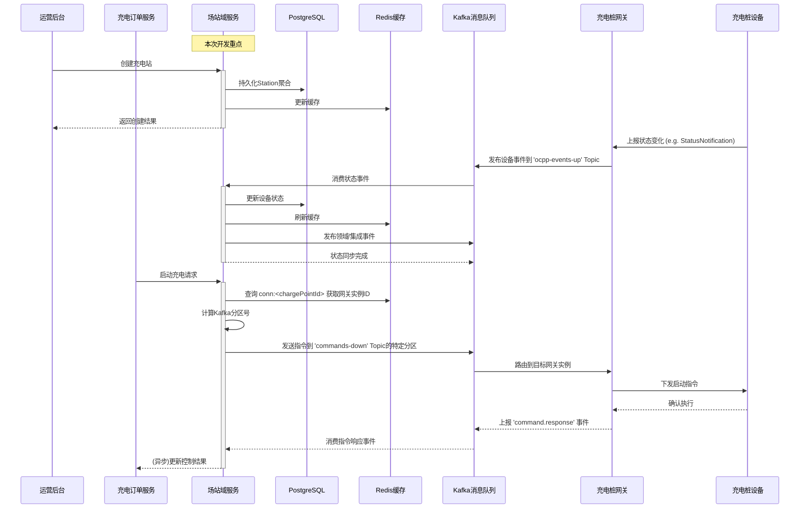

# 场站域服务 (Station Service) 详细开发设计文档 V1.0

**版本：1.0**  
**日期：2025-07-25**  
**作者：架构师团队**  
**目标读者：初级Java开发工程师**

---

## 1. 文档概述 (Overview)

### 1.1 版本历史

| 版本 | 日期 | 修改内容 | 作者 |
|------|------|----------|------|
| V1.0 | 2025-07-25 | 初始版本，基于架构设计V0.2生成详细开发设计 | 架构师团队 |

### 1.2 项目背景与目标

**功能名称**: 场站域服务 (Station Service)

**一句话功能描述**: 构建智能充电平台的资产与状态中心，管理5000个充电站和10万个充电桩的静态信息和动态状态，为上层业务提供统一的资产查询和设备控制能力。

**关联需求文档**:
- [场站域服务架构设计 V0.2](./station_service_arch_design_v2.md)
- [网关与场站服务集成协作手册 V1.0](./gateway_station_integration_handbook_v1.md)
- 智能充电平台总体架构设计

**主要技术栈**: Java 21, Spring Boot 3, Spring Cloud, Spring Data JPA, PostgreSQL + PostGIS, Redis, Redisson, Kafka, Logback

**业务价值**:
1. **数字孪生**: 实现物理充电设备在数字世界的完整映射
2. **状态同步**: 确保平台数据与设备实时状态的一致性
3. **服务解耦**: 为上层业务提供标准化的设备控制接口，屏蔽底层复杂性
4. **高可用性**: 支持5000站/10万桩规模的高并发访问和实时状态更新

### 1.3 术语表

| 术语 | 英文 | 定义 |
|------|------|------|
| 充电站 | Station | 物理充电场所，包含多个充电桩 |
| 充电桩 | ChargePoint | 具体的充电设备，包含多个充电枪 |
| 充电枪 | Connector | 充电桩上的具体充电接口 |
| 聚合根 | Aggregate Root | DDD中的核心概念，管理聚合内实体一致性 |
| 领域事件 | Domain Event | 聚合内部状态变化产生的事件 |
| 集成事件 | Integration Event | 跨服务通信的事件 |
| 数字孪生 | Digital Twin | 物理设备在数字世界的实时映射 |

---

## 2. 总体设计 (High-Level Design)

### 2.1 系统交互图



### 2.2 技术选型

| 技术组件                | 版本   | 选型理由               | 在本项目中的作用 |
|---------------------|------|--------------------|------------------|
| **Java**            | 21   | LTS版本，虚拟线程支持高并发    | 核心开发语言 |
| **Spring Boot**     | 3.3.x | 生态成熟，自动配置简化开发      | 应用框架 |
| **Spring Data JPA** | 3.3.x | 简化数据访问，支持DDD聚合持久化  | ORM框架 |
| **PostgreSQL**      | 16+  | 支持JSON、空间数据，ACID保证 | 主数据库 |
| **PostGIS**         | 3.4+ | 地理空间查询支持           | 空间数据扩展 |
| **Redis**           | 7.x  | 高性能缓存，支持分布式锁       | 缓存和会话存储 |
| **Redisson**        | 3.27.x | Redis客户端，分布式锁实现    | 分布式协调 |
| **Kafka**           | 3.6.x | 高吞吐消息队列，事件驱动架构     | 异步消息处理 |
| **Logback**         | 1.4.x | 高性能日志框架            | 日志记录 |
| **Gradle**          |      | 依赖管理               | 依赖管理 |
---

## 3. 详细设计 (Detailed Design)

### 3.1 代码分层与结构

#### 3.1.1 推荐包结构

```
com.charging.platform.station/
├── StationServiceApplication.java          # 启动类
├── config/                                 # 配置类
│   ├── DatabaseConfig.java                # 数据库配置
│   ├── RedisConfig.java                   # Redis配置
│   ├── KafkaConfig.java                   # Kafka配置
│   └── SecurityConfig.java                # 安全配置
│   # 注：所有配置项（如Kafka地址、Topic）通过Spring Cloud Kubernetes从K8s ConfigMap加载
├── interfaces/                            # 接口层 (用户接口)
│   ├── rest/                              # REST控制器
│   │   ├── StationController.java
│   │   ├── ChargePointController.java
│   │   └── DeviceControlController.java
│   ├── dto/                               # 数据传输对象
│   │   ├── request/
│   │   │   ├── CreateStationRequest.java
│   │   │   ├── UpdateStationRequest.java
│   │   │   └── StartChargingRequest.java
│   │   └── response/
│   │   │   ├── StationResponse.java
│   │   │   ├── ChargePointResponse.java
│   │   │   └── ApiResult.java
│   │   └── event/                         # 上行事件DTO
│   │       └── GatewayEventDTO.java
│   └── assembler/                         # DTO转换器
│       ├── StationAssembler.java
│       └── ChargePointAssembler.java
├── application/                           # 应用层
│   ├── service/                           # 应用服务
│   │   ├── StationApplicationService.java
│   │   ├── ChargePointApplicationService.java
│   │   └── DeviceControlApplicationService.java
│   ├── command/                           # 命令对象
│   │   ├── CreateStationCommand.java
│   │   ├── UpdateStationCommand.java
│   │   └── StartChargingCommand.java      
│   └── handler/                           # 事件处理器
│       ├── DeviceStatusEventHandler.java    # 处理状态变更
│       └── CommandResponseEventHandler.java # 处理指令的异步响应
├── domain/                                # 领域层
│   ├── model/                             # 领域模型
│   │   ├── station/                       # 充电站聚合
│   │   │   ├── Station.java              # 聚合根
│   │   │   ├── StationId.java            # 值对象
│   │   │   ├── StationInfo.java          # 值对象
│   │   │   ├── Location.java             # 值对象
│   │   │   └── BusinessHours.java        # 值对象
│   │   ├── chargepoint/                   # 充电桩聚合
│   │   │   ├── ChargePoint.java          # 聚合根
│   │   │   ├── ChargePointId.java        # 值对象
│   │   │   ├── ChargePointStatus.java    # 值对象
│   │   │   ├── Connector.java            # 实体
│   │   │   └── ConnectorType.java        # 枚举
│   │   └── shared/                        # 共享值对象
│   │       ├── DeviceStatus.java
│   │       └── PowerSpecification.java
│   ├── event/                             # 领域事件
│   │   ├── StationCreatedEvent.java
│   │   ├── ChargePointStatusChangedEvent.java
│   │   └── ChargingStartedEvent.java
│   ├── repository/                        # 仓储接口
│   │   ├── StationRepository.java
│   │   └── ChargePointRepository.java
│   └── service/                           # 领域服务
│       ├── StationDomainService.java
│       └── ChargePointDomainService.java
├── infrastructure/                        # 基础设施层
│   ├── persistence/                       # 持久化实现
│   │   ├── jpa/                          # JPA实现
│   │   │   ├── entity/
│   │   │   ├── repository/
│   │   │   └── converter/
│   │   └── cache/
│   │       ├── StationCacheService.java
│   │       └── ChargePointCacheService.java
│   ├── messaging/                         # 消息处理
│   │   ├── kafka/
│   │   │   ├── consumer/
│   │   │   │   ├── DeviceEventConsumer.java
│   │   │   ├── producer/
│   │   │   │   └── IntegrationEventProducer.java
│   │   │   └── config/
│   │   │       └── KafkaTopicConfig.java
│   │   ├── relay/
│   │   │   └── OutboxEventRelay.java
│   │   └── publisher/
│   │       └── DomainEventPublisher.java
│   └── external/                          # 外部服务集成
│       └── gateway/
│           └── GatewayCommandRouter.java  # 负责向下行Topic发送指令 (含分区路由)
└── shared/                                # 共享组件
    ├── exception/                         # 异常定义
    │   ├── BusinessException.java
    │   ├── ResourceNotFoundException.java
    │   └── GlobalExceptionHandler.java
    ├── util/                              # 工具类
    │   ├── GeoUtils.java
    │   └── ValidationUtils.java
    └── constant/                          # 常量定义
        ├── CacheKeys.java                 # 缓存Key常量
        └── KafkaTopics.java               # Kafka Topic常量
```

#### 3.1.2 各层职责说明

| 层次 | 职责 | 关键原则 |
|------|------|----------|
| **接口层 (interfaces)** | 处理HTTP请求，参数校验，DTO转换，消费上行事件 | 薄薄一层，不包含业务逻辑 |
| **应用层 (application)** | 编排业务流程，事务管理，调用领域服务，处理应用事件 | 无状态，协调者角色 |
| **领域层 (domain)** | 核心业务逻辑，领域规则，领域事件 | 与技术无关，纯业务逻辑 |
| **基础设施层 (infrastructure)** | 技术实现，数据持久化，外部集成（如分区路由） | 可替换的技术实现 |

> **设计考量**: 采用DDD分层架构确保业务逻辑与技术实现解耦，领域层保持纯净，便于测试和维护。

### 3.2 关键类与方法设计

#### 3.2.1 StationController (接口层)

**职责**: 作为HTTP入口，负责充电站相关请求的接收、校验、认证解析，并调用应用服务层。

**关键方法 `createStation`**:

**职责**: 处理创建充电站的HTTP请求

**伪代码/实现步骤**:
```java
@PostMapping("/stations")
public ApiResult<StationResponse> createStation(@Valid @RequestBody CreateStationRequest request) {
    1. 接收 @RequestBody CreateStationRequest DTO
    2. 使用 @Valid 注解触发自动校验 (JSR-303)
    3. 从安全上下文 (SecurityContext) 中获取当前操作用户信息
    4. 将DTO转换为Command对象: CreateStationCommand command = assembler.toCommand(request)
    5. 调用应用服务: StationResponse response = stationApplicationService.createStation(command)
    6. 将结果封装到 ApiResult.success(response) 中并返回
    7. 异常由全局异常处理器统一处理
}
```

#### 3.2.2 DeviceControlApplicationService (应用层)

**职责**: 编排设备控制流程，调用基础设施层的路由服务发送指令。

**关键方法 `startCharging`**:

**职责**: 处理远程启动充电的业务流程

**伪代码/实现步骤**:
```java
@Service
public class DeviceControlApplicationService {
    
    private final GatewayCommandRouter gatewayCommandRouter;
    private final ChargePointRepository chargePointRepository;

    @Transactional
    public CommandAcceptedResponse startCharging(StartChargingCommand command) {
      
        2. // 业务前置检查: 查找充电桩，确认其状态是否为AVAILABLE
           ChargePoint chargePoint = chargePointRepository.findById(command.getChargePointId())
               .orElseThrow(() -> new ResourceNotFoundException("充电桩不存在"));
           
           if (!chargePoint.isAvailable()) {
               throw new BusinessException("充电桩当前不可用");
           }
        
        3. // 创建远程启动指令 (下行指令DTO)
           RemoteStartTransactionInstruction instruction = new RemoteStartTransactionInstruction(
               command.getConnectorId(),
               command.getIdTag() // 假设command中包含idTag
           );
           
        4. // 调用网关指令路由器发送指令
           // 路由器内部会处理Redis查询、分区计算和发送逻辑
           String commandId = gatewayCommandRouter.sendCommand(
               command.getChargePointId(),
               "RemoteStartTransaction",
               instruction
           );
           
        5. // (可选) 持久化指令发送记录，状态为 "SENT"
        
        6. // 同步返回指令已被接受
           return new CommandAcceptedResponse(commandId, "ACCEPTED");
    }
}
```

#### 3.2.3 GatewayCommandRouter (基础设施层)

**职责**: 封装向网关发送指令的复杂逻辑，包括连接查询、分区计算和精确发送，严格遵循《网关集成手册》规范。

**伪代码/实现步骤**:
```java
@Service
public class GatewayCommandRouter {
    
    private final StringRedisTemplate redisTemplate;
    private final KafkaTemplate<String, String> kafkaTemplate;
    private final ObjectMapper objectMapper;
    private static final int TOTAL_PARTITIONS = 128; // 与网关约定

    public String sendCommand(ChargePointId chargePointId, String commandName, Object payload) {
        1. // 步骤1: 查询连接映射
           String redisKey = CacheKeys.DEVICE_CONNECTION_PREFIX + chargePointId.getValue();
           String gatewayPodId = redisTemplate.opsForValue().get(redisKey);
           
           if (gatewayPodId == null || gatewayPodId.isEmpty()) {
               throw new BusinessException("设备不在线或连接信息不存在");
           }
           
        2. // 步骤2: 计算目标分区
           int partitionId = calculatePartition(gatewayPodId);
           
        3. // 步骤3: 构建指令并发送到指定分区
           String commandId = UUID.randomUUID().toString();
           GatewayCommandDTO commandDTO = new GatewayCommandDTO(
               commandId, commandName, chargePointId.getValue(), payload
           );
           String message = objectMapper.writeValueAsString(commandDTO);
           
           // 精确发送到目标分区
           kafkaTemplate.send(KafkaTopics.COMMANDS_DOWN, partitionId, chargePointId.getValue(), message);
           
           log.info("指令已发送: commandId={}, chargePointId={}, partition={}", commandId, chargePointId, partitionId);
           return commandId;
    }
    
    private int calculatePartition(String key) {
        // 使用与网关团队约定的稳定哈希算法，如 FNV-1a
        long hash = Fnv1a.hash64(key.getBytes(StandardCharsets.UTF_8));
        return (int) (Math.abs(hash) % TOTAL_PARTITIONS);
    }
}
```

#### 3.2.4 DeviceStatusEventHandler (应用层事件处理器)

**职责**: 处理来自充电桩网关的`connector.status_changed`事件，更新设备状态并发布领域事件。

**关键方法 `handleStatusNotification`**:

**伪代码/实现步骤**:
```java
@KafkaListener(topics = KafkaTopics.OCPP_EVENTS_UP, groupId = "station-service")
@Transactional
public void handleGatewayEvent(String message) {
    // 根据 eventType 路由到不同处理器
    GatewayEventDTO<?> event = parseEvent(message);
    if ("connector.status_changed".equals(event.getEventType())) {
        handleStatusNotification(event);
    }
}

private void handleStatusNotification(GatewayEventDTO<StatusChangedPayload> event) {
    1. // 事件数据校验
       StatusChangedPayload payload = event.getPayload();
       if (event.getChargePointId() == null || payload == null) {
           log.warn("接收到无效的状态通知事件: {}", event);
           return;
       }
       
    2. // 查找充电桩聚合
       ChargePointId chargePointId = new ChargePointId(event.getChargePointId());
       ChargePoint chargePoint = chargePointRepository.findById(chargePointId)
            .orElseThrow(() -> new ResourceNotFoundException("充电桩不存在: " + chargePointId));
       
    3. // 更新充电桩状态
       DeviceStatus oldStatus = chargePoint.getStatus();
       DeviceStatus newStatus = DeviceStatus.fromOcppStatus(payload.getStatus());
       
       chargePoint.updateStatus(newStatus, event.getTimestamp());
       
    4. // 持久化状态变更
       chargePointRepository.save(chargePoint);
       
    5. // 更新缓存
       chargePointCacheService.evictChargePointCache(chargePointId);
       
    6. // 发布领域事件 (如果状态确实发生变化)
       if (!oldStatus.equals(newStatus)) {
           ChargePointStatusChangedEvent domainEvent = new ChargePointStatusChangedEvent(
               chargePointId, oldStatus, newStatus, event.getTimestamp()
           );
           domainEventPublisher.publish(domainEvent);
       }
}
```

#### 3.2.5 CommandResponseEventHandler (应用层事件处理器)

**职责**: 处理来自网关的`command.response`事件，更新原始指令的最终执行结果。

**伪代码/实现步骤**:
```java
@Component
public class CommandResponseEventHandler {

    // 在主消费者中路由到此
    @Transactional
    public void handleCommandResponse(GatewayEventDTO<CommandResponsePayload> event) {
        1. // 获取指令响应负载
           CommandResponsePayload payload = event.getPayload();
           log.info("收到指令响应: commandId={}, status={}", payload.getCommandId(), payload.getStatus());
           
        2. // 查找原始指令记录 (假设已持久化)
           Optional<CommandLog> commandLogOpt = commandLogRepository.findByCommandId(payload.getCommandId());
           if (commandLogOpt.isEmpty()) {
               log.warn("未找到对应的原始指令: {}", payload.getCommandId());
               return;
           }
           
        3. // 更新指令状态
           CommandLog commandLog = commandLogOpt.get();
           commandLog.setStatus(payload.getStatus()); // e.g., "Accepted", "Rejected"
           commandLog.setResponseDetails(payload.getDetails());
           commandLogRepository.save(commandLog);
           
        4. // (可选) 发布集成事件，通知上层业务（如订单服务）指令执行的最终结果
           if ("Rejected".equals(payload.getStatus())) {
               CommandRejectedEvent integrationEvent = new CommandRejectedEvent(...);
               integrationEventProducer.publish(integrationEvent);
           }
    }
}
```

#### 3.2.6 共享值对象设计 (DeviceStatus)

**职责**: 封装设备状态，提供与外部系统（如OCPP协议）状态字符串之间的安全转换，避免在业务逻辑中使用“魔法字符串”。

**文件位置**: `com/charging/platform/station/domain/model/shared/DeviceStatus.java`

**伪代码/实现步骤**:
```java
public enum DeviceStatus {
AVAILABLE("Available"),
PREPARING("Preparing"),
CHARGING("Charging"),
SUSPENDED_EVSE("SuspendedEVSE"),
SUSPENDED_EV("SuspendedEV"),
FINISHING("Finishing"),
RESERVED("Reserved"),
UNAVAILABLE("Unavailable"),
FAULTED("Faulted"),
OFFLINE("Offline"); // 内部状态，非OCPP标准

    private final String ocppStatus;

    DeviceStatus(String ocppStatus) {
        this.ocppStatus = ocppStatus;
    }

    public String getOcppStatus() {
        return ocppStatus;
    }

    /**
     * 从OCPP状态字符串安全地转换为DeviceStatus枚举。
     * @param statusString 来自网关事件的状态字符串。
     * @return 对应的DeviceStatus枚举。
     */
    public static DeviceStatus fromOcppStatus(String statusString) {
        if (statusString == null) {
            return UNAVAILABLE; // 或根据业务决定抛出异常
        }
        for (DeviceStatus status : values()) {
            if (status.ocppStatus.equalsIgnoreCase(statusString)) {
                return status;
            }
        }
        // 对于未知的状态字符串，记录警告并返回一个默认的安全状态
        // log.warn("接收到未知的OCPP状态: {}", statusString);
        return UNAVAILABLE;
    }
}
```

> **设计考量**: 使用枚举（Enum）来表示有限的状态集是最佳实践。它提供了编译时的类型安全，并允许将与状态相关的行为（如 `fromOcppStatus` 转换逻辑）内聚到枚举自身。这使得代码更清晰、更易于维护，并消除了因硬编码字符串或拼写错误导致的潜在bug。

### 3.3 API接口设计

#### 3.3.1 充电站管理与控制API

| 功能描述 | 请求方法 | 路径 | 请求体示例 | 成功响应 | 失败响应 |
|----------|----------|------|------------|----------|----------|
| **创建充电站** | POST | `/api/v1/stations` | ```json<br>{<br>  "name": "万达广场充电站",<br>  "address": "北京市朝阳区建国路93号",<br>  "latitude": 39.9042,<br>  "longitude": 116.4074,<br>  "operatorId": "OP001",<br>  "openTime": "00:00",<br>  "closeTime": "23:59"<br>}<br>``` | ```json<br>{<br>  "code": 200,<br>  "message": "success",<br>  "data": {<br>    "stationId": "ST001",<br>    "name": "万达广场充电站",<br>    "status": "INACTIVE",<br>    "createdAt": "2025-07-25T10:30:00Z"<br>  }<br>}<br>``` | ```json<br>{<br>  "code": 400,<br>  "message": "充电站名称已存在"<br>}<br>``` |
| **搜索附近充电站** | GET | `/api/v1/stations/nearby?lat=39.9042&lng=116.4074&radius=5000` | - | ```json<br>{<br>  "code": 200,<br>  "data": [<br>    {<br>      "stationId": "ST001",<br>      "name": "万达广场充电站",<br>      "distance": 1200,<br>      "availableChargePoints": 5<br>    }<br>  ]<br>}<br>``` | ```json<br>{<br>  "code": 400,<br>  "message": "无效的地理坐标"<br>}<br>``` |
| **启动充电** | POST | `/api/v1/chargepoints/{id}/start` | ```json<br>{<br>  "transactionId": "TXN001",<br>  "connectorId": 1<br>}<br>``` | ```json<br>{<br>  "code": 200,<br>  "data": {<br>    "commandId": "CMD001",<br>    "status": "ACCEPTED"<br>  }<br>}<br>``` | ```json<br>{<br>  "code": 409,<br>  "message": "充电桩不可用"<br>}<br>``` |

### 3.4 数据库设计

#### 3.4.1 充电站表 (stations)

```sql
CREATE TABLE stations (
    id VARCHAR(32) PRIMARY KEY,                    -- 充电站ID
    name VARCHAR(100) NOT NULL,                    -- 充电站名称
    address VARCHAR(200) NOT NULL,                 -- 详细地址
    description TEXT,                              -- 描述信息
    location GEOMETRY(POINT, 4326) NOT NULL,       -- 地理位置 (PostGIS)
    operator_id VARCHAR(32) NOT NULL,              -- 运营商ID
    status VARCHAR(20) NOT NULL DEFAULT 'INACTIVE', -- 状态
    open_time TIME NOT NULL DEFAULT '00:00:00',    -- 营业开始时间
    close_time TIME NOT NULL DEFAULT '23:59:59',   -- 营业结束时间
    created_at TIMESTAMP WITH TIME ZONE NOT NULL DEFAULT NOW(),
    updated_at TIMESTAMP WITH TIME ZONE NOT NULL DEFAULT NOW(),
    version BIGINT NOT NULL DEFAULT 0              -- 乐观锁版本号
);

-- 索引策略
CREATE UNIQUE INDEX idx_stations_name ON stations(name);
CREATE INDEX idx_stations_location ON stations USING GIST(location);
```

#### 3.4.2 发件箱表 (outbox_events)

**目的**: 确保领域/集成事件与业务操作在同一个事务中原子性地持久化，防止数据不一致。

```sql
CREATE TABLE outbox_events (
    id UUID PRIMARY KEY,                             -- 事件唯一ID
    aggregate_type VARCHAR(255) NOT NULL,            -- 聚合根类型 (e.g., 'Station')
    aggregate_id VARCHAR(255) NOT NULL,              -- 聚合根ID
    event_type VARCHAR(255) NOT NULL,                -- 事件类型 (e.g., 'StationCreatedEvent')
    payload JSONB NOT NULL,                          -- 事件内容的JSON序列化
    status VARCHAR(20) NOT NULL DEFAULT 'PENDING',   -- 事件状态 (PENDING, PUBLISHED)
    created_at TIMESTAMP WITH TIME ZONE NOT NULL DEFAULT NOW()
);

-- 索引策略
CREATE INDEX idx_outbox_events_status_created_at ON outbox_events(status, created_at);
```

### 3.5 缓存设计

#### 3.5.1 缓存策略

| 缓存场景 | Key格式 | 数据结构 | TTL | 更新策略 |
|----------|---------|----------|-----|----------|
| **充电站详情** | `station:{stationId}` | String (JSON) | 30分钟 | Cache-Aside |
| **充电桩状态** | `chargepoint:{chargePointId}:status` | String | 1分钟 | Write-Through/Event-Driven |
| **设备连接映射** | `conn:{chargePointId}` | String | 永久 | 由网关写入，本服务只读 |

#### 3.5.2 共享常量定义

```java
// shared/constant/KafkaTopics.java
public final class KafkaTopics {
    public static final String OCPP_EVENTS_UP = "ocpp-events-up";
    public static final String COMMANDS_DOWN = "commands-down";
}

// shared/constant/CacheKeys.java
public final class CacheKeys {
    public static final String STATION_DETAIL_PREFIX = "station:";
    public static final String CHARGEPOINT_STATUS_PREFIX = "chargepoint:status:";
    // Key与网关集成手册保持一致
    public static final String DEVICE_CONNECTION_PREFIX = "conn:";
}
```

### 3.6 异常处理

#### 3.6.1 异常分类与映射

| 异常类型 | 触发条件 | HTTP状态码 | 业务错误码 | 示例消息 |
|----------|----------|------------|------------|----------|
| **BusinessException** | 业务规则违反 | 400 | 40001-40099 | "充电站名称已存在" |
| **ResourceNotFoundException** | 资源不存在 | 404 | 40401-40499 | "充电站不存在" |
| **ValidationException** | 参数校验失败 | 400 | 40001-40099 | "无效的地理坐标" |
| **ConflictException** | 资源冲突 | 409 | 40901-40999 | "充电桩正在使用中" |
| **SystemException** | 系统内部错误 | 500 | 50001-50099 | "系统暂时不可用" |

#### 3.6.2 全局异常处理器

```java
@RestControllerAdvice
@Slf4j
public class GlobalExceptionHandler {
    
    @ExceptionHandler(BusinessException.class)
    public ResponseEntity<ApiResult<Void>> handleBusinessException(BusinessException e) {
        log.warn("业务异常: {}", e.getMessage());
        ApiResult<Void> result = ApiResult.error(e.getErrorCode(), e.getMessage());
        return ResponseEntity.badRequest().body(result);
    }
    
    @ExceptionHandler(ResourceNotFoundException.class)
    public ResponseEntity<ApiResult<Void>> handleResourceNotFound(ResourceNotFoundException e) {
        log.warn("资源不存在: {}", e.getMessage());
        ApiResult<Void> result = ApiResult.error(40404, e.getMessage());
        return ResponseEntity.status(HttpStatus.NOT_FOUND).body(result);
    }
}
```

---

## 4. DDD在Spring Boot中的最佳实践

### 4.1 事件处理与发布最佳实践（事务性发件箱模式）

**核心问题**: 直接在业务事务中向Kafka发送消息，可能导致数据库提交成功但消息发送失败，造成数据不一致。
**解决方案**: 采用“事务性发件箱”模式，确保业务数据变更和事件创建的原子性。

#### 4.1.1 整体流程

1.  **事务内**: 在同一个数据库事务中，执行业务操作（如保存Station聚合），并将需要发布的事件（DomainEvent）转换为`OutboxEventEntity`存入`outbox_events`表。
2.  **事务外**: 一个独立的后台进程（`OutboxEventRelay`）定期轮询`outbox_events`表，捞取状态为`PENDING`的事件。
3.  **发布与更新**: `OutboxEventRelay`将事件发布到Kafka。发布成功后，将`outbox_events`表中对应事件的状态更新为`PUBLISHED`或直接删除。

#### 4.1.2 事件中继器实现 (OutboxEventRelay)

**职责**: 可靠地将发件箱中的事件发布到Kafka。

```java
@Component
public class OutboxEventRelay {

    private final OutboxEventJpaRepository outboxRepository;
    private final IntegrationEventProducer kafkaProducer;

    @Scheduled(fixedDelay = 5000)
    @Transactional
    public void relayEvents() {
        // 1. 查询待发布的事件，并使用PESSIMISTIC_WRITE锁防止多实例并发处理
        List<OutboxEventEntity> pendingEvents = outboxRepository.findPendingEventsWithLock(PageRequest.of(0, 100));
        
        if (pendingEvents.isEmpty()) {
            return;
        }
        
        log.info("发现 {} 条待发布事件，开始处理...", pendingEvents.size());

        for (OutboxEventEntity eventEntity : pendingEvents) {
            try {
                // 2. 转换为集成事件并发布
                IntegrationEvent integrationEvent = toIntegrationEvent(eventEntity);
                kafkaProducer.send(integrationEvent);
                
                // 3. 更新事件状态为PUBLISHED
                eventEntity.setStatus("PUBLISHED");
                outboxRepository.save(eventEntity);
                
            } catch (Exception e) {
                log.error("发布事件失败，ID: {}", eventEntity.getId(), e);
                // 异常处理：可以增加重试次数、更新为FAILED状态等
            }
        }
    }

    private IntegrationEvent toIntegrationEvent(OutboxEventEntity entity) {
        // 使用集中的Mapper来处理反序列化
        return IntegrationEventMapper.fromOutboxEvent(entity);
    }
}
```

> **中继器设计要点**:
> 1. **调度**: 使用 `@Scheduled` 实现简单的轮询。
> 2. **并发控制**: 必须使用数据库悲观锁 (`PESSIMISTIC_WRITE`) 或分布式锁来确保同一事件只被一个实例处理。
> 3. **健壮性**: 包含完善的日志和异常处理逻辑。

#### 4.2.4 集成事件定义

**职责**: 定义跨服务通信的事件契约，保持向后兼容性。

```java
// 集成事件基类
public record IntegrationEvent(
    UUID eventId,
    String eventType,
    int eventVersion,
    String aggregateId,
    Instant occurredOn,
    String correlationId
) {}

// 具体集成事件
public record StationCreatedIntegrationEvent(
    // 继承或包含基类字段
    UUID eventId,
    String eventType,
    int eventVersion,
    String aggregateId,
    Instant occurredOn,
    String correlationId,
    
    // 业务数据
    String stationName,
    double latitude,
    double longitude
) {
    public static final String TYPE = "station.created";
    public static final int VERSION = 1;
    
    public StationCreatedIntegrationEvent(String aggregateId, String stationName, double latitude, double longitude) {
        this(UUID.randomUUID(), TYPE, VERSION, aggregateId, Instant.now(), null, stationName, latitude, longitude);
    }
}
```

> **事件契约最佳实践**:
> 1. **不可变性**: 使用Java Record或不可变类。
> 2. **版本化**: `eventType` 和 `eventVersion` 组合定义了一个唯一的事件Schema，便于演进。
> 3. **数据扁平化**: 避免嵌套复杂的领域对象，只包含下游服务需要的数据。
> 4. **Schema注册**: 在生产环境中，强烈建议使用Schema Registry（如Confluent Schema Registry）来管理和校验Schema，确保生产者和消费者之间的契约兼容性。
> 5. **集中映射**: 提供一个`IntegrationEventMapper`类，统一处理领域事件到集成事件的转换、序列化和反序列化，避免逻辑分散。

---

## 5. 样板代码与最佳实践

### 5.1 Controller层样板代码

```java
@RestController
@RequestMapping("/api/v1/stations")
@Validated
@Slf4j
public class StationController {
    
    private final StationApplicationService stationApplicationService;
    private final StationAssembler stationAssembler;
    
    @PostMapping
    public ApiResult<StationResponse> createStation(
            @Valid @RequestBody CreateStationRequest request,
            HttpServletRequest httpRequest) {
        
        log.info("创建充电站请求: {}", request.name());
        
        // 获取操作用户信息
        String operatorId = SecurityContextHolder.getContext()
            .getAuthentication().getName();
        
        // 转换为命令对象
        CreateStationCommand command = stationAssembler.toCommand(request, operatorId);
        
        // 调用应用服务
        StationResponse response = stationApplicationService.createStation(command);
        
        log.info("充电站创建成功: {}", response.stationId());
        return ApiResult.success(response);
    }
}
```

### 5.2 DTO样板代码 (使用Record)

```java
// 请求DTO
public record CreateStationRequest(
    @NotBlank(message = "充电站名称不能为空")
    @Size(max = 100, message = "充电站名称长度不能超过100字符")
    String name,
    
    @NotBlank(message = "地址不能为空")
    String address,
    
    @NotNull(message = "纬度不能为空")
    @DecimalMin(value = "-90") @DecimalMax(value = "90")
    Double latitude,
    
    @NotNull(message = "经度不能为空")
    @DecimalMin(value = "-180") @DecimalMax(value = "180")
    Double longitude,
    
    @NotNull(message = "营业开始时间不能为空")
    @JsonFormat(pattern = "HH:mm")
    LocalTime openTime,
    
    @NotNull(message = "营业结束时间不能为空")
    @JsonFormat(pattern = "HH:mm")
    LocalTime closeTime
) {}

// 响应DTO
public record StationResponse(
    String stationId,
    String name,
    String address,
    LocationResponse location,
    String status,
    Integer chargePointCount,
    Instant createdAt
) {}
```

---

## 5. 分布式协调与缓存高级实践

### 5.1 使用Redisson实现分布式锁

**场景**: 防止在分布式环境下并发创建具有相同名称的充电站。

**实现**: 在应用服务的 `createStation` 方法中，使用Redisson的`RLock`来锁定充电站名称。

```java
// StationApplicationService.java
@Transactional
public StationResponse createStation(CreateStationCommand command) {
    String lockKey = "lock:station:name:" + command.getName();
    RLock lock = redissonClient.getLock(lockKey);

    try {
        boolean isLocked = lock.tryLock(10, 30, TimeUnit.SECONDS);

        if (!isLocked) {
            throw new BusinessException("操作频繁，请稍后再试");
        }

        // --- 核心业务逻辑 (获取锁后双重检查) ---
        if (stationDomainService.isStationNameExists(command.getName())) {
            throw new BusinessException("充电站名称已存在");
        }
        
        // ... 创建和保存Station聚合的逻辑 ...
        
        return stationAssembler.toResponse(savedStation);

    } catch (InterruptedException e) {
        Thread.currentThread().interrupt();
        throw new SystemException("获取分布式锁时被中断", e);
    } finally {
        if (lock.isHeldByCurrentThread()) {
            lock.unlock();
        }
    }
}
```

> **分布式锁实践要点**:
> 1. **锁的粒度**: 选择合适的锁粒度，避免锁范围过大影响并发。
> 2. **超时与释放**: 必须设置锁的超时时间（Lease Time），并在`finally`块中确保锁被释放。
> 3. **双重检查**: 获取锁后，应再次进行业务校验。

---

## 6. 测试要点

### 6.1 单元测试清单

- ✅ **领域模型测试**: 验证聚合根创建、业务规则和领域事件。
- ✅ **应用服务测试**: 验证事务边界、服务编排和异常处理。
- ✅ **基础设施测试**: 验证`GatewayCommandRouter`的分区计算逻辑是否正确。
- ✅ **事件处理器测试**: 验证`DeviceStatusEventHandler`和`CommandResponseEventHandler`的逻辑正确性。

### 6.2 集成测试清单

- ✅ **API集成测试**: 从HTTP请求到数据库持久化的完整链路。
- ✅ **数据库集成测试**: 验证聚合持久化、索引和约束。
- ✅ **消息队列集成测试**:
    - ✅ **事件发布**: 验证事件通过发件箱模式可靠发布。
    - ✅ **事件消费**: 测试事件消费者的幂等性。
    - ✅ **指令路由**: **关键测试**，验证指令能够被正确路由到`commands-down` Topic的指定分区。
    - ✅ **异步响应**: 验证`command.response`事件能被正确消费并更新业务状态。

---

## 7. 总结

本详细设计文档基于DDD理念，并严格遵循与网关团队的集成契约，为场站域服务提供了完整的开发指导。文档涵盖了从架构设计到具体实现的各个层面，特别强调了以下几个关键点：

1.  **DDD核心实践**: 清晰的聚合、事件驱动、分层架构和仓储模式。
2.  **网关集成**:
    -   **分区路由**: 设计了`GatewayCommandRouter`以实现精确的下行指令路由。
    -   **数据契约**: 定义了与网关手册一致的上下行事件DTO。
    -   **异步处理**: 设计了对`command.response`事件的处理流程。
    -   **分布式追踪**: 将`traceId`集成到指令发送流程中。
3.  **技术最佳实践**: 充分利用Spring Boot 3、PostGIS、Kafka和Redisson等现代技术栈，并通过事务性发件箱、分布式锁等模式保证系统健壮性。

通过遵循本设计文档，开发团队能够构建出高质量、可维护、且与外部系统无缝集成的场站域服务。